# 6. Example Project for Secondary Development

This project aims to facilitate secondary development of the example project implemented using mxcad. By configuring and using plugins, you can create your own drawing editing page.

The example project is built on Vue 3 and Vuetify 3 UI frameworks and the mxcad library.

::: tip Recommendation
Embed the example project using an iframe for an efficient and non-intrusive way to integrate it into your project. With the provided plugin mechanism, you can meet various customization needs.
:::

## H5 Version

Demo URL: <https://demo.mxdraw3d.com:3000/mxcad/>

Source code download location: <https://demo.mxdraw3d.com:3562/MxCADCode.7z>

After extracting the directory, you will find the following folders:

- dist: Contains the frontend resources for the MxCad online editing project after building.

- MxCAD: Contains plugins for extending the MxCad online editing project.

- MxCADiframe: Contains a demo that embeds the MxCad online editing project using an iframe.

First, navigate to the MxCAD and MxCADiframe directories, and run the `npm install` command.

To run and debug the MxCAD project, use the command: `npm run dev`.

Result after running:
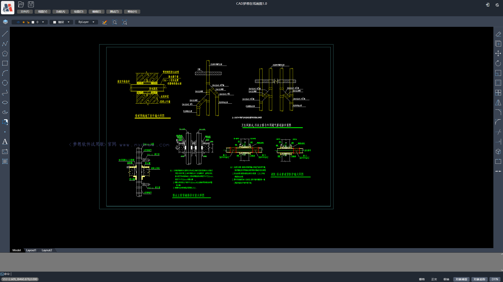

To run and debug the MxCADiframe project, use the command: `npm run serve`.

Directly opening it may not retrieve the drawing or the iframe may display a "localhost refused to connect" error. To resolve this, visit `http://localhost:8081/?debug=true`. This is because it needs to be on the same origin. In other words, you should load the frontend resources from the dist directory on your own project's server with the same port. Then, embed the MxCad online editing project in your frontend using an iframe.

Result after running:
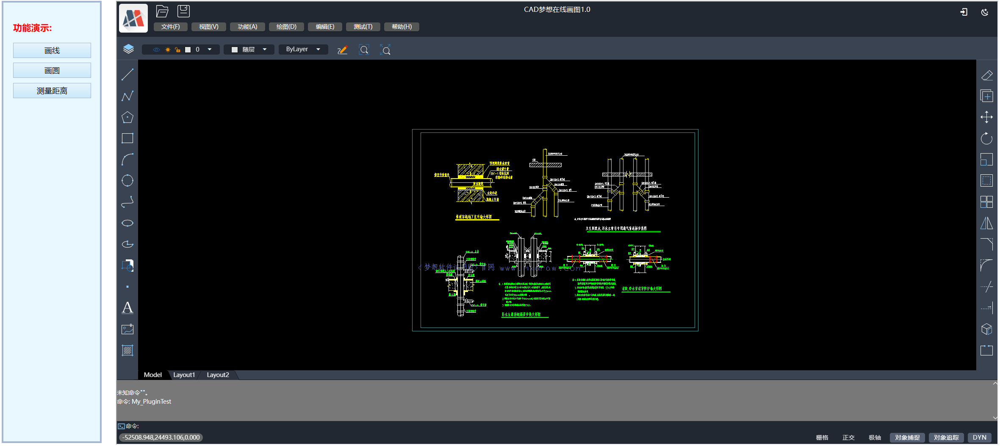

The entire process for secondary development of the MxCad online editing frontend project is as follows:

1. Download the source code, unzip it, and navigate to the MxCAD directory. Run `npm install` to install dependencies.

2. Run `npm run dev` to debug and develop your own requirements.

3. Run `npm run build` to build the plugin. A JavaScript file will be generated in the dist/plugins directory.

4. Copy all the frontend resources in the dist directory to your own project's (debug) server.

5. In the MxCADiframe project, run `npm install` to install dependencies.

6. In the `src/components/Home.vue` file, set the `src` attribute of the iframe to the URL of the frontend resources you copied to your project's server.

7. Finally, if everything looks fine, follow the approach in the MxCADiframe directory to embed the MxCad online editing project in your own frontend project using an iframe.

The above steps only cover what needs to be done on the frontend. In practice, you will need collaboration from the backend and implementation of necessary backend APIs, including features like uploading drawings and saving DWG files. Therefore, you need to download the MxDraw Cloud Development Package from [here](https://www.mxdraw.com/download.html) and follow the getting started guide to understand how to use it: [MxDraw Cloud Development Package Guide](https://help.mxdraw.com/?pid=32).

You can directly copy all the files in the dist directory to `MxDrawCloudServer\SRC\TsWeb\public\mxcad`. This will replace all the existing files.

Then, double-click to run `Mx3dServer.exe`:

1. Click "开始web服务" (Start Web Service).

2. Click "启动MxCAD" (Start MxCAD).

You will see the complete modified version of the project. The buttons and the opened page in MxCADiframe are available in the MxCADCode.7z archive, which contains the source code. By following the steps above, you can achieve the frontend part of your secondary development. To implement services for uploading and saving drawings, you will need to refer to the MxDraw Cloud Development Package documentation.

Now, let's delve into the dist directory to understand how to achieve secondary development through configuration and plugins.

### Understanding the dist Directory

The dist directory contains the packaged frontend resources that can be deployed on your server.

The MxCAD project is started using a Node server for debugging, which serves the index.html file located in the dist directory. The MxCAD project's build with `npm run build` generates a test.js file (by default, a sample test plugin) in the dist/plugins directory.

Some important configuration files are:

**mxUiConfig.json**:

The mxUiConfig.json file in the dist directory is used for configuring the user interface:

- title: The browser's title.

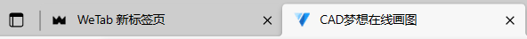

- headerTitle: It automatically replaces `<version>` with the version number.

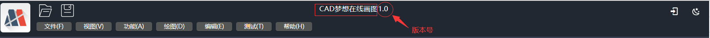

- mTitleButtonBarData: An array of elements where "prompt" represents a tooltip and "cmd" represents a command. Clicking the button executes a command.

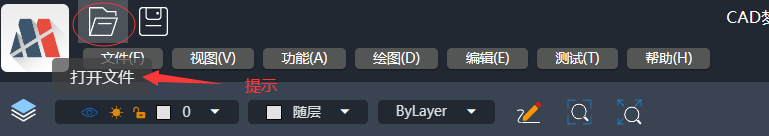

- mRightButtonBarData and mLeftButtonBarData: "isShow" indicates whether to show the buttons.

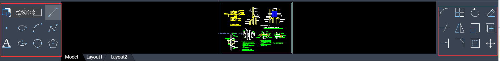

- mMenuBarData: A menu list. You can nest lists within lists to create multi-level menus.

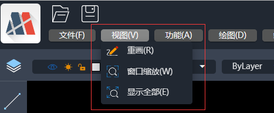

- footerRightBtnSwitchData: An array of button names to be displayed. An empty array means no buttons will be displayed.

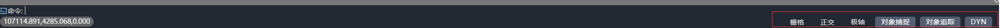

For more configurations, refer to the configuration file, which provides detailed explanations.

**mxServerConfig.json**:

- uploadFileConfig: This configuration is based on [WebUploader](http://fex.baidu.com/webuploader/) for file uploads. It has several configuration parameters, and the backend upload API is explained below:

  - baseUrl: The base URL for the same backend server. The relative interfaces below are all based on the same server address.

  - fileisExist: This interface returns data.ret === "fileAlreadyExist" if the file already exists, indicating a rapid upload through MD5 check. Otherwise, the file needs to be uploaded. This POST request carries two parameters: { fileHash: "file MD5", filename: "file name" }. You can implement the corresponding backend logic according to your needs.

  - chunkisExist: This POST interface checks if a chunk already exists. It carries the following parameters:

    ```json
    {
      chunk: "chunk",
      chunks: "total chunks",
      fileName: "file name",
      fileHash: "file MD5",
      size: "chunk file size"
    }
    ```

    The backend returns data.ret === "chunkAlreadyExist" if the chunk already exists; otherwise, it indicates that the chunk doesn't exist.

  - mxfilepath: Indicates the directory where uploaded drawing files are stored and converted to .mxweb file format. The files saved by the backend must follow this format: `fileHash.type.mxweb`, where:

    - `fileHash` is the MD5 value of the original CADfile.
    - `type` is the original file extension of the CAD drawing.

  - saveDwgUrl: This is the service address for saving DWG files. The implementation of this interface can be provided through the development package.

  Default location of the file-saving service in the Node server:
  Windows:
  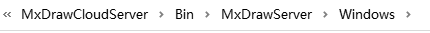
  Linux:
  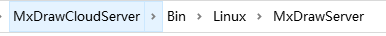

  - wasmConfig: This configuration distinguishes which wasm-related files to use. You can find more details in the configuration files in the dist directory.

**Plugin Configuration File - plugins/config.json**:

The plugins folder contains files with the names of the plugins. They will be loaded one by one in the order specified in the plugins configuration in the `plugins/config.json` file. For example, if you have a `plugins/test.js` file, you should add "test" as an entry in the configuration.

The MxCAD directory is for creating the corresponding JavaScript files in dist/plugins. For instance:

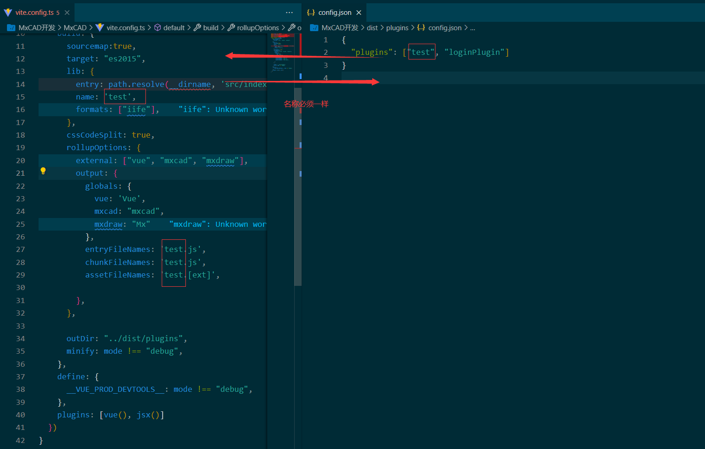

MxCAD Directory Overview:

- Built on Vite, you can directly run and serve the dist directory by executing `npm run dev`. This allows you to view and modify .ts and .vue files, which will be automatically compiled and the page will refresh.

- Vite requires manual execution of `npm run build` to bundle the dist directory. After bundling, the dist directory should be placed in dist/plugins.

- When you use `import` to include mxcad, mxdraw, and Vue, you are referring to the bundled frontend resources in dist, not creating entirely new instances of mxcad, mxdraw, and Vue.

- The Vite configuration in the MxCAD directory must match the plugins configuration in `vite.config.ts` and `dist/plugins/config.json`.

**Tip**: During secondary development, you can refer to the documentation of [mxcad frontend library](https://mxcadx.gitee.io/mxcad_docs/en/) and [mxdraw frontend library](https://mxcadx.gitee.io/mxdraw_docs/) for API references and introductory documents to implement your own requirements.

In the src directory of the MxCAD directory, you will find a multitude of test cases that demonstrate various functions implemented using the mxcad library. You can run them during debugging, either through the test buttons on the page or by entering commands in the command line.

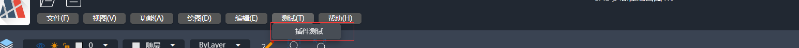
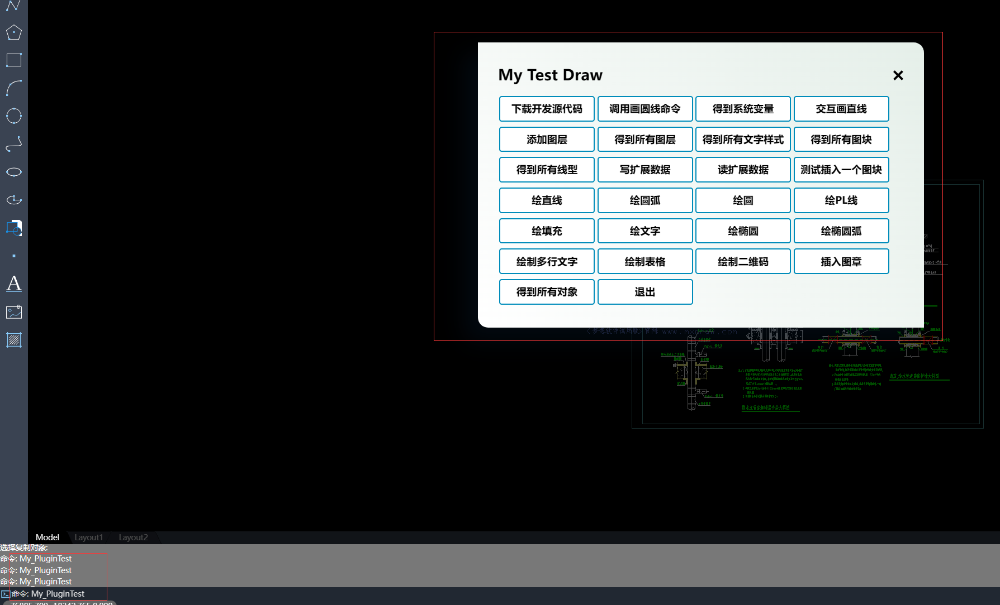

The code corresponding to the functionality of a specific button can be found by searching for it in the source code.

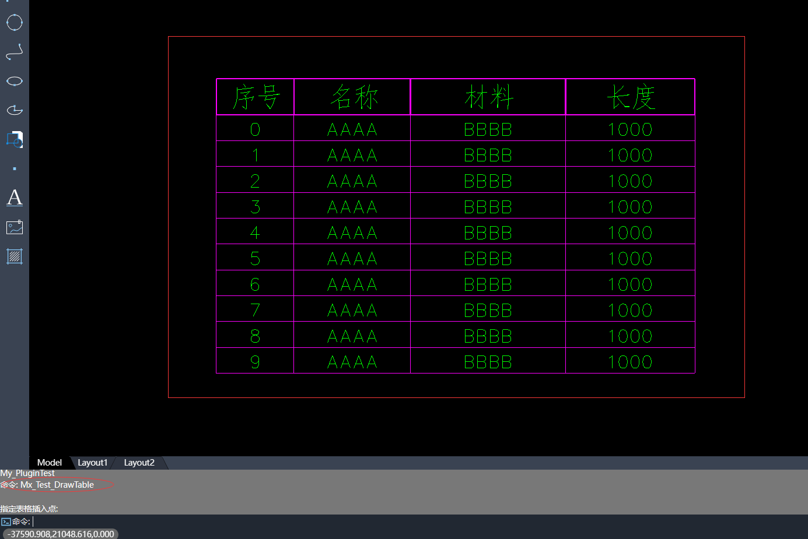

After developing a plugin, run `npm run build` to bundle it into the dist/plugins directory.

Now, you just need to place the dist directory on your server and embed it using an iframe. The MxCADiframe project serves as a simple demo that you can refer to for integrating the dist frontend resources into your project.

In the src directory of the MxCAD directory, there's an iframe.ts file that corresponds to the postMessage in the MxCADiframe project.

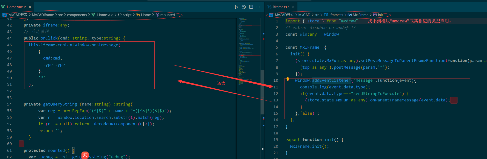

We recommend using this method to implement your custom requirements and for integration and deployment.

With these steps, you can embed the dist frontend resources into your project and implement your own requirements through configuration and plugins.

If you have any further questions or need assistance with a specific aspect of this development process, feel free to ask!

## Electron Version

We provide an Electron version for building desktop applications.

Download link: [MxCADAppElectron.zip](https://gitee.com/mxcadx/mxdraw-article/blob/master/MxCad%E9%A1%B9%E7%9B%AE%E4%BA%8C%E6%AC%A1%E5%BC%80%E5%8F%91%E6%8F%92%E4%BB%B6%E9%9B%86%E6%88%90/MxCADAppElectron.zip)

After downloading and extracting it, you can set up the Electron project by running `npm install` to install the dependencies and then running `npm run dev` to start the Electron project.

For the Electron version, there are no changes in the frontend plugins for secondary development (the JavaScript files generated in the MxCAD directory mentioned above).

The only difference is that the Electron version on Windows has added an object called `MxElectronAPI`, which provides the ability to communicate with the main thread. You can use `MxElectronAPI` to determine if it's running in an Electron environment when developing frontend plugins.

In the Electron project, there are also plugins designed for specific requirements in the Electron main thread. These plugins are written in TypeScript and are bundled using Vite. The Vite configuration can be found in `vite.plugins.config.ts`.

Here are the steps to create a new Electron project plugin:

1. Create a `src/plugins` directory if it doesn't already exist.

2. Inside the `src/plugins` directory, create a new directory for your plugin (e.g., `testPlugin`), and create an `index.ts` file as the entry point for your plugin.

3. Add the plugin entry configuration in `vite.plugins.config.ts` with `pluginEntryFileName: ["plugins/testPlugin/index.ts"]`.

4. Run the command for debugging: `dev:plugins`.

5. Run the command for building: `build:plugins`.

6. If you create a `preload.ts` in your `testPlugin` directory and export an object from it, this object will be used for communication with the web page. This is similar to the concept of a preload script, as described here: [Electron Preload](https://www.electronjs.org/zh/docs/latest/tutorial/tutorial-preload).

7. Plugins can have many directories, and each directory represents a plugin. The directory name also serves as the namespace. In the frontend, you can access the plugin object using `window.MxElectronAPI.namespace`, where `namespace` is the name of the plugin directory.

In Electron project plugins, the `global.mxAppContext` object is available. It provides access to several properties and methods, such as `getMainWindow`, `showMessage`, `showMessageBoxSync`, and `MainTabs`. You can access these through TypeScript with type hints and explanations.

Here's a description of the directories in the Electron project:

| Path | Description | Note |
|-------|-------|-------|
| dist | Contains the frontend project resources | It has 2d and 3d directories, each with a `dist` directory. This `dist` directory is where you replace the frontend resources, just as mentioned above. Make sure to check if the `config.json` file has the necessary configurations.
| dist-electron | Contains the main thread code for Electron | It's not recommended to modify this code directly, as it may be updated and replaced at any time.
| rendererTypes | TypeScript type definitions for window.MxElectronAPI | These definitions and descriptions can be used in the frontend.
| src/plugins | Plugin directories | Each directory contains an `index.ts` as the entry point.
| vite.plugins.config.ts | Vite's build configuration | Every newly created directory should be documented here. If you are familiar with Vite, you can make adjustments based on your requirements, but ensure that the final output file structure remains unchanged, as any changes may prevent the loading of plugins.

If you have specific secondary development requirements or if the existing configurations or plugins are insufficient, please provide feedback, and we will continue to improve them.

Screenshot of the Electron desktop application:

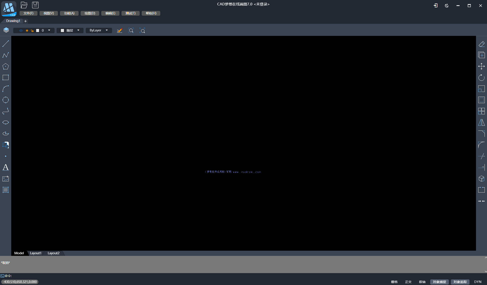
