# Mathematical Library

In CAD development, the correct use of mathematical libraries is crucial.

We learned from the [Quick Start](../1.Guides/1.Quick_Start.md) that when we open a drawing and want to manipulate the graphics in various ways, we need various calculations. MXCAD provides some classes to participate in calculations or represent certain data structures.

If you have never dealt with vectors or matrices before, please take the time to understand before continuing to read.

## Mathematical system of Geometry Information

In cad, there are many different ways to describe the vertex, edge, line, face, volume and other information of a graph. If we use a different drawing system, each drawing system may have a unique way or a specific API to solve a specific problem or a certain kind of specific problem.

Because there are so many tools to choose from, it is difficult for us to find the most appropriate one.

And if we have only tools to solve specific problems and no unified methodology, then we will not be able to solve the root of the problem once and for all.

Therefore, in graphics, a set of simple mathematical system based on vector and matrix operation is established to describe the geometric information which is not related to each graphics system, and how to use this system to solve the problem of visual graphics presentation.

## coordinate system and coordinate Mapping

First, let's take a look at some of the coordinate systems that mxcad might use:

1. HTML uses the upper-left corner of the window coordinate system as the coordinate origin, x-axis to the right, y-axis down, and the coordinate values correspond to pixel values, which are generally called screen coordinates in CAD.

2. Webgl coordinate system, mxcad depends on mxdraw, mxdraw internally uses a specific version of the modified three.js, so, generally speaking, we refer to the Three.js coordinate system.

3. The drawing coordinate system is the drawing coordinate system in cad, and then mxcad and mxdraw generally become document coordinates based on the coordinates of its coordinate system.

4. CAD coordinate system refers to the coordinate system of CAD drawings. In mxcad, the coordinates of [McGePoint3d](../api/classes/McGePoint3d.md) are CAD drawing coordinates.

The method of transformation between mxcad coordinate systems is listed in [mxdraw coordinate conversion](https://mxcadx.gitee.io/mxdraw_docs/en/coordinate/CoordinateTransformation.html).
We can directly use the API provided by mxdraw to transform the mxcad-related coordinates.

For example:

```ts
Import { MxFun } from "mxdraw"
Import { McGePoint3d } from "mxcad"

Const pt = new McGePoint3d ()
// CAD drawing coordinates to document coordinates
MxFun.cadCoord2Doc (pt.x, pt.y, pt.z)
```

Although these four coordinate systems are different in origin position, axis direction and coordinate range, they are all Cartesian coordinate systems, so they all meet the characteristics of Cartesian coordinate systems: no matter how the direction of the origin and axis changes, using the same method to draw geometry, their shape and relative position remain the same.

## Vector: McGeVector3d

: tip
After the introduction of mxcad, the THREE variable is automatically mounted globally to represent three.js.
If you find that McGeVector3d can call the `toVector3` method to get THREE.Vector3, use the API provided by three.js for vector operation.
To turn THREE.Vector3 into McGeVector3d, you only need to use THREE.Vector3 as a parameter of new McGeVector3d.
:::

So how do you represent a point and a segment in a Cartesian coordinate system?

The previous example contains three axes x, y, z, so they form a three-dimensional space for drawing, but usually we only need to consider x and y. Therefore, we can use two-dimensional vectors to represent points and line segments on this plane. A two-dimensional vector is actually an array of two values, one is the x coordinate value, the other is the y coordinate value.

Suppose that there is now a vector v in this plane Cartesian coordinate system.

The vector v has two meanings: one is that it can represent a point located at (xPowery) in the coordinate system, and the other is that it can represent a line segment from the origin (0memy) to the coordinate (xmemy).

The same two vectors can also perform mathematical operations:

For example, now there are two vectors, v1 and v2, and if you add them together, the result is equivalent to moving the end point of the v1 vector (x1, y1) a distance in the direction of the v2 vector, which is equal to the length of the v2 vector.

In this way, we can get a new point (x1 + x2, y1 + y2), a new line segment [(0,0), (x1 + x2, y1 + y2)], and a broken line: [(0,0), (x1, y1), (x1 + x2, y1 + y2)].

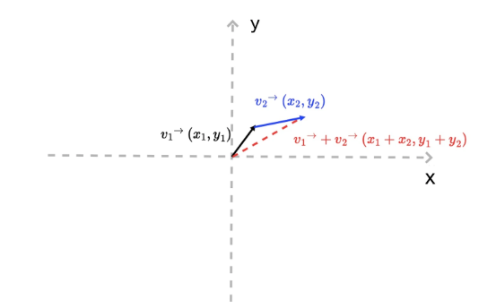

Second, a vector contains length and direction information. Its length can be expressed by the square root of the sum of x and y squares of vectors.

```js
v.length = function () {return Math.hypot (this.x, this.y)}
```

Its direction can be expressed by the angle with the x-axis, that is:

```js
v.dir = function () {return Math.atan2 (this.y, this.x);}
```

In the above code, the value of Math.atan2 ranges from-π to π, with negative numbers below the x-axis and positive numbers above the x-axis

Finally, according to the definition of length and direction, we can derive a set of relations:

```js
v.x = v.length * Math.cos (v.dir)
v.y = v.length * Math.sin (v.dir)
```

This corollary implies an important fact: we can simply construct a drawing vector. That is, if we want to draw a line segment of length length along a certain direction, starting with a point (x0, y0), we only need to construct the following vector.

```js
// Dir is the direction of a vector (angle with the x axis), and length is the length of the vector.
function createV1(dir, length) {
    return {
        x: length * Math.cos(dir),
        y: length * Math.sin(dir)
    }
}
var v0 = { x: 0, y: 0 }
var v1 = createV1(Math.PI / 5, 30)
// Then we add the vector (x0, y0) to this vector v1, and we get the end of the line.
```

The corresponding methods `McGeVector3d.length` and `McGeVector3d.angleTo1` are also provided in mxcad to calculate the vector length and direction angle.

There are also two vectors added together `McGeVector3d.add` you can choose to use the API we provide to simplify the above operations.

There is a vector `THREE.Vector3` in three.js and the corresponding [McGeVector3d](../api/classes/McGeVector3d.md) in mxcad represents a vector (vector) in 3D space.

In this class, four axes `kXAxis`, `kYAxis`, `kZAxis` and `kNegateZAxis` are fixed vectors, respectively.

`THREE.Vector3` is completely equivalent to `McGeVector3d`, except that it is `McGeVector3d` that participates in operation with other data in mxcad.

Here is a brief explanation of some of the vector operations provided by mxcad:

```ts
import { McGeVector3d } from "mxcad"
const vet = new McGeVector3d(1, 0, 0)
// Get THREE.Vector3
const tVet = vet.toVector3()
const newVet = new McGeVector3d(tVet)
// Rotation
tVet.rotateBy(Math.PI. McGeVector3d.kXAxis)
// negated
vet.negate()
// Vertical 90 degrees
vet.perpVector()
// Calculate the angle between two vectors
vet.angleTo1(newVet)
vet.angleTo1(newVet,  McGeVector3d.kZAxis)
// Normalization
vet.normalize()
// dot product
vet.dotProduct(newVet)
// crossed product
vet.crossProduct(newVet)
// Is it equal?
vet.isEqualTo(newVet)
// Multiply a vector by a value
vet.mult(10)
```

You can refer to [Mathematics Library demonstration effect](#MathematicsLibrarydemonstrationeffect) and click to get the length and angle of the vector and get a line through a vector according to the direction and distance to see if the corresponding method is used correctly.
As in the code above, we use a lot of vector operations, maybe you don't understand what they mean, let's explain it briefly:

### addition and subtraction of vectors

Their calculations are easier to calculate:

```js
//  For example, vector v + vector v1:
(v.x + v1.x, v.y + v1.y)
// For example, vector v -vector v1:
(v.x - v1.x, v.y - v1.y)
```

So how do they understand that they get vectors by adding and subtracting?

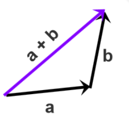
Each vector is connected from beginning to end in turn, and the result is that the starting point of the first vector points to the end vector a plus vector b of the last vector. After connecting an and b, the starting point of a points to the end of b, that is, a + b.

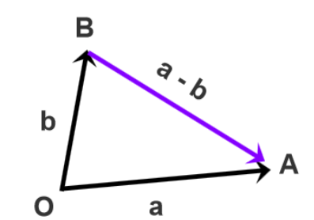
Translate two vectors to the common starting point O, point from the end point B of the subtraction vector to the end point An of the subtracted vector A, subtract the starting point of the vector an and the vector b to the common starting point O in the lower left corner, and the vector pointing from point B to point An is a-b.

It may be more abstract to understand. It is easier to understand by clicking on the addition and subtraction of the vector in [Mathematical Library demonstration effect](#MathematicalLibrarydemonstrationeffect) to see the specific effect and source code.

### Vector multiplication

There are two kinds of vector multiplication, one is point multiplication and the other is cross multiplication, which have different geometric and physical meanings.

If you do not quite understand after reading, you can click on the vector multiplication in [Mathematical Library demonstration effect] (# Mathematical Library demonstration effect) to see its practical application, and it is easier to understand its concept by reading the source code.

#### Point multiplication

Suppose that there are two N-dimensional vectors an and b an a = [A1, a2,... bn], b = [b1, b2,... b2]. The dot product code of that vector is as follows:

```js
a*b = a1*b1 + a2*b2 + ... + an*bn
```

In N-dimensional linear space, the geometric meaning of the dot product of an and b vectors is the projection component of a vector multiplied by b vector on a vector.
Its physical meaning is equivalent to the work done by a force acting on an object to produce b displacement. The dot product formula is shown in the following figure:

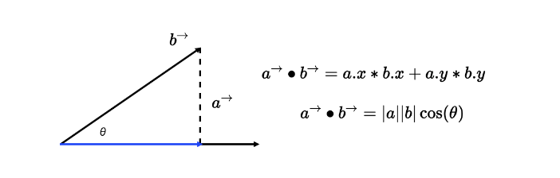

Of course, there are two special cases of dot multiplication:

If the vectors an and b are parallel, then the angle between them is 0 °, then a ·b = | a | * | b | it is represented by JavaScript code:

```js
a.x * b.x + a.y * b.y === a.length * b.length；
```

If the vectors of an and b are vertical, then the angle between them is 90 °, then a ·b = 0 is represented by JavaScript code:

```js
a.x * b.x + a.y * b.y === 0;
```

#### Cross multiplication

There are two differences between cross multiplication and dot multiplication:

First of all, the result of vector cross multiplication is not a scalar, but a vector; secondly, the cross product of two vectors is perpendicular to the coordinate plane composed of two vectors.

In two-dimensional space, for example, the cross product of vectors an and b is equivalent to the product of the vertical projection of vector a (blue arrowhead segment) and vector b (red arrowhead segment).
As shown in the following figure, the geometric meaning of two-dimensional vector cross product is **the area of parallelogram composed of vectors an and b**.

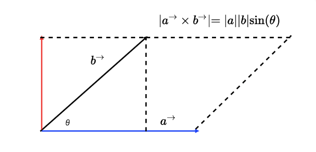

How to calculate the cross product mathematically? Suppose that there are two three-dimensional vectors a (x1, y1, z1) and b (x2, y2, z2), then the cross product of an and b can be expressed as a determinant of the following graph:

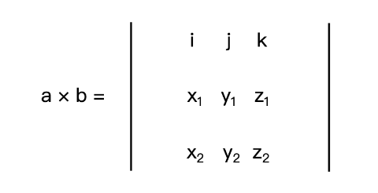

Where I, j and k are the unit vectors of x, y and z axes, respectively. If we expand this determinant, we can get the following formula:

```js
a * b = [y1 * z2 - y2 * z1, - (x1 * z2 - x2 * z1), x1 * y2 - x2 * y1]
```

The physical meaning of vector cross multiplication in two-dimensional space is the moment of an and b (torque you can understand as the tendency of an object to rotate around an axis under the action of a force.

## 3D Point: McGePoint3d

This is one of the most commonly used classes: [McGePoint3d](../../api/classes/McGePoint3d.md), representing a point in 3D space.

It consists of three double-precision values: `x`, `y`, and `z`.

```typescript
import { McGePoint3d } from "mxcad";
const pt1 = new McGePoint3d(0, 0, 0);
// Or
const pt2 = new McGePoint3d({ x: 0, y: 0, z: 0 });

// Provides some utility methods
// Check if two points are equal
pt1.isEqualTo(pt2);
// Calculate the distance between two points
pt1.distanceTo(pt2);
// Set from a THREE.Vector3
pt1.setFromVector3(new THREE.Vector3());
// Get the corresponding THREE.Vector3
pt1.toVector3();

// Subtract two points to get a new vector
const vector = pt1.sub(pt2);
// Add a vector to get a new position
pt1.addvec(vector);
// Shortened form
pt1.av(vector);

// Subtract a vector to get a new position
pt1.subvec(vector);
// Shortened form
pt1.sv(vector);
```

We mentioned affine transformation earlier, so what is radiation transformation?

Affine transformation is simply "linear transformation + translation".

For example, setting the transform attribute of CSS on an element is to apply an affine transformation to the element.

The affine transformation of geometry has the following two properties:
1. Before affine transformation, it is a straight line segment, but after affine transformation, it is still a straight line segment.
2. Applying the same affine transformation to two straight line segments an and b, the length ratio of the line segments remains unchanged before and after the transformation.

Common forms of affine transformation include translation, rotation, scaling and their combinations.

The simplest thing is translation. In mxcad, you can directly understand that the McGePoint3d point adds a vector McGeVector3d through the addvec method, which is the distance of translating the vector in the direction represented by the vector.

## Matrix: McGeMatrix3d

As we know how to translate a point above, we can also rotate and scale a point through a linear transformation.

So what is a linear transformation? we can also get how to rotate and scale through vector operations.

Just rotation and scaling, we choose to express it in the form of a matrix, and the transformation in the form of multiplying the matrix and the vector is called linear transformation.

In addition to the two properties of affine transformation, linear transformation has two additional properties:
1. Linear transformation does not change the origin of coordinates (because if x 0 and y 0 are equal to zero, then x and y must be equal to 0).
2. Linear transformations can be superimposed. The superposition result of multiple linear transformations is to multiply the matrices of linear transformations in turn, and then multiply them with the original vector.

Then according to the second property of linear transformation, we can sum up a general linear transformation formula, that is, an original vector P0 passes through M1, M2, … The final coordinate P is obtained after the linear transformation of Mn degree.

In mxcad, the [McGeMatrix3d](../../api/classes/McGeMatrix3d.md) class represents the affine transformation of 3D space.

Usually, we need to represent all kinds of complex radiation transformations formed by the combination of translation, rotation, scaling, etc., by linear transformation.

We just need to convert the original n-dimensional coordinates into nasty 1-dimensional coordinates.
This kind of 1-dimensional coordinate is called homogeneous coordinate, and the corresponding matrix is called homogeneous matrix.

Our McGeMatrix3d is also a homogeneous matrix, so we can perform various linear transformations directly through McGeMatrix3d, and finally apply this affine transformation through the vector's `transformBy` method.

The same matrix can also be applied to all geometric entities [McDbEntity.transformBy](../../api/classes/McDbEntity.md#transformBy) in mxcad for affine transformation, because all geometry is based on points and lines.

We can regard the point or line as a vector, and the radiative transformation of the entity is equivalent to the radiative transformation of all the points that make up the entity.

[McGeMatrix3d](../../api/classes/McGeMatrix3d.md) represents affine transformations in 3D space.

### Matrix multiplication

The multiplication of the matrix actually corresponds to the property that the linear transformation described above can be superimposed.

We hope to form a complex affine transformation through a combination of matrices, that is, the final matrix obtained by multiplying matrices one by one, that is, the complex affine transformation formed by combination.

Two An and B matrices are multiplied. Take An as an example, A can choose left multiplication or right multiplication matrix B.

Left multiplication is `B * A`, right multiplication is `A * B`.

Here we can understand the difference between left multiplication and right multiplication through the following figure:

First, suppose the matrix A:
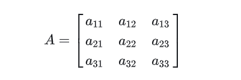

Set the column vector:
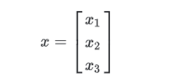

Remove the right multiplication matrix A by column vector
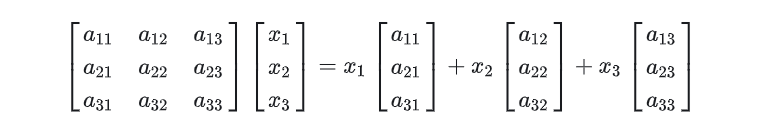

It is equivalent to a linear combination of the column vectors in matrix A.

Left multiplication of matrix A by column vector
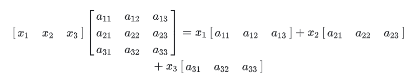

It is equivalent to the left linear combination of row vectors in matrix A.

According to the above concepts, the left multiplication and right multiplication in matrix multiplication are extended to the same idea:

Set up a matrix B:
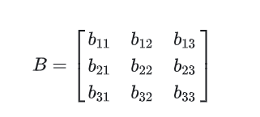

Use matrix B to multiply matrix A:
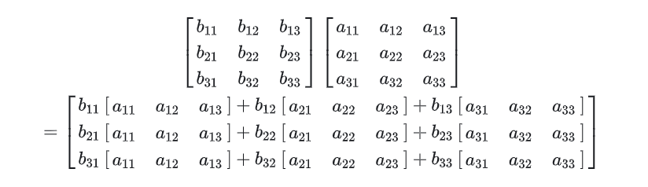

**Therefore, every row of a new matrix obtained by matrix B left multiplication matrix An is a linear combination of row vectors of matrix A. similarly, every column of a new matrix obtained by matrix B right multiplication matrix An is a linear combination of column vectors of matrix A.**

Here are some of the ways McGeMatrix3d offers:

```typescript
import { McGeMatrix3d, McGePoint3d, McGeVector3d } from "mxcad";
// Identity matrix for multiplication
McGeMatrix3d.kIdentity;

const m = new McGeMatrix3d();
const m1 = new McGeMatrix3d();

// Set to identity matrix.
m.setToIdentity();

// Pre-multiply by a specified matrix.
const m3 = m.preMultBy(m1);

// Post-multiply by a specified matrix.
m3.postMultBy(m1);

// Set the matrix to the product of two matrices.
new McGeMatrix3d().setToProduct(m1, m2);

// Inverse matrix.
m1.invert();

// Check if the matrix is singular.
m1.isSingular();

// Transpose
m1.transposeIt();

// Check equality
m1.isEqualTo(m2);

// Determinant of the matrix.
m1.det();

// Set the matrix to a specified coordinate system. Parameters are origin, xyz axes
m1.setCoordSystem(new McGePoint3d(), new McGeVector3d(), new McGeVector3d(), new McGeVector3d());

// Translation
m1.setToTranslation(new McGeVector3d(0, 1, 0));

// Rotation: Parameters are angle, axis, rotation center
m1.setToRotation(Math.PI, McGeVector3d.kXAxis, new McGePoint3d());

// Scaling: Parameters are scaling factor, scaling center
m1.setToScaling(0.5, new McGePoint3d());

// Set as a mirror matrix
m1.setMirror(new McGePoint3d(), new McGePoint3d());

// Get scaling factors
m1.scale();

// Get the value of a specified element in the matrix. Parameters are row index, column index
m1.getData(0, 0);
```

How to use matrix in mxcad, you can view the rotation translation and scaling of points in [MathematicalLibrarydemonstrationeffect](#MathematicalLibrarydemonstration effect) | affine transformation of the entity | it is easier to understand and use by viewing the specific effect and source code.

## MxCADResbuf

[MxCADResbuf](../../api/classes/MxCADResbuf.md) is a data structure used in CAD development to pass data, also known as a "result buffer".

It is commonly used for object property queries, custom object definitions and storage, XDATA (extended data) processing, and editing of drawing entities.

For example, in [MxCADSelectionSet](../../api/classes/MxCADSelectionSet.md), it is used to represent object filters:

```typescript
import { MxCADSelectionSet, MxCADResbuf } from "mxcad";
let ss = new MxCADSelectionSet();
let filter = new MxCADResbuf();
// Here, we add the query string "0". The second parameter is data type 8, indicating a null pointer (RTNUL), meaning that this resbuf structure does not contain any valid data. It is typically used as a terminator at the end of a linked list.
filter.AddString("0", 8);
// Select all entities on layer 0
ss.allSelect(filter);
ss.forEach((objId) => console.log(objId));
```

## calcBulge: Calculate Arc Bulge

MxCADUtility is an instance provided by [MxCADUtilityClass](../../api/classes/MxCADUtilityClass.md), offering many useful methods.

[MxCADUtility.calcBulge](../../api/classes/MxCADUtilityClass.md#calcBulge) calculates the bulge of an arc.

When adding points to a polyline entity, one parameter is the bulge value. Calculating the bulge can be complex, but MXCAD provides the `calcBulge` method for this purpose.

It requires three parameters: the start point of the arc, the mid-point of the arc, and the end point of the arc.

```typescript
import { MxCADUtility, McGePoint3d, McDbPolyline } from "mxcad";
// Start point of the arc
const startPoint = new McGePoint3d(0, 0, 0);
// Mid-point of the arc
const midPoint = new McGePoint3d(0, 0, 0);
// End point of the arc
const endPoint = new McGePoint3d(0, 0, 0);
const bulge = MxCADUtility.calcBulge(startPoint, midPoint, endPoint).val;
const pl = new McDbPolyline();
pl.addVertexAt(startPoint, bulge);
pl.addVertexAt(endPoint);
```

This translation is kept as faithful as possible to the original Chinese article.

If you do not know any of the above three parameters, refer to the figure below to calculate the convexity yourself:

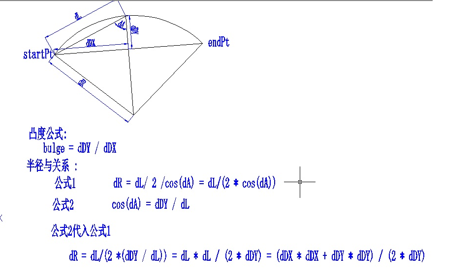

**The convexity value is half the distance between the start point and the end point of the arc, and the distance from the midpoint of the segment to the center of the arc is connected by the start point of the arc to the end point.**

## Demonstration effect of math library

The demo is based on vue3 and is based on tsx. Please refer to [vue official website Tsx instructions](https://cn.vuejs.org/guide/extras/render-function.html#jsx-tsx) (code can be edited).

:::demo
```tsx
import { createMxCad, McGeVector3d, McGePoint3d, McGeMatrix3d, MxCADUiPrPoint, McDbLine } from "mxcad"
import { MxFun } from "mxdraw"
import { reactive, defineComponent } from "vue"

// CAD component
const Cad = defineComponent({
     emits: ['mxcad'],
     setup(props, { emit }) {
         createMxCad({
            canvas: "#myCanvas",
            locateFile: (fileName: string)=> {
                return "https://unpkg.com/mxcad/dist/wasm/2d-st/" + fileName
            },
            // Directory location where fonts are loaded
            fontspath: self.location.origin + "/mxcad_docs/fonts",
            // Load the converted drawing file
            fileUrl: self.location.origin + "/mxcad_docs/empty_template.mxweb"
            })
            .then((mxcad)=> {
                emit("mxcad", mxcad)
            })
        return () => (
            <div style="height: 600px; overflow: hidden;"><canvas id="myCanvas" style="height: 300px"></canvas></div>
        )
    }
})

// Get CAD current paper coordinates
const useMxcadDrawingCoordinates = ()=> {
    const coordinates   = reactive({
        x: 100,
        y: 100
    })
    const onGetDrawingCoordinates = (mxcad)=> {
        // Get the mxdraw control
        const mxdraw = mxcad.mxdraw
        const canvas = mxdraw.getCanvas()
        canvas.onmousemove = (e: MouseEvent)=> {
            // Transfer screen coordinates to document coordinates
            const { x, y } = MxFun.screenCoord2Doc(e.clientX, e.clientY)
            // Conversion of document coordinates to CAD drawing coordinates
            const pt = MxFun.docCoord2Cad(x, y, 0)
            coordinates.x = pt.x
            coordinates.y = pt.y
        }
    }
    return {
        coordinates,
        onGetDrawingCoordinates
    }
}
    // Vector correlation
  const useMxCadVector3d = () => {
    // Get vector length and angle
    const getVetLengthAndDir = async () => {
      const getPt = new MxCADUiPrPoint()
      getPt.clearLastInputPoint()
      getPt.setUserDraw((pt, pw) => {
        const point = new McGePoint3d(MxFun.viewCoordLong2Cad(150), MxFun.viewCoordLong2Cad(300))
        // A new vector is obtained by subtracting two points.
        const vet = point.sub(pt)
        pw.setColor("#f00")
        pw.drawLine(point.toVector3(), pt.toVector3())
        pw.setColor(0x00ff00)
        const midPoint = new McGePoint3d((point.x + pt.x) / 2, (point.y + pt.y) / 2)
        // Calculate the length of vector
        pw.drawText("Vector length:" + vet.length(), MxFun.viewCoordLong2Cad(20), 0, midPoint.toVector3())
        // Calculate vector direction (angle)
        pw.drawText("Vector direction (angle °):" + (Math.atan2(vet.y, vet.x) * (180 / Math.PI)).toFixed(2) + "°", MxFun.viewCoordLong2Cad(20), 0, point.toVector3())
      })
      await getPt.go()
    }
    // Get a line from a vector according to direction and distance
    const getALineFromVectorAccordToDirectionAndDistance = async () => {
      const getPt = new MxCADUiPrPoint()
      getPt.clearLastInputPoint()
      getPt.setUserDraw((pt, pw) => {
        //  the direction of the vector
        const angle = Math.PI / 3
        // Screen distance to CAD drawing distance
        const dist = MxFun.viewCoordLong2Cad(150)
        // Get the vector according to the direction and distance of the vector
        const vet = new McGeVector3d(dist * Math.cos(angle), dist * Math.sin(angle))
        // Clone the current mouse position (avoid changing the pt position) and add the position of the vector to get a new coordinate point
        const point = pt.clone().addvec(vet)
        pw.setColor("#f00")
        pw.drawLine(point.toVector3(), pt.toVector3())
        pw.setColor(0x00ff00)
        pw.drawText("The position of the point after the vector is added", MxFun.viewCoordLong2Cad(16), 0, point.toVector3())
      })
      await getPt.go()
    }
    // Addition and subtraction of vectors
    const callAdditionAndSubtractionOfVectors = async () => {
      const getPt = new MxCADUiPrPoint()
      getPt.clearLastInputPoint()
      // Suppose there are two vectors.
      const vet1 = new McGeVector3d(0, MxFun.viewCoordLong2Cad(300))
      const vet2 = new McGeVector3d(MxFun.viewCoordLong2Cad(300), 0)
      const size = MxFun.viewCoordLong2Cad(20)
      getPt.setUserDraw((pt, pw) => {
        const draw = (color: number, vet: McGeVector3d, funName: "subvec" | "addvec", vetName: string) => {
          pw.setColor(color)
          const _pt = pt.clone()[funName](vet).toVector3()
          pw.drawLine(_pt, pt.toVector3())
          pw.drawText(`Points and vectors${vetName}${funName === "addvec" ? " Add up " : " Subtract "}The point obtained.`, size, 0, _pt)
          return _pt
        }
        // 点分别对两个点进行相加相减操作
        pw.setColor(0xff0000)
        draw(0xff0000, vet1, "addvec", "vet1")
        draw(0xff0000, vet1, "subvec", "vet1")
        draw(0xffff00, vet2, "addvec", "vet2")
        draw(0xffff00, vet2, "subvec", "vet2")

        // 两向量分贝相加相减 后得到新的vet3 vet4 向量 (这里直接使用three.js提供的向量相加方法)
        const vet3 = new McGeVector3d(vet1.toVector3().add(vet2.toVector3()))
        const vet4 = new McGeVector3d(vet1.toVector3().sub(vet2.toVector3()))
        pw.setColor(0xff00ff)
        draw(0xff00ff, vet3, "addvec", "vet3")
        draw(0xff00ff, vet3, "subvec", "vet3")
        draw(0x00ff00, vet4, "addvec", "vet4")
        draw(0x00ff00, vet4, "subvec", "vet4")

        pw.setColor(0xffffff)
        pw.drawText("point", size, 0, pt.toVector3())
      })
      await getPt.go()
    }

    // vector multiply
    const callVectorMultiplication = async () => {

      const getPt = new MxCADUiPrPoint()
      getPt.clearLastInputPoint()
      getPt.setUserDraw((pt, pw) => {
        let vet = new McGeVector3d(MxFun.viewCoordLong2Cad(300), 0)
        // Generate a line based on the vector vet
        const startPoint = new McGePoint3d(MxFun.viewCoordLong2Cad(300), MxFun.viewCoordLong2Cad(300))
        const endPoint = startPoint.clone().addvec(vet)
        const line = {
          startPoint,
          endPoint
        }
        // Describe the location of the point
        pw.drawText("R", MxFun.viewCoordLong2Cad(16), 0, line.startPoint.toVector3())
        pw.drawText("Q", MxFun.viewCoordLong2Cad(16), 0, line.endPoint.toVector3())
        pw.drawText("p", MxFun.viewCoordLong2Cad(16), 0, pt.toVector3())

        // The first vector is from the start point to the end point of the segment.
        vet = endPoint.sub(startPoint)

        // Start point of the second vector segment to pt point
        const vet1 = pt.sub(line.startPoint)
        // Draw two vectors
        pw.setColor(0x00ffff)
        pw.drawLine(line.startPoint.toVector3(), line.endPoint.toVector3())
        pw.drawText("Vector vet", MxFun.viewCoordLong2Cad(16), 0, new THREE.Vector3((line.startPoint.x + line.endPoint.x) / 2, (line.startPoint.y + line.endPoint.y) / 2))

        pw.setColor(0xffff00)
        pw.drawLine(line.startPoint.toVector3(), pt.toVector3())
        pw.drawText("Vector vet1", MxFun.viewCoordLong2Cad(16), 0, new THREE.Vector3((line.startPoint.x + pt.x) / 2, (line.startPoint.y + pt.y) / 2))
        // computing a dot product
        const dotProduct = vet.normalize().dotProduct(vet1.normalize())
        // The angle between vectors is obtained by dot product
        pw.drawText("The angle between two vectors:" + (Math.acos(dotProduct) * (180 / Math.PI)).toFixed(1) + "°", MxFun.viewCoordLong2Cad(20), Math.PI / 4, line.startPoint.clone().addvec(new McGeVector3d(-MxFun.viewCoordLong2Cad(20), 0)).toVector3())

        // Find the distance from the point to the line segment
        // First find the projection point N point line segment start point as R point line segment end point as Q point pt point as P point
        // Derivation: it is known that QN is the projection of QP on QR
        // QN = (QR / |QR|) * (QP·QR / |QR|) = QR * (QP·QR / |QR|²)
        // N.x - Q.x = QN.x, N.y - Q.y = QN.y
        // vet Vector inversion is the vector from the end point to the start point of the QR.
        const Q = line.endPoint.clone()
        const R = line.startPoint.clone()
        const P = pt.clone()

        const QP = P.sub(Q)
        const QR = R.sub(Q)
        const RP = P.sub(R)
        // Distance from point P to segment QR
        let dist: number
        // The distance from point P to the QR line the size of the cross product (length) is the parallelogram area / base is the height of the parallelogram, that is, the distance from point P to QR.
        let dist1 = QP.crossProduct(QR).length() / QR.length();
        // Calculate dot product
        let result = QP.dotProduct(QR);
        // The property of dot product: the result of dot product divided by the length of QR is the projection length of the vector on another vector.
        const QN = QR.clone().mult(result / QR.length() ** 2);
        // Get a point N
        const N = Q.clone().addvec(QN)
        pw.drawText("N", MxFun.viewCoordLong2Cad(16), 0, N.toVector3())
        if (result < 0) {
          pw.setColor(0xff0000)
          pw.drawLine(Q.toVector3(), pt.toVector3())
          dist = QP.length()
        } else if (result > Math.pow(QR.length(), 2)) {
          //  In geometry, the square of the shortest distance from point P to the segment QR is equal to the square of the vertical distance from point P to the line on which QR is located.
          // Therefore, when determining which side of the extension line of the QR the point P is on, the square of the QR length is used for comparison to determine the shortest distance from the point P to the line segment QR.
          pw.setColor(0xff0000)
          pw.drawLine(R.toVector3(), pt.toVector3())
          dist = RP.length()
        } else {
          dist = dist1
        }
        pw.setColor(0x00ff00)
        pw.drawLine(N.toVector3(), pt.toVector3())
        let text = `Distance from point P to segment QR:${Math.floor(dist)}, The distance from point P to the straight line of QR is ${Math.floor(dist1)}`;
        pw.drawText(text, MxFun.viewCoordLong2Cad(16), 0, pt.clone().addvec(new McGeVector3d(0, MxFun.viewCoordLong2Cad(16))).toVector3())
      })
      await getPt.go()
    }
    return {
      getVetLengthAndDir,
      getALineFromVectorAccordToDirectionAndDistance,
      callAdditionAndSubtractionOfVectors,
      callVectorMultiplication
    }
  }

  // affine transformation matrix
  const useMxCadAffineTransformation = () => {
    // Rotation translation and scaling of points
    const callRotationTranslationAndScalingOfPoint = async () => {
      const getPt = new MxCADUiPrPoint()
      getPt.clearLastInputPoint()
      getPt.setUserDraw((pt, pw) => {
        // Translate the current point
        const m = new McGeMatrix3d()
        // X-axis translation 300 pixels
        m.setToTranslation(new McGeVector3d(MxFun.viewCoordLong2Cad(300), 0))
        const N = pt.clone().transformBy(m)
        pw.drawText("Point N after translation", MxFun.viewCoordLong2Cad(16), 0, N.toVector3())
        pw.drawLine(pt.toVector3(), N.toVector3())

        // Point N rotates 45 degrees around the z axis with pt as the center.
        const m1 = new McGeMatrix3d()
        m1.setToRotation(Math.PI / 4, McGeVector3d.kZAxis, pt)
        const C = N.clone().transformBy(m1)
        pw.drawText("Point pt", MxFun.viewCoordLong2Cad(16), 0, pt.toVector3())

        pw.drawText("Point C", MxFun.viewCoordLong2Cad(16), 0, C.toVector3())

        // Scalin 0.5
        const m2 = new McGeMatrix3d()
        m2.setToScaling(0.5, pt)
        // Equivalent to the midpoint of point pt and point C.
        const D = C.clone().transformBy(m2)
        pw.drawText("Point N rotates 45 degrees around the z axis with pt as the center point to get point C.", MxFun.viewCoordLong2Cad(20), 0, D.toVector3())
        pw.drawLine(pt.toVector3(), C.toVector3())

        // First rotate 45 degrees around the Z axis, then zoom 0.5 times and finally reverse translation
        const m3 = m1.clone().postMultBy(m2).postMultBy(m.invert())
        const F = C.clone().transformBy(m3)
        pw.drawText("Point F", MxFun.viewCoordLong2Cad(20), 0, F.toVector3())
        pw.drawLine(F.toVector3(), pt.toVector3())
        const midF = F.clone().transformBy(m2)
        pw.drawText("Point C rotates 45 degrees around the Z axis and then zooms by 0.5 times and finally translates in reverse.", MxFun.viewCoordLong2Cad(20), 0, midF.toVector3())
      })
      await getPt.go()
    }

    //Affine transformation of solid
    const callEntityAffineTransformation= async () => {
      const getPt = new MxCADUiPrPoint()
      getPt.clearLastInputPoint()
      const startPoint = new McGePoint3d()
      getPt.setUserDraw((pt, pw) => {
        const line = new McDbLine(startPoint, pt)
        pw.setColor(0xffffff)
        pw.drawMcDbEntity(line)
        // Translate the current segment
        const m = new McGeMatrix3d()
        // X-axis translation 300 pixels
        m.setToTranslation(new McGeVector3d(MxFun.viewCoordLong2Cad(300), 0))

        line.transformBy(m)
        pw.setColor(0xff0000)
        pw.drawMcDbEntity(line)

        pw.drawText("Segment after translation", MxFun.viewCoordLong2Cad(20), 0, line.endPoint.toVector3())

        const m1 = new McGeMatrix3d()
        // The zoom center point is the midpoint from the origin of the drawing to the current mouse point
        const sPt = new McGePoint3d(pt.x/ 2, pt.y / 2) 
        m1.setToScaling(0.5, sPt)
        line.transformBy(m1)
        pw.setColor(0xff00ff)
        pw.drawMcDbEntity(line)
        pw.drawText("Line segment scaled 0.5 times", MxFun.viewCoordLong2Cad(20), 0, new McGePoint3d((line.startPoint.x + line.endPoint.x) / 2, (line.startPoint.y + line.endPoint.y) / 2).toVector3())
        
        const m2 = new McGeMatrix3d()
        m2.setToRotation(Math.PI / 2, McGeVector3d.kZAxis, line.startPoint)
        line.transformBy(m2)
        pw.setColor(0x00ff00)
        pw.drawMcDbEntity(line)
        pw.drawText("A segment rotated 90 °", MxFun.viewCoordLong2Cad(20), 0, new McGePoint3d((line.startPoint.x + line.endPoint.x) / 2, (line.startPoint.y + line.endPoint.y) / 2).toVector3())
        
        // Matrix multiplication
        const m3 = m1.postMultBy(m2).postMultBy(m)
        const line1 = new McDbLine(new McGePoint3d(), pt)
        line1.transformBy(m3)
        pw.setColor(0x00ffff)
        pw.drawMcDbEntity(line1)
        pw.drawText("Line segments applied after matrix multiplication", MxFun.viewCoordLong2Cad(20), 0, new McGePoint3d((line1.startPoint.x + line1.endPoint.x) / 2, (line1.startPoint.y + line1.endPoint.y) / 2).toVector3())
      })
      await getPt.go()
    }
    return {
      callRotationTranslationAndScalingOfPoint,
      callEntityAffineTransformation
    }
  }
const App = ()=> {
    const { coordinates, onGetDrawingCoordinates } = useMxcadDrawingCoordinates()
    const { getVetLengthAndDir, getALineFromVectorAccordToDirectionAndDistance, callAdditionAndSubtractionOfVectors, callVectorMultiplication } = useMxCadVector3d()
    const { callRotationTranslationAndScalingOfPoint, callEntityAffineTransformation } = useMxCadAffineTransformation()
    return (props, context) => {
        const onMxcad = (mxcad)=> {
            onGetDrawingCoordinates(mxcad)
        }
        return (
        <div>
            <Cad onMxcad={onMxcad} />
            <div>CAD drawing coordinates x: {coordinates.x}, y: {coordinates.y}</div>
            <div>
                Vector correlation:
                <button onClick={getVetLengthAndDir}>Get vector length and angle</button>|
                <button onClick={getALineFromVectorAccordToDirectionAndDistance}>Get a line from a vector according to direction and distance</button>|
                <button onClick={callAdditionAndSubtractionOfVectors}>Addition and subtraction of vectors</button>|
                <button onClick={callVectorMultiplication}>Vector multiplication</button>|
                <br/>
                矩阵仿射变换:
                <button onClick={callRotationTranslationAndScalingOfPoint}>Rotation translation and scaling of points</button>|
                <button onClick={callEntityAffineTransformation}>Affine transformation of solid</button>|
            </div>
        </div>
        )
    }
}
export default App()

```
:::
