# Mathematical library

In the CAD secondary development, the correct use of mathematics library is very important, we do not need a lot of mathematics, only need to ordinary four operations and call the api provided by mxcad.

We know through the [Quick Start](../1.Start/2.QuickGetStart.md)  that if you open the drawing and want to perform various processing on the graph, you need a variety of calculations, mxcad provides some classes to participate in the calculation or represent some data structures.

## Mathematical system of geometric graphic information

In cad, there are many different ways to describe the vertices, edges, lines, surfaces, bodies, and other kinds of information of a graph, and if we use different drawing systems, each drawing system may have a unique way or a specific API to solve a specific problem or class of problems

Because there are so many tools to choose from, it can be difficult to find the right one.

And if we only have the tools to solve specific problems, without a unified methodology, then we can't solve the root of the problem once and for all.

Therefore, in graphics, a simple mathematical system based on vector and matrix operations is established to describe the information of geometric graphics independent of each graphics system, and how to use this system to solve the problem of visual graphics presentation.


## Coordinate system and coordinate mapping

First let's look at some of the coordinate systems that mxcad might use:

1. HTML uses the upper left corner of the window coordinate system as the origin of coordinates, x axis to the right, y axis down, coordinate values corresponding to pixel values, in CAD we are generally called screen coordinates.

2. webgl coordinate system, mxcad relies on mxdraw, mxdraw internal use a specific version of the modified three.js so, in general, we refer to the Three.js coordinate system

4. CAD coordinate system refers to the coordinate system of CAD drawings, and the coordinates of [McGePoint3d](../../api/classes/2d.McGePoint3d.md) in mxcad are the coordinates of CAD drawings

The method of mxcad coordinate system conversion is listed in [mxdraw coordinate conversion](https://www.mxdraw3d.com/mxdraw_docs/coordinate/CoordinateTransformation.html)
We can directly use the API provided by mxdraw to convert mxcad related coordinates.

For example:

```ts
import { MxFun } from "mxdraw"
import { McGePoint3d } from "mxcad"

const pt = new McGePoint3d()
// CAD drawing coordinates to document coordinates
MxFun.cadCoord2Doc(pt.x, pt.y, pt.z)
```

Although these four coordinate systems are different in the origin position, axis direction, and coordinate range, they are all rectangular coordinate systems, so they all meet the characteristics of rectangular coordinate systems: no matter how the origin and axis direction change, with the same method to draw geometric figures, their shape and relative position are unchanged.

## Vector McGeVector3d

:::tip Note
After the introduction of mxcad, three variables are automatically mounted globally, representing three.js
If you find McGeVector3d, you can call the `toVector3` method to get THREE.Vector3 uses the API provided by Three.js to perform vector operations
To turn THREE.Vector3 into McGeVector3d, simply take THREE.Vector3 as an argument to the new McGeVector3d
:::

So how do you represent a point and a line in a rectangular coordinate system?

The previous example contains three axes, x, y, and z, so they form a three-dimensional space of the plot, but usually we only need to consider x and y. Therefore, we can use two-dimensional vectors to represent points and line segments on this plane. A two-dimensional vector is just an array of two values, one for the x coordinate and one for the y coordinate.

Let's say we have a vector v in this rectangular plane coordinate system.

The vector v has two meanings: first, it can represent a point at (x, y) in this coordinate system; The second is a line segment that can be represented from the origin (0,0) to the coordinate (x,y)

The same two vectors can perform mathematical operations:

For example, I have two vectors, v1 and v2, and if I add them together, the result is the same as moving the end point of v1 (x1, y1) in the direction of v2 by a distance equal to the length of v2.

This gives us a new point on the plane (x1 + x2, y1 + y2), a new line segment [(0, 0), (x1 + x2, y1 + y2)], and a broken line: [(0, 0), (x1, y1), (x1 + x2, y1 + y2)].

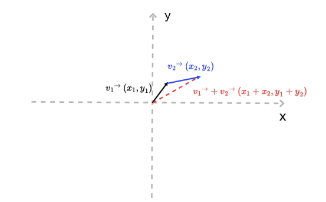

Second, a vector contains length and direction information. Its length can be expressed as the square root of the sum of the squares of the vectors x and y

```js
v.length = function(){return Math.hypot(this.x, this.y)};
```

Its direction can be expressed by its Angle to the X-axis, i.e. :

```js
v.dir = function() { return Math.atan2(this.y, this.x);}
```

In the above code, Math.atan2 ranges from -π to π, with negative numbers below the X-axis and positive numbers above it

Finally, based on the definition of length and direction, we can also derive a set of relations:

```js
v.x = v.length * Math.cos(v.dir);
v.y = v.length * Math.sin(v.dir);
```

This corollary implies an important fact: we can construct a drawing vector very simply. In other words, if we wanted to draw a line segment of length in some direction starting at the point (x0, y0), we would only need to construct one of the following vectors.

```js
// dir is the direction of a vector (the Angle with the X-axis), and length is the length of the vector
function createV1(dir, length) {
    return {
        x: length * Math.cos(dir),
        y: length * Math.sin(dir)
    }
}
var v0 = { x: 0, y: 0 }
var v1 = createV1(Math.PI / 5, 30)
// And then we add the vector (x0, y0) to this vector v1, and we get the end of this line segment
```

The corresponding methods `McGeVector3d.length` and `McGeVector3d.angleTo1` are also provided in mxcad to find the vector length and direction Angle.

There is also McGeVector3d.add for adding two vectors. You can choose to use these apis that we provide to simplify the above calculation.

In three.js there is the vector 'THREE.Vector3' and the corresponding one exists in mxcad [McGeVector3d](../../api/classes/2d.McGeVector3d.md) said in 3 d space vector (vector)

In this class there are four axes `kXAxis`, `kYAxis`, `kZAxis`, `kNegateZAxis`, which are fixed vectors respectively.

`THREE.Vector3` is completely equivalent to `McGeVector3d`, except that it is ` McGeVector3d` that participates in the computation with other data in mxcad

The following is a brief description of some vector operations provided by mxcad:

```ts
import { McGeVector3d } from "mxcad"
const vet = new McGeVector3d(1, 0, 0)
// You get THREE.Vector3
const tVet = vet.toVector3()
const newVet = new McGeVector3d(tVet)
// Rotate
tVet.rotateBy(Math.PI. McGeVector3d.kXAxis)
// Take the inverse
vet.negate()
// Vertical 90 degrees
vet.perpVector()
// Calculate the Angle between two vectors
vet.angleTo1(newVet)
vet.angleTo1(newVet,  McGeVector3d.kZAxis)
// Normalized
vet.normalize()
// Dot product
vet.dotProduct(newVet)
// Cross product
vet.crossProduct(newVet)
// Whether it is equal
vet.isEqualTo(newVet)
// The vector is multiplied by some value
vet.mult(10)
```
You can refer to the [Math library demonstration effect](#mathematical-library-demonstration-effect) click to get the vector length and Angle and get a line through a vector according to the direction and distance, to see if the corresponding method is used correctly.

The above code we use a lot of vector operations, maybe you do not understand what they represent, we roughly explain:

### vector addition and subtraction

Their calculations are relatively easy to calculate:

```js
// For example, vector v + vector v1:
(v.x + v1.x, v.y + v1.y)
// For example, vector v - vector v1:
(v.x - v1.x, v.y - v1.y)
```

So they add and subtract to get the vector. How do you understand that?


The result is that the starting point of the first vector points to the end point of the last vector vector a plus vector b, and after connecting a and b, the starting point of a points to the end point of b, that is, a + b.

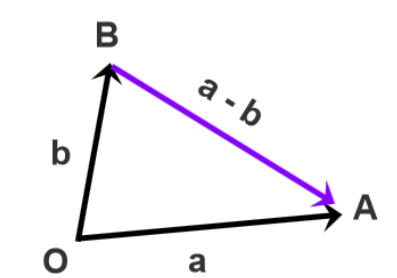
Shift the two vectors to the common starting point O, from the end point of the subtraction vector B to the end point of the subtracted vector A for the subtraction result Move the starting point of vectors a and b to the common starting point O in the lower left corner, and the vector from point B to point A is A-B.

It may be more abstract to understand, below we view the [math library demonstration effect](#mathematical-library-demonstration-effect) click on the vector to see the specific effect and source code can be easier to understand.

### Multiplication of vectors

There are two kinds of vector multiplication, one is the point product, the other is the cross product, and they have different geometric and physical meanings

If you don't quite understand it after reading it, you can click vector multiplication in the [Math Library Demonstration Effect]((#mathematical-library-demonstration-effect)) to see its practical application, reading the source code is easier to understand the concept.

#### Dot product

Suppose that we now have two n-dimensional vectors a and b, a = [a1, a2,...an], b = [b1, b2,...bn], and the dot product code of that vector is as follows:

```js
a*b = a1*b1 + a2*b2 + ... + an*bn
```

In n-dimensional linear space, the geometric meaning of the dot product of vectors a and b is that a vector is multiplied by the projected component of b vector on a vector.
Its physical meaning is equivalent to the work done by the a force acting on the object to produce the b shift. The dot product formula is shown in the figure below:
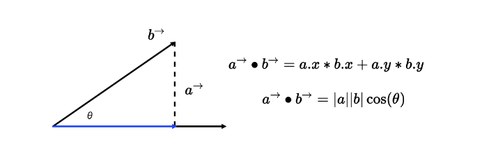

Of course, there are two special cases of dot multiplication:

If vectors a and b are parallel, the Angle between them is 0°, then a·b=|a|*|b| in JavaScript code is:

```js
a.x * b.x + a.y * b.y === a.length * b.length；
```

If vectors a and b are perpendicular, then the Angle between them is 90°, then a·b=0 in JavaScript code is:

```js
a.x * b.x + a.y * b.y === 0;
```

#### cross product

There are two differences between cross and dot products:

First, the result of the vector cross product operation is not a scalar, but a vector; Secondly, the cross product of two vectors is perpendicular to the coordinate plane formed by the two vectors

In two-dimensional space, for example, the cross product of vectors a and b is equivalent to the product of vector a (blue arrow segment) and the projection of vector b (red arrow segment) in the vertical direction
As shown in the figure below, the geometric meaning of the cross product of two-dimensional vectors is **the area of a parallelogram composed of vectors A and b**
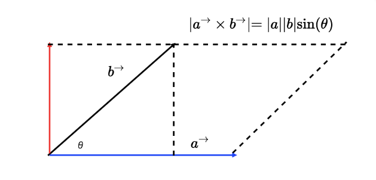

So how do you calculate the cross product mathematically? Suppose that we now have two three-dimensional vectors a(x1, y1, z1) and b(x2, y2, z2), then the cross product of a and b can be expressed as a determinant of the following figure:
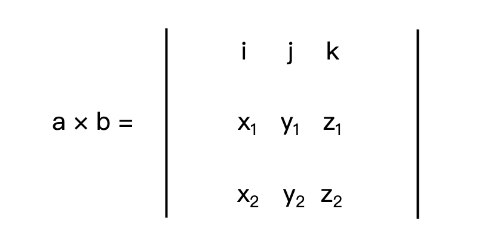

Where i, j, and k are unit vectors of the x, y, and z axes, respectively. If we expand this determinant, we get the following formula:

```js
a * b = [y1 * z2 - y2 * z1, - (x1 * z2 - x2 * z1), x1 * y2 - x2 * y1]
```

The physical meaning of the cross product in two dimensions is the moment of a and b (the moment you can think of as the tendency of an object to rotate around an axis under the action of a force).

## 3D Point McGePoint3d

This is the most commonly used class [McGePoint3d](../../api/classes/2d.McGePoint3d.md) that represents a point in 3D space.

By `x`, `y`, `z` structure composed of three double precision values, of course, McGePoint3d is essentially a vector, above we said that the vector can also represent a point.

The distinction is made because it is meant to represent a point in a coordinate system, not a quantity,

If you want to change the position of this point, you need an affine transformation, which you can do by operating on the vector to get a new point position.

The following are some of the methods commonly used in this class, mainly by performing mathematical operations with vectors to get the position of new points.

```ts
import { McGePoint3d } from "mxcad"
const pt1 = new McGePoint3d(0, 0, 0)
// or
const pt2 new McGePoint3d({ x: 0, y: 0, z: 0})

// Provides some practical methods
// Determine whether two points are equal
pt1.isEqualTo(pt2)
// Calculate the distance between two points
pt1.distanceTo(pt2)
// Sets the vector of three.js to points
pt1.setFromVector3(new THREE.Vector3())
// Get the three.js vector corresponding to the point
pt1.toVector3()

// Subtract two points to get a new vector
const vet = pt1.sub(pt2)
// Add the new position of the vector
pt1.addvec(vet)
// Short for
pt1.av(vet)

// Subtract the new position of the vector
pt1.subvec(vet)
// Short for
pt1.sv(vet)
```

Affine transformation is simply "linear transformation + translation".

For example, setting the CSS transform property on an element applies an affine transform to the element.

The affine transformation of geometric figures has the following two properties:
1. before the affine transformation is a straight line segment, after the affine transformation is still a straight line segment
2. Apply the same affine transformation to the two straight line segments a and b, and the ratio of the length of the line segment before and after the transformation remains unchanged

Common forms of affine transformation include translation, rotation, scaling, and their combinations

The easiest thing to do is shift, in mxc
In d, you can directly understand the McGePoint3d point by addvec method plus a vector McGeVector3d, which is the distance of the translation vector in the direction represented by the vector.

## Matrix McGeMatrix3d

As we know how to translate a point, we can also rotate and scale a point by linear transformations.

So what is a linear transformation? We can also use vector operations to figure out how to rotate and scale.

Just rotation and scaling, which we chose to represent in matrix form, by multiplying matrices with vectors is called a linear transformation.

In addition to satisfying the two properties of affine transformations, linear transformations have two additional properties:
1. the linear transformation does not change the origin of the coordinates (because if x0 and y0 are zero, then x and y must be zero);
2. linear transformations can be superimposed, the superposition of multiple linear transformations is to multiply the matrix of the linear transformation in turn, and then multiply with the original vector.

Then according to the second property of linear transformations, we can summarize a general linear transformation formula, that is, a primitive vector P0 passes through M1, M2,... The linear transformation of degree Mn gives the final coordinate P

In mxcad the [McGeMatrix3d](../../api/classes/2d.McGeMatrix3d.md) class represents an affine transformation of a 3D space

In general, we need to combine translation, rotation, scaling, etc. to form a variety of complex radiological transformations are represented by linear transformations,

We just need to convert the original n-dimensional coordinates to n+ 1-dimensional coordinates.
Such n+ 1-dimensional coordinates are called homogeneous coordinates, and the corresponding matrix is called homogeneous

Our McGeMatrix3d is also a homogeneous matrix, so we can make various linear transformations directly through McGeMatrix3d, and finally apply the affine transformation through the vector's `transformBy` method.

The same matrix can also be applied to all geometric entities [McDbEntity.transformBy](../../api/classes/McDbEntity.md#transformBy) in mxcad for affine transformations, because all geometric figures are based on points and lines.

We can think of a point or a line as a vector, and a radiative transformation of the entity is equivalent to a radiative transformation of all the points that make up the entity.

### Matrix multiplication

Multiplication of matrices actually corresponds to the property that linear transformations can be superimposed,

We want to form a complex affine transformation by combining matrices one by one, that is, multiplying matrices one by one and the final matrix is the complex affine transformation formed by combining matrices

Where two matrices A and B are multiplied together, in the case of A, A can choose to multiply the matrix B left or right,

So if you multiply by left, that's `B * A` and if you multiply by right, that's `A * B`

Here we can understand the difference between left and right multiplication by looking at the following figure:

Let's first assume matrix A:
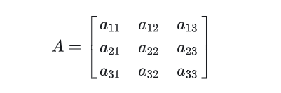

设列向量:
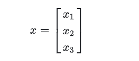

用列向量去右乘矩阵A
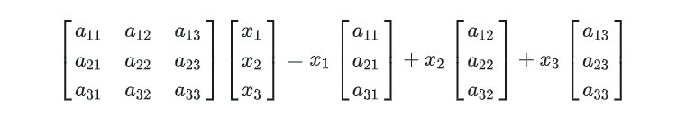

It's equivalent to taking A linear combination of the column vectors in matrix A

Multiply A matrix A by a column vector
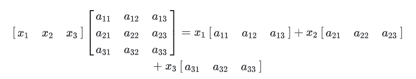

Equivalent to A left linear combination of the row vectors in matrix A

According to the above concept extended to the left and right multiplication of matrix multiplication, the idea is the same:

Set a matrix B:
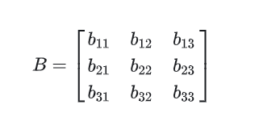

Multiply matrix A by matrix B:
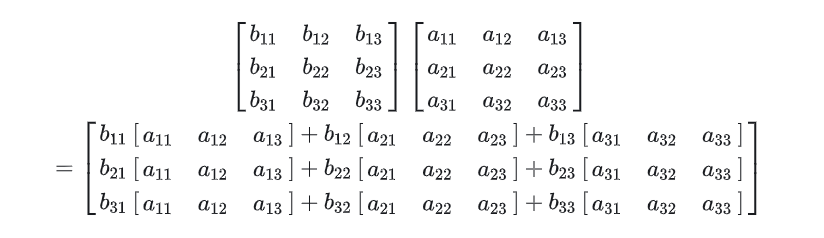

**Therefore, every row of the new matrix obtained by multiplying matrix A by matrix B is A linear combination of the row vectors of matrix A, in the same way that every column of the new matrix obtained by multiplying matrix A by matrix B is a linear combination of the column vectors of matrix A**

Here are some of the methods McGeMatrix3d offers:

```ts
import { McGeMatrix3d, McGePoint3d, McGeVector3d } from "mxcad"
// The identity matrix of multiplication
McGeMatrix3d.kIdentity

const m = new McGeMatrix3d()

const m1 = new McGeMatrix3d()

// Set to the identity matrix.
m.setToIdentity()

// Left multiply the specified matrix.
const m3 = m.preMultBy(m1)

// Right multiply the specified matrix.
m3.postMultBy(m1)

// Matrix is set to the product of two matrices.
new McGeMatrix3d().setToProduct(m1, m2)

// Inverse matrix.
m1.invert()

// Is it a singular matrix.
m1.isSingular()

// transpose
m1.transposeIt()

// Whether it is equal
m1.isEqualTo(m2)

// The determinant of the matrix.
m1.det()

// Sets the matrix to the specified coordinate system. The parameters are the origin and xyz axis
m1.setCoordSystem(new McGePoint3d(), new McGeVector3d(), new McGeVector3d(), new McGeVector3d())

// translation
m1.setToTranslation(new McGeVector3d(0, 1, 0))

// Rotation parameters: Angle, axis, center point of rotation
m1.setToRotation(Math.PI, McGeVector3d.kXAxis, new McGePoint3d())

// Scaling parameters: scaling factor, scaling center point
m1.setToScaling(0.5, new McGePoint3d())

// Set to mirror orientation matrix
m1.setMirror(new McGePoint3d(), new McGePoint3d())

// Get the scale factor
m1.scale()

// Gets the element value parameter row index and column index at the specified position in the matrix
m1.getData(0, 0)
```

How to use matrix in mxcad, you can see [math library demonstration effect](#mathematical-library-demonstration-effect) on the point rotation translation and scaling | entity affine transformation | view the specific effects and source code can be easier to understand and use.

## MxCADResbuf

[MxCADResbuf](../../api/classes/2d.MxCADResbuf.md) is a data structure used by `resbuf` (i.e. "result buffer") to pass data in CAD secondary development.

It is generally used for object attribute query, definition and storage of custom objects, XDATA (extended data) processing, and editing of drawing entities.

For example, the filter object is represented in the [MxCADSelectionSet](../../api/classes/2d.MxCADSelectionSet.md) selection set:

```ts
import { MxCADSelectionSet, MxCADResbuf  } from "mxcad"
 let ss = new MxCADSelectionSet();
 let filter = new MxCADResbuf();
// Add the query character "0" here the second argument is data type 8 in CAD secondary development indicates that this is a null pointer (RTNUL) i.e. the resbuf structure does not contain any valid data and is usually used as a terminator at the end of a linked list
 filter.AddString("0", 8);
 // Select all entities on layer 0
 ss.allSelect(filter);
 ss.forEach((objId)=> console.log(objId))
```

## calcBulge Calculates the convexity of the arc

MxCADUtility is an example provided by [MxCADUtilityClass](../../api/classes/2d.MxCADUtilityClass.md), which provides many practical ways.

[MxCADUtility.calcBulge](../../api/classes/2d.MxCADUtilityClass.md#calcBulge) Calculates the convexity of the arc.

One of the parameters for adding points to a multi-segment entity is the convexity value, and mxcad provides the calcBulge method to calculate the convexity

Three parameters are required in order: the beginning point of the arc (starting point), the middle point of the arc, and the end point of the arc (endpoint).

```ts
import { MxCADUtility, McGePoint3d, McDbPolyline } from "mxcad"
// Starting point of the arc
const startPoint = new McGePoint3d(0, 0, 0);
// Midpoint of the arc
const midPoint = new McGePoint3d(0, 0, 0);
// End point of the arc
const endPoint = new McGePoint3d(0, 0, 0);
const bulge = MxCADUtility.calcBulge(startPoint, midPoint, endPoint).val
const pl = new McDbPolyline()
pl.addVertexAt(startPoint, bulge)
pl.addVertexAt(endPoint)
```

If you do not know any of the above three parameters, refer to the figure below to calculate the convexity yourself:

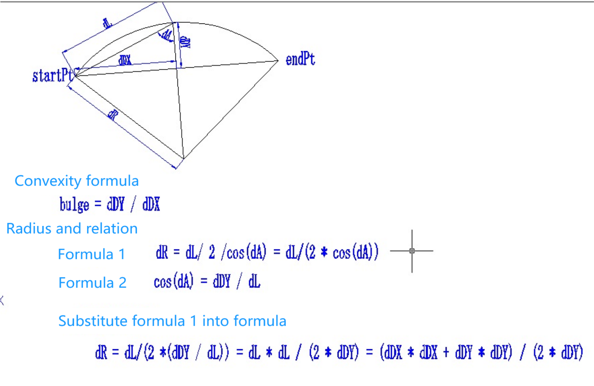

**The convexity value is half the distance between the beginning point of the arc and the end point, minus the distance from the middle point of the line connecting the beginning point of the arc and the end point to the center of the arc**

## Mathematical library demonstration effect

The demo is based on vue3 and adopts tsx mode. Please refer to [vue official website Tsx Description](https://cn.vuejs.org/guide/extras/render-function.html#jsx-tsx) to write the code (expand the code to edit).

:::demo
```tsx
import { createMxCad, McGeVector3d, McGePoint3d, McGeMatrix3d, MxCADUiPrPoint, McDbLine } from "mxcad"
import { MxFun } from "mxdraw"
import { reactive, defineComponent } from "vue"

// CAD module
const Cad = defineComponent({
     emits: ['mxcad'],
     setup(props, { emit }) {
         createMxCad({
            canvas: "#myCanvas",
            locateFile: (fileName: string)=> {
                return self.location.origin + "/mxcad_docs/wasm/2d-st/" + fileName
            },
            // The directory location where the font is loaded
            fontspath: self.location.origin + "/mxcad_docs/fonts",
            // Load the converted drawing file
            fileUrl: self.location.origin + "/mxcad_docs/empty_template.mxweb"
            })
            .then((mxcad)=> {
                emit("mxcad", mxcad)
            })
        return () => (
            <div style="height: 600px; overflow: hidden;"><canvas id="myCanvas" style="height: 300px"></canvas></div>
        )
    }
})

// Get CAD current drawing coordinates
const useMxcadDrawingCoordinates = ()=> {
    const coordinates   = reactive({
        x: 100,
        y: 100
    })
    const onGetDrawingCoordinates = (mxcad)=> {
        // Get the mxdraw control
        const mxdraw = mxcad.mxdraw
        const canvas = mxdraw.getCanvas()
        canvas.onmousemove = (e: MouseEvent)=> {
            // Screen coordinates to document coordinates
            const { x, y } = MxFun.screenCoord2Doc(e.clientX, e.clientY)
            // Document coordinates to CAD drawing coordinates
            const pt = MxFun.docCoord2Cad(x, y, 0)
            coordinates.x = pt.x
            coordinates.y = pt.y
        }
    }
    return {
        coordinates,
        onGetDrawingCoordinates
    }
}
    // Vector correlation
  const useMxCadVector3d = () => {
    // Gets the vector length and Angle
    const getVetLengthAndDir = async () => {
      const getPt = new MxCADUiPrPoint()
      getPt.clearLastInputPoint()
      getPt.setUserDraw((pt, pw) => {
        const point = new McGePoint3d(MxFun.viewCoordLong2Cad(150), MxFun.viewCoordLong2Cad(300))
        // You subtract the two points and you get a new vector
        const vet = point.sub(pt)
        pw.setColor("#f00")
        pw.drawLine(point.toVector3(), pt.toVector3())
        pw.setColor(0x00ff00)
        const midPoint = new McGePoint3d((point.x + pt.x) / 2, (point.y + pt.y) / 2)
        // Computed vector length
        pw.drawText("vector length:" + vet.length(), MxFun.viewCoordLong2Cad(20), 0, midPoint.toVector3())
        // Calculate vector direction (Angle)
        pw.drawText(" vector direction (Angle):" + (Math.atan2(vet.y, vet.x) * (180 / Math.PI)).toFixed(2) + "°", MxFun.viewCoordLong2Cad(20), 0, point.toVector3())
      })
      await getPt.go()
    }
    // You get a line through a vector based on direction and distance
    const getALineFromVectorAccordToDirectionAndDistance = async () => {
      const getPt = new MxCADUiPrPoint()
      getPt.clearLastInputPoint()
      getPt.setUserDraw((pt, pw) => {
        // Direction of the vector
        const angle = Math.PI / 3
        // Distance from screen to CAD drawing
        const dist = MxFun.viewCoordLong2Cad(150)
        // The vector is obtained from its direction and distance
        const vet = new McGeVector3d(dist * Math.cos(angle), dist * Math.sin(angle))
        // Clone the current mouse position (avoid changing the pt position) plus the position of the vector to get a new coordinate point
        const point = pt.clone().addvec(vet)
        pw.setColor("#f00")
        pw.drawLine(point.toVector3(), pt.toVector3())
        pw.setColor(0x00ff00)
        pw.drawText("The position of the point after the vector is added", MxFun.viewCoordLong2Cad(16), 0, point.toVector3())
      })
      await getPt.go()
    }
    // Vector addition and subtraction
    const callAdditionAndSubtractionOfVectors = async () => {
      const getPt = new MxCADUiPrPoint()
      getPt.clearLastInputPoint()
      // Let's say there are two vectors
      const vet1 = new McGeVector3d(0, MxFun.viewCoordLong2Cad(300))
      const vet2 = new McGeVector3d(MxFun.viewCoordLong2Cad(300), 0)
      const size = MxFun.viewCoordLong2Cad(20)
      getPt.setUserDraw((pt, pw) => {
        const draw = (color: number, vet: McGeVector3d, funName: "subvec" | "addvec", vetName: string) => {
          pw.setColor(color)
          const _pt = pt.clone()[funName](vet).toVector3()
          pw.drawLine(_pt, pt.toVector3())
          pw.drawText(`Point and vector${vetName}${funName === "addvec" ? "addition" : "subtract"}Get the points`, size, 0, _pt)
          return _pt
        }
        
        // Points add and subtract two points respectively
        pw.setColor(0xff0000)
        draw(0xff0000, vet1, "addvec", "vet1")
        draw(0xff0000, vet1, "subvec", "vet1")
        draw(0xffff00, vet2, "addvec", "vet2")
        draw(0xffff00, vet2, "subvec", "vet2")

        // The new vet3 vet4 vector is obtained by adding and subtracting the decibels of the two vectors (here, the vector addition method provided by three.js is directly used).
        const vet3 = new McGeVector3d(vet1.toVector3().add(vet2.toVector3()))
        const vet4 = new McGeVector3d(vet1.toVector3().sub(vet2.toVector3()))
        pw.setColor(0xff00ff)
        draw(0xff00ff, vet3, "addvec", "vet3")
        draw(0xff00ff, vet3, "subvec", "vet3")
        draw(0x00ff00, vet4, "addvec", "vet4")
        draw(0x00ff00, vet4, "subvec", "vet4")

        pw.setColor(0xffffff)
        pw.drawText("Point", size, 0, pt.toVector3())
      })
      await getPt.go()
    }

    // Vector multiplication
    const callVectorMultiplication = async () => {

      const getPt = new MxCADUiPrPoint()
      getPt.clearLastInputPoint()
      getPt.setUserDraw((pt, pw) => {
        let vet = new McGeVector3d(MxFun.viewCoordLong2Cad(300), 0)
        // Generates a line based on the vector vet
        const startPoint = new McGePoint3d(MxFun.viewCoordLong2Cad(300), MxFun.viewCoordLong2Cad(300))
        const endPoint = startPoint.clone().addvec(vet)
        const line = {
          startPoint,
          endPoint
        }
        // Describe the position of the point
        pw.drawText("R", MxFun.viewCoordLong2Cad(16), 0, line.startPoint.toVector3())
        pw.drawText("Q", MxFun.viewCoordLong2Cad(16), 0, line.endPoint.toVector3())
        pw.drawText("p", MxFun.viewCoordLong2Cad(16), 0, pt.toVector3())

        // The first vector is the starting point to the ending point of the segment
        vet = endPoint.sub(startPoint)

        // The second vector segment starts at the pt point
        const vet1 = pt.sub(line.startPoint)
        // Draw two vectors
        pw.setColor(0x00ffff)
        pw.drawLine(line.startPoint.toVector3(), line.endPoint.toVector3())
        pw.drawText("vector vet", MxFun.viewCoordLong2Cad(16), 0, new THREE.Vector3((line.startPoint.x + line.endPoint.x) / 2, (line.startPoint.y + line.endPoint.y) / 2))

        pw.setColor(0xffff00)
        pw.drawLine(line.startPoint.toVector3(), pt.toVector3())
        pw.drawText("vector vet1", MxFun.viewCoordLong2Cad(16), 0, new THREE.Vector3((line.startPoint.x + pt.x) / 2, (line.startPoint.y + pt.y) / 2))
        // Calculate the dot product
        const dotProduct = vet.normalize().dotProduct(vet1.normalize())
        // The Angle between the vectors is obtained by dot product
        pw.drawText("The Angle between two vectors:" + (Math.acos(dotProduct) * (180 / Math.PI)).toFixed(1) + "°", MxFun.viewCoordLong2Cad(20), Math.PI / 4, line.startPoint.clone().addvec(new McGeVector3d(-MxFun.viewCoordLong2Cad(20), 0)).toVector3())

        // Find the distance from a point to a line segment
        // Figure out the projection point N and call the beginning point R and the end point Q and the pt point P
        // Derivation: QN is known to be the projection of QP onto QR
        // QN = (QR / |QR|) * (QP·QR / |QR|) = QR * (QP·QR / |QR|²)
        // N.x - Q.x = QN.x, N.y - Q.y = QN.y
        // The vet vector inverted is the vector from the end point of QR to the start point
        const Q = line.endPoint.clone()
        const R = line.startPoint.clone()
        const P = pt.clone()

        const QP = P.sub(Q)
        const QR = R.sub(Q)
        const RP = P.sub(R)
        // Distance from point P to line segment QR
        let dist: number
        // The length of the cross product of the line from point P to QR is the area of the parallelogram/the base is the height of the parallelogram and the distance from point P to QR
        let dist1 = QP.crossProduct(QR).length() / QR.length();
        // Calculate the dot product
        let result = QP.dotProduct(QR);
        // Properties of the dot product: The result of the dot product divided by the length of QR is the length of the projection of the vector on another vector
        const QN = QR.clone().mult(result / QR.length() ** 2);
        // Get point N
        const N = Q.clone().addvec(QN)
        pw.drawText("N", MxFun.viewCoordLong2Cad(16), 0, N.toVector3())
        if (result < 0) {
          pw.setColor(0xff0000)
          pw.drawLine(Q.toVector3(), pt.toVector3())
          dist = QP.length()
        } else if (result > Math.pow(QR.length(), 2)) {
          // In geometry, the square of the shortest distance from point P to line segment QR is equal to the square of the vertical distance from point P to the line on which QR is located.
          // Therefore, when determining which side of the extension line of the QR is point P, the square of the length of the QR is used for comparison to determine the shortest distance from point P to line segment QR.
          pw.setColor(0xff0000)
          pw.drawLine(R.toVector3(), pt.toVector3())
          dist = RP.length()
        } else {
          dist = dist1
        }
        pw.setColor(0x00ff00)
        pw.drawLine(N.toVector3(), pt.toVector3())
        let text = `The distance from point P to line segment QR：${Math.floor(dist)}, The distance from point P to the line where QR is located is ${Math.floor(dist1)}`;
        pw.drawText(text, MxFun.viewCoordLong2Cad(16), 0, pt.clone().addvec(new McGeVector3d(0, MxFun.viewCoordLong2Cad(16))).toVector3())
      })
      await getPt.go()
    }
    return {
      getVetLengthAndDir,
      getALineFromVectorAccordToDirectionAndDistance,
      callAdditionAndSubtractionOfVectors,
      callVectorMultiplication
    }
  }

// Affine transformation matrix
  const useMxCadAffineTransformation = () => {
    // Rotation translation and scaling of points
    const callRotationTranslationAndScalingOfPoint = async () => {
      const getPt = new MxCADUiPrPoint()
      getPt.clearLastInputPoint()
      getPt.setUserDraw((pt, pw) => {
        // Shift the current point
        const m = new McGeMatrix3d()
        // Shift the X-axis by 300 pixels
        m.setToTranslation(new McGeVector3d(MxFun.viewCoordLong2Cad(300), 0))
        const N = pt.clone().transformBy(m)
        pw.drawText("Point N after translation", MxFun.viewCoordLong2Cad(16), 0, N.toVector3())
        pw.drawLine(pt.toVector3(), N.toVector3())

        // Point N is rotated 45 degrees about the z axis with pt as the center point
        const m1 = new McGeMatrix3d()
        m1.setToRotation(Math.PI / 4, McGeVector3d.kZAxis, pt)
        const C = N.clone().transformBy(m1)
        pw.drawText("pt", MxFun.viewCoordLong2Cad(16), 0, pt.toVector3())

        pw.drawText("C", MxFun.viewCoordLong2Cad(16), 0, C.toVector3())

        // Zoom 0.5
        const m2 = new McGeMatrix3d()
        m2.setToScaling(0.5, pt)
        // The midpoint between point pt and point C
        const D = C.clone().transformBy(m2)
        pw.drawText("Point N is rotated 45 degrees around the z axis with pt as the center point to get point C", MxFun.viewCoordLong2Cad(20), 0, D.toVector3())
        pw.drawLine(pt.toVector3(), C.toVector3())

        // We rotate it 45 degrees around the Z axis then scale it by 0.5 times and then reverse shift
        const m3 = m1.clone().postMultBy(m2).postMultBy(m.invert())
        const F = C.clone().transformBy(m3)
        pw.drawText("F", MxFun.viewCoordLong2Cad(20), 0, F.toVector3())
        pw.drawLine(F.toVector3(), pt.toVector3())
        const midF = F.clone().transformBy(m2)
        pw.drawText("Point C rotates 45 degrees around the Z axis then scales by 0.5 times and then shifts backwards", MxFun.viewCoordLong2Cad(20), 0, midF.toVector3())
      })
      await getPt.go()
    }

    // Affine transformation of entities
    const callEntityAffineTransformation= async () => {
      const getPt = new MxCADUiPrPoint()
      getPt.clearLastInputPoint()
      const startPoint = new McGePoint3d()
      getPt.setUserDraw((pt, pw) => {
        const line = new McDbLine(startPoint, pt)
        pw.setColor(0xffffff)
        pw.drawMcDbEntity(line)
        // Shift the current line segment
        const m = new McGeMatrix3d()
        // Shift the X-axis by 300 pixels
        m.setToTranslation(new McGeVector3d(MxFun.viewCoordLong2Cad(300), 0))

        line.transformBy(m)
        pw.setColor(0xff0000)
        pw.drawMcDbEntity(line)

        pw.drawText("Translated line segment", MxFun.viewCoordLong2Cad(20), 0, line.endPoint.toVector3())

        const m1 = new McGeMatrix3d()
        // The zoom center point is the midpoint between the drawing origin and the current mouse point
        const sPt = new McGePoint3d(pt.x/ 2, pt.y / 2) 
        m1.setToScaling(0.5, sPt)
        line.transformBy(m1)
        pw.setColor(0xff00ff)
        pw.drawMcDbEntity(line)
        pw.drawText("Scale the line segment by 0.5 times", MxFun.viewCoordLong2Cad(20), 0, new McGePoint3d((line.startPoint.x + line.endPoint.x) / 2, (line.startPoint.y + line.endPoint.y) / 2).toVector3())
        
        const m2 = new McGeMatrix3d()
        m2.setToRotation(Math.PI / 2, McGeVector3d.kZAxis, line.startPoint)
        line.transformBy(m2)
        pw.setColor(0x00ff00)
        pw.drawMcDbEntity(line)
        pw.drawText("Rotated 90° line segment", MxFun.viewCoordLong2Cad(20), 0, new McGePoint3d((line.startPoint.x + line.endPoint.x) / 2, (line.startPoint.y + line.endPoint.y) / 2).toVector3())
        
        // Matrix multiplication
        const m3 = m1.postMultBy(m2).postMultBy(m)
        const line1 = new McDbLine(new McGePoint3d(), pt)
        line1.transformBy(m3)
        pw.setColor(0x00ffff)
        pw.drawMcDbEntity(line1)
        pw.drawText("Line segments applied after matrix multiplication", MxFun.viewCoordLong2Cad(20), 0, new McGePoint3d((line1.startPoint.x + line1.endPoint.x) / 2, (line1.startPoint.y + line1.endPoint.y) / 2).toVector3())
      })
      await getPt.go()
    }
    return {
      callRotationTranslationAndScalingOfPoint,
      callEntityAffineTransformation
    }
  }
const App = ()=> {
    const { coordinates, onGetDrawingCoordinates } = useMxcadDrawingCoordinates()
    const { getVetLengthAndDir, getALineFromVectorAccordToDirectionAndDistance, callAdditionAndSubtractionOfVectors, callVectorMultiplication } = useMxCadVector3d()
    const { callRotationTranslationAndScalingOfPoint, callEntityAffineTransformation } = useMxCadAffineTransformation()
    return (props, context) => {
        const onMxcad = (mxcad)=> {
            onGetDrawingCoordinates(mxcad)
        }
        return (
        <div>
            <Cad onMxcad={onMxcad} />
            <div>CAD drawing coordinate x: {coordinates.x}, y: {coordinates.y}</div>
            <div>
                Vector correlation:
                <button onClick={getVetLengthAndDir}> Gets the vector length and Angle </button>|
                < button onClick = {getALineFromVectorAccordToDirectionAndDistance} > according to the direction and distance is obtained by a vector line </ button> |
                < button onClick = {callAdditionAndSubtractionOfVectors} > vector and subtract </button> |
                <button onClick={callVectorMultiplication}> Multiply a vector </button>|
                <br/>
                Matrix affine transformation:
                <button button onClick = {callRotationTranslationAndScalingOfPoint} > to point the rotation of the pan and zoom </button > |
                <button button onClick = {callEntityAffineTransformation} > entity for affine transformation </button> |
            </div>
        </div>
        )
    }
}
export default App()

```
:::
