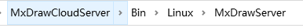
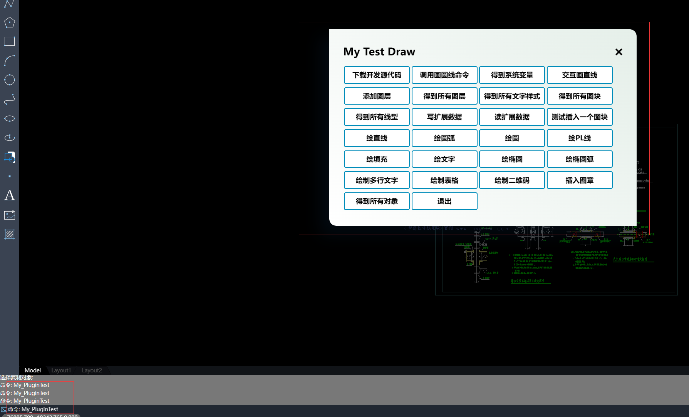

# MxCAD APP application integration

We have developed a complete online CAD application according to mxcad development kit, which includes the realization of drawing, editing, text style setting, layer setting, line setting and other functions.

At the same time, we provide a plug-in development interface, users can carry out secondary development on the basis of the interface, so that users can reduce the workload of scratch development, and can quickly integrate a complete CAD project into the project that users need.

We recommend using iframe technology to integrate the functionality of our MxCAD App into the target project.

Click on the [download the sample demo source](https://demo.mxdraw3d.com:3562/MxCADCode.7z)

:::tip Note
After downloading and unziving the demo source code, we need to go to the 'Edit\2d' directory, where our target projects are stored, and its structure is as follows:

- dist: Front-end resources after MxCAD APP is packaged online

- MxCAD: Secondary development project of MxCAD APPP plug-in (users can develop functions on this basis)

- MxCADiframe: A sample demo of embedding MxCAD APP via iframe
  :::

## Run the Demo description

1. Go to the MxCAD directory and run npm install to install the dependency.

2. run the 'npm run dev' command to run MxCAD APP online CAD.

After running, visit http://localhost:3366/, and the effect is as follows:

3. run the 'npm run build' command to package the demo.

4. Go to the MxCADiframe directory and run npm install to install the dependency.

5. In its src/components/Home.vue, set the src attribute of iframe to the URL just visited by MxCAD :http://localhost:3366/

6. run the debugging MxCADiframe project command: 'npm run serve'.

The effect after operation is as follows:

:::tip Note

If you open the MxCADiframe project directly, the drawing cannot be obtained or the iframe message localhost has rejected the connection, because the project in the MxCAD directory has not been started.

:::

Users can refer to the above MxCADiframe project implementation, in their own front-end project with iframe embedded MxCad online editing project.

:::tip Tip

MxCAD directory Description:

- Based on vite, you can directly run the startup server through npm run dev to browse the page of dist directory, and modify the.ts and.vue files in MxCAD will be automatically compiled and automatically refresh the page.

- Based on vite, you need to manually run 'npm run build' to package the dist directory, and after packaging the dist directory is directly placed in dist/plugins.

- `import` The import of mxcad, mxdraw, and vue is actually used in the front-end resources of dist packaging, not a new mxcad, mxdraw, and vue.

- The configuration of plugins in vite.config.ts and dist/plugins/config.json in the MxCAD directory must correspond.

:::

## Description of back-end services

MxCAD APP online CAD when running, will access the following service interface, such as save, open DWG file interface, we need to start MxDraw cloud image development kit in the background service program, So we need to [first download MxDraw cloud development kit](https://www.mxdraw.com/download.html), Learn how to use the MxDraw Cloud Graphics Development Kit from the Getting Started Documentation (https://help.mxdraw.com/?pid=32).

1. Download the MxDraw cloud image development package and decompress it to the target directory.

2. Double-click the Mx3dServer.exe application
   

3. Click Start web Service
   

:::tip Tip

To realize the service interface of uploading drawings and saving drawings, you need to read the related documents of MxDraw cloud diagram development kit in detail :<https://help.mxdraw.com/?pid=32>, and then refer to the corresponding interface source code of MxDraw cloud diagram development kit to implement it according to your own needs. Or directly reuse MxDraw cloud image development kit to provide a good interface.

:::

## MxCAD APP online CAD preparation instructions

dist directory of online CAD is the front-end resource after packaging. We can prepare MxCAD APP by modifying the configuration file in this directory.

dist directory several important configuration files:

1. mxUiConfig.json: UI configuration file. Some configuration attributes are described as follows (See the configuration file for details).

- title: browser title
  

- headerTitle: Add `<version>` to automatically replace the version number
  

- mTitleButtonBarData: prompt in the array element, cmd represents a command, clicking the button will execute a command
  

- mRightButtonBarData and mLeftButtonBarData: isShow indicates whether it is displayed
  

- mMenuBarData: list Menu list can always be nested in the list to form a multi-level menu
  

- footerRightBtnSwitchData: ["grid", "orthogonal", "pole", "object capture", "tracking", "DYN"] shows that correspond to the name of the button, an empty array will not display
  

2. mxServerConfig.json: service configuration file. Some configuration attributes are described as follows.

- uploadFileConfig: is based on the [WebUploader] (http://fex.baidu.com/webuploader/) to realize the file upload, it is part of the configuration parameters, upload the backend interface specifications are as follows:

- baseUrl: indicates the same background server address. The following relative interfaces are based on the same server address
  The default background service source location is in the cloud map development package:
  windows:
  
  linux:
  

- saveDwgUrl: Save DWG file service address, how to implement the interface can provide subsequent development kit
  Default file saving Node service location:
- wasmConfig: The configuration here distinguishes which WASM-related file to use, and see the configuration file in dist for details

plugins/config.json: plug-in configuration file. Some of its properties are described as follows.

- plugins: Is the file that stores the name of the plug-in, it will load the script corresponding to the js corresponding name in the current directory in order, such as a plugins/test.js to fill in a test, you can write your own need to extend the function in these js files, you can ask mxcad globally in the window petition, It is not good to write js directly, and the MxCAD directory is used to package the js project and create the corresponding js file in dist/plugins, as shown in the figure:

:::tip Tip
The MxCAD and vue introduced in the mxcad project are actually mxcad and vue in the cadDemo, and this js file is a secondary development extension for cadDemo. The MxCADiframe project demonstrates how to integrate cadDemo packaged resources into an iframe.
:::

## Test Demo use cases

In the src folder under the MxCAD directory, we provide some of the functional test cases implemented through the mxcad library, and users can run these functions from the test button on the page or from the command line.

The corresponding code of the function can also be searched in the source code through the command to find the corresponding implementation

Once the plug-in is developed, run 'npm run build' to package it into the dist/plugins directory.

In addition, there is a 'ifame.ts' file in the src directory, which corresponds to postMessage in the MxCADiframe project.

## Keyboard shortcuts

### Menu shortcuts

Open menu, press `Ctrl` and corresponding characters in parentheses such as `E`, open menu  
When a menu is open, pressing the character in brackets of the corresponding menu item will trigger the command for that menu item.  
Like Ctrl+E and then N is a new command.

### Quick keys in pop-up

When you open a shortcut, if an operation button or tab is paired with parentheses such as `(E)`, pressing `E` will execute the corresponding action.

### Global shortcuts

:::tip Keyboard shortcut tip  
 Some hotkeys conflict with browser hotkeys, and only work in full screen mode  
:::
Ctrl+A will select all objects.  
Ctrl+C copies all selected objects  
Ctrl+Shift+C to copy all selected objects with a base point  
Ctrl+Shift+V will paste copied objects as blocks inserted  
Ctrl + X to cut selected objects  
Ctrl + V will paste the copied object. External copy texts and pictures can also be pasted (without copying objects).  
Ctrl+N New File  
Ctrl+O Open file  
Ctrl + P Print  
Ctrl + S to save file  
Ctrl + Z to undo an operation  
Ctrl + Y to restore operation  
Delete operation of deleting objects  
14. F8 to enable or disable orthogonal  
15. F7 to open or close grid  
16. F10 to open or close polar axis  
17. To turn on or off object snap, press F9 or F3.  
18. F11 to turn on or off object tracking

## Brief description of command implementation

:::tip Command description tip  
If there is no specific location description, it means that this command is an internal command or a test command. The source code implementation of most commands can be found in the secondary development project of MXCAD: MXCAD APPP plugin  
:::

### Draw a polygon Mx_Polygon

Draw a polygon with any number of sides.  
Location: "Menu bar" → "Drawing" → "Polygon"

### Copy to clipboard Mx_CopyClip

Copy selected content to clipboard for pasting elsewhere.  
Location:"Edit menu" → "Copy"

### Cut to clipboard Mx_CutClip

Cut selected content to clipboard, and original position will be deleted.  
Location:"Edit menu" → "Cut"

### Copy base Mx_CopyBase

It may be used to copy a specific reference point or object.  
Location: Not yet determined.

### Paste clipboard content Mx_PasteClip

Paste content from clipboard to current position.  
Location:"Edit menu" → "Paste"

### Paste Block Mx_PasteBlock

Paste a block object from the clipboard to the current drawing.  
Location:"Edit menu" → "Paste block"

### Select all Mx_select_all

Select all objects in the current graphic.  
Location:"Edit menu" → "Select All"

### Open file options Mx_open_file_options

Provide options for opening files.  
Location:"File menu" → "Open options"

### Open record file Mx_openRecordsFile

Open a specific record file.  
Location: "File menu" → "Open Record File"

### Bezier Curve \_SampleCurve

Used to create spline curves.  
Location:"Drawing menu" → "Spline Curve"

### Draw rotated dimension \_DrawRotatedDimension

Draw dimension annotations with a rotation angle.  
Location:"Annotation menu" → "Rotate dimension"

### Draw aligned dimension \_DrawAlignedDimension

Draw dimension annotations aligned with objects.  
Location:"Annotation menu" → "Align dimensions"

### Rotate a plane by 90 degrees counterclockwise Mx_Plan90CCW

Rotate the plane counterclockwise by 90 degrees.  
Location:"View menu" → "Plane rotation"

### Planar operations Mx_Plan

It may involve related settings and operations on a plane.  
Location: Not yet determined.

### View Color \_ViewColor

Used to set color display of view.  
Location:"View menu" → "Color settings"

### Revise Cloud Line \_Revcloud

Draw revision clouds, which are often used to identify areas that have been modified or need attention.  
Location:"Drawing menu" → "Revision Cloud Lines"

### Print Plot

Perform a print operation.  
Location:"File menu" → "Print"

### Pencil tool MxET_Pencil

It can be used for hand-drawn or freehand drawing.  
Location:"Drawing Toolbar" → "Pencil"

### Full screen display MxFullScreen

Switch to full-screen mode.  
Location:"View menu" → "Full screen display"

### Circle \_donut

Draw a circular shape.  
Location:"Drawing menu" → "Circle"

### Angle annotation \_dimangular

Used to annotate angle dimensions.  
Location:"Annotation menu" → "Angle annotation"

### Stretch \_stretch

Stretch selected objects.  
Location:"Edit menu" → "Stretch"

### Watermark \_watermark

Add a watermark to an image.  
Location:"Insert menu" → "Watermark"

### Draw diametric dimension \_DrawDiametricDimension

Draw a diameter dimension for an object.  
Location:"Annotation menu" → "Diameter annotation"

### Draw radial dimension \_DrawRadialDimension

Draw radial dimension annotations for objects.  
Location:"Annotation menu" → "Radial annotation"

### Open MxWeb Mx_openMxweb

Open a specific MXWeb page or feature.  
Location: Not yet determined.

### Measure distance Mx_MxMeasurementDistance

Measure distance between two points.  
Location:"Measurement menu" → "Distance measurement"

### Measure Geometry MEASUREGEOM

Measure geometric shapes.  
Location:"Measurement menu" → "Geometric measurement"

### Identifier ID

It may be used to add identifiers or identification information for an object.  
Location: Not yet determined.

### Bezier curve Mx_Spline

Create a spline curve.  
Location:"Drawing menu" → "Spline Curve"

### Open a DWG file. OpenDwg

Open a drawing file in the DWG format.  
Location: "File menu" → "Open" → "DWG file"

### Open a DWG file (without using cache) OpenDwg_DoNotUseCache

Open a DWG file without using cache.  
Location: "File menu" → "Open" → "DWG file (without cache)"

### Import a DWG file (without using cache) OpenDwgImp_DoNotUseCache

Import a DWG file without using cache.  
Location: "File menu" → "Import" → "DWG file (without cache)"

### Importing a DWG file. OpenDwgImp

Import a file in DWG format.  
Location: "File menu" → "Import" → "DWG file"

### Save As Mx_SaveAs

Save current graph as a new file.  
Location: "File menu" → "Save As"

### Quick Save Mx_QSave

Save changes to current graph quickly.  
Location: "File menu" → "Quick Save"

### Export DWG Mx_Export_DWG

Export current graphics to a file in DWG format.  
Location: "File menu" → "Export" → "DWG file"

### Debugging Mx_debug

Used for debugging operations.  
Location: Not yet determined.

### Clear buffer Mx_clear_buf

Clears system buffer data.  
Location: Not yet determined.

### Array Mx_Array

Perform array copy operation on selected object.  
Location:"Edit menu" → "Array"

### New file Mx_NewFile

Create a new graphics file.  
Location: "File menu" → "New"

### Create a new file based on template Mx_NewFile_Template

Create a new graphic file according to specified template.  
Location:"File menu" → "New" → "Based on template"

### Draw multi-line texts. MxPE_DrawMText

Draw multi-line content.  
Location:"Drawing menu" → "Multiline Text"

### Front-end web page intelligent selection Mx_FrontEndWebpageIntelliSel

Perform intelligent selection operations in front-end web pages.  
Location: Not yet determined.

### Front-end web page grip edit Mx_FrontEndWebpageGripEdit

Edit the snap points in a front-end web page.  
Location: Not yet determined.

### Graphical Grips Edit McDraw_GripEdit

Edit handles of a graphical object.  
Location: Not yet determined.

### Undo Mx_Undo

Undo the previous operation.  
Location:"Edit menu" → "Undo"

### Redo Mx_Redo

Undo the operation that was undone.  
Location:"Edit menu" → "Redo"

### Pan View Mx_Pan

Pan to view different areas.  
Location: "Top button bar" → "View area pan"

### Draw an image. Mx_DrawImage

Insert an image in a graphic.  
Location:"Insert menu" → "Image"

### Model fixed SVG Mx_ModelFixedSvg

It may be used to display a fixed view of the model in SVG format.  
Location: Not yet determined.

### Draw a straight line segment. Mx_Lines

Draw a straight line segment.  
Location: "Left button bar" → "Draw line command"

### Angle measurement Mx_AngleSurveying

Measure angle values.  
Location:"Measurement menu" → "Angle measurement"

### Draw an arc with three points Mx_3PointArc

Draw an arc by specifying three points.  
Location:"Drawing menu" → "Arc" → "Three-point arc"

### Draw an arc with two points Mx_2PointArc

Draw an arc by specifying two points.  
Location: "Drawing menu" → "Arc" → "Two-point arc"

### Coordinate operations Mx_Coord

It may involve related settings and operations of coordinates.  
Location: Not yet determined.

### Draw a straight line Mx_Line

Draw a straight line.  
Location:"Drawing menu" → "Line"

### Draw a rectangle Mx_DrawRect

Draw a rectangle.  
Location:"Drawing menu" → "Rectangle"

### Measurement of dimensions Mx_DimensionMeasurement

Measure dimensions of a graphic object.  
Location:"Annotation menu" → "Dimension measurement"

### Area measurement Mx_Area

Measure the area of a shape.  
Location:"Measurement menu" → "Area measurement"

### Lead Tag Mx_LeadTag

Draw a labeled annotation with a lead.  
Location:"Annotation menu" → "Leader Annotation"

### Any line Mx_AnyLine

You can draw any form of straight line.  
Location:"Drawing menu" → "Line"

### Cloud Line Mx_CloudLine

Draw cloud-like lines.  
Location:"Drawing menu" → "Cloud line"

### Regular polygon Mx_RegularPolygon

Draw regular polygons.  
Location:"Drawing menu" → "Regular polygon"

### Comment Mx_Comment

Add comment content.  
Location:"Comment menu" → "Comments"

### Check drawing Mx_CheckDraw

It may be used to check the accuracy or completeness of drawing.  
Location: Not yet determined.

### Ellipse Mx_Ellipse

Draw an ellipse.  
Location:"Drawing menu" → "Ellipse"

### Text Mx_Text

Enter the content of the text.  
Location:"Drawing menu" → "Text"

### Elliptical arc Mx_MxDbEllipseArc

Draw an elliptical arc.  
Location:"Drawing menu" → "Elliptical arc"

### Arcs Mx_MxDbCircleArc

Draw an arc.  
Location:"Drawing menu" → "Arc"

### Arc shape Mx_MxDbArcShape

Draw an arc shape.  
Location:"Drawing menu" → "Arcs"

### Circular shape Mx_MxDbRingShape

Draw a circular shape.  
Location:"Drawing menu" → "Circle"

### Star shape Mx_MxDbStarShape

Draw a star shape.  
Location:"Drawing menu" → "Star"

### Arrow Mx_MxDbArrow

Draw an arrow.  
Location:"Drawing menu" → "Arrow"

### Bezier curve Mx_Spline

Create a spline curve.  
Location:"Drawing menu" → "Spline Curve"

### Circle Mx_Circle

Draw a circle.  
Location:"Drawing menu" → "Circle"

### Point Mx_Point

Draw a point.  
Location:"Drawing menu" → "Point"

### Multiline Mx_Pline

Draw a polyline.  
Location:"Drawing menu" → "Polyline"

### Arc Mx_Arc

Draw an arc.  
Location:"Drawing menu" → "Arc"

### Ellipse Mx_Ellipse

Draw an ellipse.  
Location:"Drawing menu" → "Ellipse"

### Delete Mx_Erase

Delete selected objects.  
Location:"Edit menu" → "Delete"

### Copy Mx_Copy

Copy selected objects.  
Location:"Edit menu" → "Copy"

### Move Mx_Move

Move selected object to a new location.  
Location:"Edit menu" → "Move"

### Rotate Mx_Rotate

Rotate selected objects.  
Location:"Edit menu"->"Rotate"

### Scale Mx_Scale

Zoom in on selected objects.  
Location:"Edit menu" → "Zoom"

### Window Zoom Mx_WindowZoom

Zoom in or out by specifying a window range.  
Location:"View menu" → "Window Zoom"

### Zoom range Mx_ZoomE

Adjust the display range of graphics to be fully visible.  
Location:"View menu" → "Zoom range"

### Rotate a plane by 90 degrees clockwise Mx_Plan90CW

Rotate the plane clockwise by 90 degrees.  
Location:"View menu" → "Plane rotation"

### Offset Mx_Offset

Offset copy of selected object.  
Location:"Edit menu" → "Offset"

### Regeneration Mx_Regen

Recreate graphics display.  
Location:"View menu" → "Regenerate"

### Mirror Mx_Mirror

Mirror selected objects.  
Location:"Edit menu"->"Mirror"

### Bevel Mx_Chamfer

Create chamfers between two lines.  
Location:"Edit menu" → "Chamfer"

### Round corners Mx_Fillet

Create rounded corners between two lines.  
Location:"Edit menu" → "Rounded corners"

### Trim Mx_Trim

Trim objects to a specified boundary.  
Location:"Edit menu" → "Trim"

### Extend Mx_Extend

Extend an object to a specified boundary.  
Location:"Edit menu" → "Extend"

### Decompose Mx_Explode

Break down a composite object to individual objects.  
Location:"Edit menu" → "Decompose"

### Merge Mx_Join

Merge multiple objects into one object.  
Location:"Edit menu" → "Merge"

### Break Mx_Break

Break at a specified location on an object.  
Location:"Edit menu" → "Interrupt"

### Draw order placed on top of all other layers. Mx_DrawOrderTopmost

Place the drawing order of objects on top.  
Location:"Show menu"->"Drawing order"

### Draw order placed at bottommost Mx_DrawOrderButtomost

Place the drawing order of objects at the bottom.  
Location:"Show menu"->"Drawing order"

### Draw order on top of the stack Mx_DrawOrderTop

Place the drawing order of objects on top.  
Location:"Show menu"->"Drawing order"

### Draw order is placed at the bottom. Mx_DrawOrderButtom

Place the drawing order of objects on the bottom.  
Location:"Show menu"->"Drawing order"

### Draw a rectangle Mx_Rectang

Draw a rectangle.  
Location:"Drawing menu" → "Rectangle"

### List list

It may be used to generate a list of objects or display related information.  
Location: Not yet determined.

### Plugin Test My_PluginTest

Test operation on plug-in.  
Location: Not yet determined.

### Extension tools My_Extool

It may be related to specific extension tool operations.  
Location: Not yet determined.

### Open demo code Mx_Open_DemoCode

Open the code for demonstration.  
Location: Not yet determined.

### Open development installation Mx_Open_DevInstall

Open an installation program or setting related to development.  
Location: Not yet determined.

### Open Map Mx_Open_Map_gdslwzj

Open a specific map, gdslwzj.  
Location: Not yet determined.

### Open Map Mx_Open_Map_gdyx

Open a specific map, gdyx.  
Location: Not yet determined.

### Open Map Mx_Open_Map_tdtsl

Open a specific map, tdtsl.  
Location: Not yet determined.

### Open Map Mx_Open_Map_bdsl

Open a specific map, bdsl.  
Location: Not yet determined.

### Open Map Mx_Open_Map_geoq

Open a specific map, geoq.  
Location: Not yet determined.

### Open Map Mx_Open_Map_googlecn

Open a specific Google China map.  
Location: Not yet determined.

### View background color Mx_ViewBackgroundColor

Set the background color of a view.  
Location:"View menu" → "Background color"

### Test extended properties Mx_TestExProp

Extend properties of test objects.  
Location: Not yet determined.

### Test open file Mx_Test_OpenFile

Test the function of opening files.  
Location: Not yet determined.

### Test to get file Mx_Test_GetFile

Test file operations.  
Location: Not yet determined.

### Test extended properties Mx_TestExProp

Extend properties of test objects.  
Location: Not yet determined.

### Select Entity Hide Layer Mx_SelectEntitHideLayer

Select an entity object located on a hidden layer.  
Location: Not yet determined.

### Test add current selection MxTest_TestAddCurrentSelect

Test adding current selection.  
Location: Not yet determined.

### Test Set View Angle MxTest_TestSetViewAngle

View the angle of the test settings view.  
Location: Not yet determined.

### Text Zoom Center MxText_ZoomCenter

Set the zoom center of the text.  
Location: Not yet determined.

### Test map download MxTest_Map_Download

Download function of test map.  
Location: Not yet determined.

### Test drawing images Mx_Test_DrawImage

Test drawing operations on images.  
Location: Not yet determined.

### Test Modify Image Mx_Test_ModifyImage

Test the image modification function.  
Location: Not yet determined.

### Test drawing a three-dimensional polyline. Mx_Test_Draw3DPolyline

Test the function of drawing 3D polyline.  
Location: Not yet determined.

### Temporary test MxTemp_Test

Temporary test operation.  
Location: Not yet determined.

### Test intersection and Mx_Test_IntersectWith

Test for intersections between test objects.  
Location: Not yet determined.

### Test offset draw line Mx_Test_OffsetIn_DrawLine

Test offset operations when drawing lines.  
Location: Not yet determined.

### Test Create Group Mx_Test_CreateGroup

Test the function of creating a group.  
Location: Not yet determined.

### Screen shot to JPG Mx_ScreenToJpg

Save a screenshot as an image in JPEG format.  
Location: Not yet determined.

### Compare DWG files Mx_CompareDWG

Compare differences between two DWG files.  
Location: Not yet determined.

### Test drawing a marked circle Mx_Test_DrawMarkCircle

Test drawing a marked circle.  
Location: Not yet determined.

### Test Erase Mx_Test_Wipeout

Test drawing a mask layer

### Test drawing a straight line. Mx_Test_DrawLine

Test related functions and effects of drawing straight lines.  
Location: Not yet determined.

### Test drawing an arc Mx_Test_DrawArc

Test drawing arcs and their behavior.  
Location: Not yet determined.

### Test drawing a circle Mx_Test_DrawCircle

Test the function of drawing a circle.  
Location: Not yet determined.

### Test drawing a polyline. Mx_Test_DrawPolyline

Check whether the function of drawing multi-segment lines is normal.  
Location: Not yet determined.

### Test drawing fill Mx_Test_DrawHatch

Test to draw a filled pattern.  
Location: Not yet determined.

### Test drawing text Mx_Test_DrawText

Check related functions of drawing texts.  
Location: Not yet determined.

### Test drawing an ellipse Mx_Test_Ellipse

Verify that you can draw an ellipse.  
Location: Not yet determined.

### Test drawing an ellipse arc Mx_Test_EllipseArc

To draw an ellipse arc.  
Location: Not yet determined.

### Test drawing multi-line text Mx_Test_MText

Test the function of drawing multi-line texts.  
Location: Not yet determined.

### Test drawing text Mx_Test_Text

To evaluate the performance of drawing common texts.  
Location: Not yet determined.

### Parametric drawing of straight lines Mx_ParamDrawLine

Draw a straight line according to specific parameters.  
Location: Not yet determined.

### Test drawing aligned dimension annotations Mx_Test_DimAligned

Test drawing functions of alignment annotations.  
Location: Not yet determined.

### Test drawing rotated dimensions Mx_Test_DrawDimRotated

Check the drawing of rotation annotations.  
Location: Not yet determined.

### Test drawing angle annotations Mx_Test_DrawDimAngular

Test the drawing effect of angle annotation.  
Location: Not yet determined.

### Test real text Mx_Test_TrueText

Verify that real text is displayed and processed.  
Location: Not yet determined.

### Linear Mx_Linear

Operations or settings that are possibly related to linear.  
Location: Not yet determined.

### Angle measurement BR_AngleMeasure

Used to measure angles.  
Location: Not yet determined.

### Coordinate measurement BR_CoordMeasure

Measure coordinate-related data.  
Location: Not yet determined.

### Test Select Entity MxTest_SelectEntity

Test entity selection functionality.  
Location: Not yet determined.

### Test to get all entities. TestGetAllEntity

Get all entity objects in current graphics.  
Location: Not yet determined.

### Test to get system variables MxTest_GetSysVars

Get related variables of system settings.  
Location: Not yet determined.

### Test reading X data MxTest_ReadxData

Read specific X data.  
Location: Not yet determined.

### Test write x data MxTest_WritexData

Write data X to a specified location.  
Location: Not yet determined.

### Test drawing table Mx_Test_DrawTable

Draw a test table.  
Location: Not yet determined.

### Test generate QR code Mx_Test_QRCode

Test operation to generate a QR code.  
Location: Not yet determined.

### Test Insert Stamp MxTest_InsertStamp

Test inserting a stamp.  
Location: Not yet determined.

### Test line type MxTest_LineTypeTest

Perform a correlation test on the line.  
Location: Not yet determined.

### Test generating entities according to layers. TestGentEntityOnLayer

Generate an entity object based on a specific layer.  
Location: Not yet determined.

### Test to get named object dictionary. MxTest_GetNamedObjectsDictionary

Get dictionary information of named objects.  
Location: Not yet determined.

### Test to get object extended dictionary data. MxTest_GetObjectExDictionaryData

Get extended dictionary data of an object.  
Location: Not yet determined.

### Test Write X Record MxTest_WriteXRecord

Write data to X record.  
Location: Not yet determined.

### Test adding a text style table. MxTest_AddTextStyleTable

Add a table with text styles.  
Location: Not yet determined.

### Test change color Mx_Test_ChangeColor

Change the color of an object.  
Location: Not yet determined.

### Test change visibility Mx_Test_ChangeVisible

Adjusts the visibility state of an object.  
Location: Not yet determined.

### Test change entity layer Mx_Test_ChangeEntityLayer

Move an entity object to a different layer.  
Location: Not yet determined.

### Change entity drawing order. Mx_ChaneEntityDrawOrder

Adjusts the drawing order of entity objects.  
Location: Not yet determined.

### Mx compare Mx_MxCompare

Compare two Mx objects.  
Location: Not yet determined.

### Export to PDF Mx_Export_Pdf

Export a graphic as a PDF file.  
Location: Not yet determined.

### Cut DWG file Mx_Cut_Dwg

Cut operation on DWG file.  
Location: Not yet determined.

### Find Text Mx_FindText

Find specified text content in a graphic.  
Location: Not yet determined.

### Block Library Mx_BlockLibrary

A library for storing and managing blocks.  
Location: Not yet determined.

### Drawing Library Mx_DrawingsLibrary

The library for saving drawings.  
Location: Not yet determined.

### Code Editor Mx_CodeEditor

Tools for editing code.  
Location: Not yet determined.

### Data display in database Mx_DatabaseDisplay

Display information about a database.  
Location: Not yet determined.

### Properties Mx_Properties

View and edit object properties.  
Location: Not yet determined.

### Run code runCode

Execute the code you have written.  
Location: Not yet determined.

### Insert Mx_Insert

Insert a block into the drawing.  
Location: Not yet determined.

### Add Insert Block List Mx_add_insert_blocks_list

Add a list of blocks for insertion.  
Location: Not yet determined.

### Edit Text Mx_EditText

Edit existing content.  
Location: Not yet determined.

### Draw Text \_DrawText

Draw a text object.  
Location: Not yet determined.

### Show Walk Through Layers showWalkThroughLayers

Show all layers and traverse.  
Location: Not yet determined.

### Open all layers \_OpenAllLayer

Open all layers in the graphic.  
Location: Not yet determined.

### Close layer \_SelOffLayer

Close selected layers.  
Location: Not yet determined.

### Layer Recovery \_layer_recovery

Restore a layer to its previous state.  
Location: Not yet determined.

### Set current layer \_layer_putCurrent

Set the selected layer as current layer.  
Location: Not yet determined.

### Layer matching \_layer_matching

Match layers.  
Location: Not yet determined.  
Set an object to current layer \_layer_setEntToCurrentLayer  
Move selected object to current layer.  
Location: Not yet determined.

### Copy objects to new layer \_layer_CopyObjectsToNewLayer

Copy objects to a newly created layer.  
Location: Not yet determined.

### Freeze layer \_layer_freeze

Freeze selected layers.  
Location: Not yet determined.

### Thaw all layers \_layer_thawedAll

Thaw all frozen layers.  
Location: Not yet determined.

### Lock layer \_layer_lock

Lock selected layers.  
Location: Not yet determined.

### Unlock layer \_layer_unlock

Unlock locked layers.  
Location: Not yet determined.

### Merge layers \_layer_combined

Merge multiple layers to one.  
Location: Not yet determined.

### Delete layer \_layer_remove

Delete selected layers.  
Location: Not yet determined.

### Layer Manager MxLayerManager

Layers for managing graphics.  
Location: Not yet determined.

### Line width Mx_LWeight

Set the width of lines.  
Location: Not yet determined.

### Block Mx_Block

Process block objects in a graphic.  
Location: Not yet determined.

### Export to PDF ExportPdf

Export the graphic to a PDF format.  
Location: Not yet determined.

### Quick Select Mx_QuickSelect

Select objects that meet specific conditions quickly.  
Location: Not yet determined.

### Point style Mx_ddptype

Set display style of point.  
Location: Not yet determined.

### Array dialog box Mx_ArrayDialog

A dialog box used to set array parameters.  
Location: Not yet determined.

### Cloud Quick Command MxCloud_QuickCommand

Cloud-related quick commands.  
Location: Not yet determined.

### Annotation style Mx_Dimstyle

Set the style of annotations.  
Location: Not yet determined.

### Show DWG Cut dialog box showDWGCutDialog

Display a dialog box related to clipping of DWG files.  
Location: Not yet determined.

### Line type Mx_Linetype

Set the type of line.  
Location: Not yet determined.

### CAD About \_xCAD_About

Information about CAD software.  
Location: Not yet determined.

### Insert Image \_InsertImage

Insert an image in a graphic.  
Location: Not yet determined.

### Style Mx_Style

The style settings for graphics.  
Location: Not yet determined.

### Fill in Mx_Hatch

Fill in an area.  
Location: Not yet determined.

### Set application dialog box. Mx_SetAppDialog

Set up related dialog boxes for applications.  
Location: Not yet determined.

### Print dialog box Mx_PrintDialog

A dialog box used to set printing parameters.  
Location: Not yet determined.

### Batch print dialog box Mx_batch_PrintDialog

A dialog box for batch printing settings.  
Location: Not yet determined.

### Find old text Mx_FindText_old

Find old versions of text content.  
Location: Not yet determined.

### Show Drafting Settings Dialog box showDraftingSettingsDialog

Displays a dialog box related to drawing settings.  
Location: Not yet determined.

### Insert table Mx_InsertTable

Insert a table in the graphic.  
Location: "Menu bar" → "Insert" → "Insert table"

### Color Mx_Color

Set the color of an object.  
Location: Not yet determined.

### Annotation style Mx_Dimstyle

Set the style of annotations.  
Location: Not yet determined.
