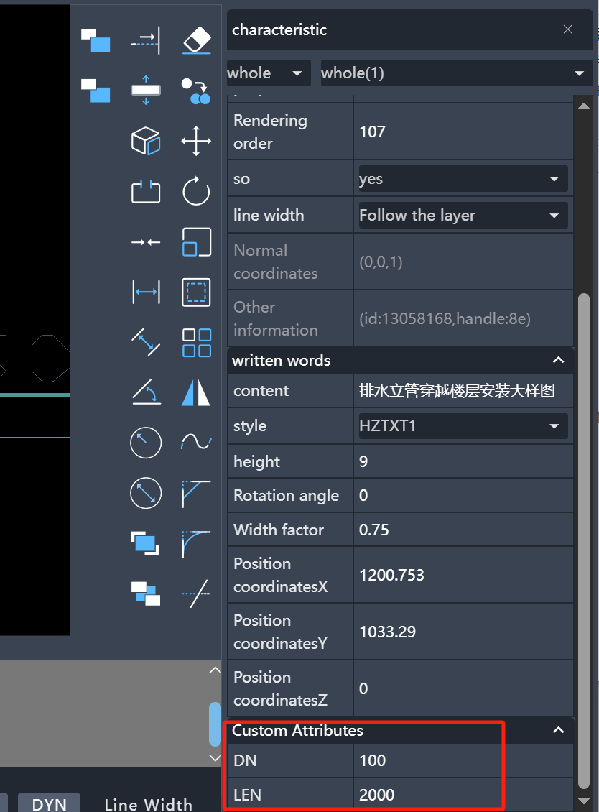

# Plugin Development

A project plugin is a JavaScript file, for example our test.js used for testing:

```javascript
console.log("hello world");
```

We configure this plugin in dist/plugins/config.json:

```json
{
  "plugins": ["test"]
}
```

Then the project will automatically print "hello world"

## Plugin Configuration Description

| Parameter | Type                | Description                             |
| --------- | ------------------- | --------------------------------------- |
| plugins   | pluginConfig[] | List of plugins executed in array order |

pluginConfig configuration description:
| Parameter | Type | Description |
| ---- | ---- | ---- |
| name | String | Plugin name |
| isAfterLoad | Boolean | Whether to execute code after project loading |
| dir | Boolean | Whether the project is a directory structure. If true, index.js in the directory will be loaded automatically (name is the directory name) |

## Built-in Plugins Description

| Plugin Name           | Description                                                                           |
| --------------------- | ------------------------------------------------------------------------------------- |
| test                  | Test plugin providing various sample code and plugin usage examples                   |
| pluginBaseTemplate    | Standard plugin project packaging empty template (for testing)                        |
| loginPlugin           | Official website login plugin (used with electron for official website account login) |
| pluginCodeEdit        | Code editing plugin (for online code debugging)                                       |
| pluginIdentifyPattern | Drawing recognition, symbol annotation, home decoration design, drawing comparison    |

## Plugin Project Structure

For relatively complex extensions, using plain JavaScript is inefficient and lacks good development experience. Therefore, we created some standard plugin project templates based on Vite.

In [Project Integration Basic Description](./1.BasicDescriptionOfProjectIntegration.md), three directories were mentioned:
The dist directory contains the packaged code,
The MxCAD directory contains sample code for plugin development,
The MxCADiframe directory serves as an example project integrating our project.

After understanding these three project directories, we should realize that the MxCAD directory is a plugin project. However, we should only reference its code implementation and create our own plugin.

Using Vite, we can easily package a plugin since plugins are essentially JavaScript files.
We just need to package the JS file into the dist/plugins directory and configure it in dist/plugins/config.json for it to take effect.

In the development package, we provide a standard extension project that you can copy to develop your own plugin.
Location: MxDrawCloudServer\SRC\sample\Edit\2d\createPluginBaseTemplate

To better understand this packaging project, here's its description:

1. Modify Plugin Name
   Find the name property in package.json and change it to your plugin name

2. In vite.config.ts, the exclude property records external dependencies, and the globals property records global variables for external dependencies.
   These defined external dependencies can be imported using modular approach.
   For example:

```ts
import { MxFun } from "mxdraw";
```

This exports MxFun object from global variable Mx

```js
const { MxFun } = Mx;
```

3. Ensure the plugin project directory has a sibling dist directory
   For example, if the plugin directory is: test
   Then there must be a dist directory (our project's packaged code) at the same level as the test directory

4. `npm run dev` is for development debugging, `npm run build` is for packaging (packaged JS files are automatically placed in dist/plugins directory)

5. MxPluginContext.d.ts is the TypeScript type file for plugin context, used for type hints

### Plugin Code Configuration

In the mxcad npm package's MxCADPluginBase class, we can modify its configuration as follows to initialize the project based on this configuration during project initialization:

```ts
import { MxCADPluginBase } from "mxcad";
import { MxFun } from "mxdraw";
class MxCADPlugin extends MxCADPluginBase {
  constructor() {
    super();
    // Modify default mxweb file opened during project initialization
    this.openFile = "test3.mxweb";
  }
}
let mxcadUi: MxCADUI;
MxFun.on("mxcadApplicationStart", (mxcadUiImp: MxCADUI) => {
  mxcadUi = mxcadUiImp;
  mxcadUi.init(new MxCADPlugin());
});
// Synchronous initialization (if configuration settings are asynchronous, initialize here)
MxFun.onInitSync(() => {
  return new Promise((resolve) => {
    mxcadUi.init(new MxCADPlugin());
    resolve(true);
  });
});
```

The specific configurations provided by MxCADPluginBase and MxCADUI are explained in the TypeScript type hints, please check them. Generally, these configurations are used during project initialization.

If you use `mxcadUi.init(new MxCADPlugin())`, ensure that `isAfterLoad` in scripts/synchronizationProfile.js automation script configuration is `false`.
If it's `true`, the plugin code will execute after project loading, causing MxCADPluginBase configuration to not take effect.

### Plugin Context

In plugins, the global variable `MxPluginContext` is exposed on the window object

#### getApp Get Vue3 App Instance

Here app is the app instance created by Vue's createApp

```ts
import { App } from "vue";
const app = MxPluginContext.getApp();
app.use({
  install(app: App) {
    // vue3 plugin
  },
});
```

#### Entity Custom Properties



The above display effect in plugins showing custom entity properties is implemented as follows:

```ts
import { MxFun } from "mxdraw";
import { MxCpp, McObjectId, MxPropertiesWindowCustomValueType } from "mxcad";
// Wait for project to create mxcad instance
MxFun.on("mxcadApplicationCreatedMxCADObject", (param) => {
  const { mxcad } = param;
  // Get
  MxCpp.PropertiesWindow.onEvent_getProperties((id: McObjectId) => {
    let ent = id.getMcDbEntity();
    if (!ent) return [];
    let dn = ent.getxDataDouble("DN");
    let len = ent.getxDataDouble("LEN");
    let ret = [];

    if (dn.ret) {
      ret.push({
        sVarName: "DN",
        iVarType: MxPropertiesWindowCustomValueType.kDouble,
        val: dn.val,
        isOnlyRead: false,
      });
    }

    if (len.ret) {
      ret.push({
        sVarName: "LEN",
        iVarType: MxPropertiesWindowCustomValueType.kDouble,
        val: len.val,
        isOnlyRead: false,
      });
    }
    return ret;
  });
  // Set
  MxCpp.PropertiesWindow.onEvent_setProperties((id: McObjectId, prop: any) => {
    let ent = id.getMcDbEntity();
    if (!ent) return;
    if (prop.sVarName == "DN") {
      ent.setxDataDouble("DN", prop.val);
    } else if (prop.sVarName == "LEN") {
      ent.setxDataDouble("LEN", prop.val);
    }
  });
});
```

The maximum number of custom properties that can be displayed can be set using `MxPluginContext.setCustomDataListLength(12)`

#### store Partial Global Data Management

1. Command line input box auto-focus can be controlled using `MxPluginContext.store.useFocus()`

```ts
const { setCommandFocus, isCommandFocus } = MxPluginContext.useFocus()
setCommandFocus(false) // Disable command line input box keyboard input auto-focus, true enables auto-focus
// Check current auto-focus status
console.log(isCommandFocus.value)
// Set auto-focus input element
setInputEl(document.getElementById("inputEl")
```

#### getUiConfig Get UI Configuration

This is an example of dynamically adding UI configuration. Since getUiConfig's configuration data is partially reactive, you can directly add or modify UI configuration and it will take effect

```ts
MxPluginContext.getUiConfig().then((config) => {
  if (!config?.leftDrawerComponents?.includes("CodeEditor"))
    config?.leftDrawerComponents?.push("CodeEditor");
  const uiInfo = {
    icon: "class: iconfont daimabianji",
    prompt: "Code Editor",
    cmd: "Mx_CodeEditor",
  };
  if (!config.mTopButtonBarData) {
    config.mTopButtonBarData = [];
  }
  const isUI = config.mTopButtonBarData.some((info) => {
    return info.cmd === uiInfo.cmd && uiInfo.prompt === uiInfo.prompt;
  });
  if (!isUI) {
    config.mTopButtonBarData.push(uiInfo);
  }
});
```

#### Add Sidebar Components


We can implement our own sidebar, here's a code example:
We need to implement three files
useComponent.ts

```ts
const { utils } = MxPluginContext
const { browserCacheRef } = utils

export const isShow = browserCacheRef(false, "Mx_Open_Test_Component");
```

index.vue

```vue
<template>
  <div v-show="isShow">
    <v-btn>hello world</v-btn>
  </div>
</template>
<script setup lang="ts">
import { VBtn } from "vuetify/components";
import { isShow } from "./useComponent";
</script>
```

index.ts

```ts
import { defineAsyncComponent } from "vue";
import { isShow } from "./useComponent";

MxPluginContext.addDrawerComponent("Test_Component", {
  isShow: isShow,
  component: defineAsyncComponent(() => import("./index.vue")),
  width: 600,
  title: "hello world",
  cmd: [
    {
      cmd: "Mx_Open_Test_Component",
      call: async () => {
        isShow.value = !isShow.value;
      },
    },
  ],
});
MxPluginContext.getUiConfig().then((config) => {
  if (!config?.leftDrawerComponents?.includes("Test_Component")) {
    config?.leftDrawerComponents?.push("Test_Component");
  }
});
```

Key elements here:

1. The sidebar name (Test_Component here) must be added to leftDrawerComponents or rightDrawerComponents in UiConfig
2. Must implement a command to control sidebar open/close logic
3. Component must provide isShow and only show when true
4. Sidebar components can directly use vuetify/components

#### Using Vuetify Components

The project uses Vuetify components, which can also be used in plugins. Since Vuetify instance is already mounted in the project, we should use it like this:

index.vue

```vue
<script setup lang="ts">
import { VBtn, VList, VSelect } from "vuetify/components";
</script>
<template>
  <div>
    <VList>
      <VBtn>hello</VBtn>
      <VSelect :items="[1, 2, 3, 4]"></VSelect>
    </VList>
  </div>
</template>
```

index.ts

```ts
import { createVNode, render } from "vue";
import Index from "./index.vue";
const targetEl = document.querySelector("header div div");
const el = document.createElement("div");

targetEl.appendChild(el);
const vnode = createVNode(Index);
const app = MxPluginContext.getApp();
vnode.appContext = app._context;
render(vnode, el);
```

This adds the component to the header div element.

#### Custom Dialog

We provide custom dialog components in the context, you can implement custom dialogs following our specifications with hooks

| Property        | Type                                                                                                                                                                      | Description                         |
| --------------- | ------------------------------------------------------------------------------------------------------------------------------------------------------------------------- | ----------------------------------- |
| title           | string                                                                                                                                                                    | Dialog title                        |
| logo            | string                                                                                                                                                                    | Left logo                           |
| cardClass       | string                                                                                                                                                                    | Define card css class               |
| cardTextClass   | string                                                                                                                                                                    | Define card content area css class  |
| cardActionClass | string                                                                                                                                                                    | Define footer action area css class |
| footerBtnList   | `{ name: string, fun?: (...args: any[]) => void, primary?: boolean, labelProps?: { keyName?: string,colon?: boolean,noTextCaption?: boolean}, disabled?: () => boolean }[]` | Footer area button configuration    |
| modelValue      | boolean                                                                                                                                                                   | Show/hide                           |
| keys            | `{ [key: string]: (e: KeyboardEvent) => any } `                                                                                                                             | Dialog shortcut key definitions     |

| Slot        | Description                                                    |
| ----------- | -------------------------------------------------------------- |
| header      | Define entire dialog header                                    |
| header-icon | If no header slot, define left default logo image display area |
| default     | Default slot, dialog main content                              |
| actions     | Footer action bar                                              |

When using MxDialog component, must use `useDialogIsShow` hook to define component data.
Detailed explanation of `useDialogIsShow`, we can achieve many useful effects:
dialog.ts

```ts
// dialog.isShow defaults to false
// If no command passed, can only show dialog by modifying dialog.isShow or calling showDialog
// If command passed, calling command will automatically show/close dialog
// If third parameter passed, will customize command implementation
export const dialog = MxPluginContext.useDialogIsShow(
  false,
  "Mx_test_dialog",
  () => {
    dialog.showDialog(!dialog.isShow);
  }
);
```

dialog.vue

```vue
<script setup lang="ts">
import { VBtn, VList, VSelect } from "vuetify/components";
import { dialog } from "./dialog.ts";
const { MxDialog } = MxPluginContext.components;
const footerBtnList = [
  {
    name: "OK",
  },
];
const { isShow } = dialog;
</script>
<template>
  <MxDialog
    title="Test Title"
    v-model="isShow"
    max-width="300"
    :footerBtnList="footerBtnList"
  >
    asdasdasdasdasdasd
    <VBtn
      >asdasdsa
      <template #loader></template>
    </VBtn>
    <input />
    <VBtn>asdasdsa</VBtn>
  </MxDialog>
</template>
```

index.ts

```ts
import dialog from "./dialog.vue";
const el = document.createElement("div");
document.body.appendChild(el);
const vnode = createVNode(dialog);
const app = MxPluginContext.getApp();
vnode.appContext = app._context;
render(vnode, el);
```

Now we just need to call Mx_test_dialog command to show the dialog, this is the basic usage.

We can also use `useDialogIsShow` to implement show, confirm, cancel effects:
dialog.ts

```ts
// Data to show in dialog
type RevealData = { title: string };
// Data to pass when confirming
type ConfirmData = { data: number };
// Data to pass when canceling
type CancelData = { data: number };
export const dialog = MxPluginContext.useDialogIsShow<
  RevealData,
  ConfirmData,
  CancelData
>();
```

dialog.vue

```vue
<script setup lang="ts">
import { ref } from "vue";
import { VBtn, VList, VSelect } from "vuetify/components";
import { dialog } from "./dialog.ts";
const { MxDialog } = MxPluginContext.components;
const footerBtnList = [
  {
    name: "Cancel",
    fun: () => {
      // Dialog clicked cancel button, pass data
      dialog.cancel({ data: 1 });
      // Need to send data before closing dialog
      dialog.showDialog(false);
    },
  },
  {
    name: "OK",
    fun: () => {
      // Dialog clicked confirm button, pass data
      dialog.confirm({ data: 2 });
      dialog.showDialog(false);
    },
    primary: true,
  },
];
const { isShow, onReveal } = dialog;
const title = ref("Test Title");
onReveal((data) => {
  // Received show message
  if (data.title) title.value = data.title;
});
</script>
<template>
  <MxDialog
    :title="title"
    v-model="isShow"
    max-width="300"
    :footerBtnList="footerBtnList"
  >
    asdasdasdasdasdasd
    <VBtn
      >asdasdsa
      <template #loader></template>
    </VBtn>
    <input />
    <VBtn>asdasdsa</VBtn>
  </MxDialog>
</template>
```

index.ts

```ts
import DialogComponent from "./dialog.vue";
import { dialog } from "./dialog.ts";
const el = document.createElement("div");
document.body.appendChild(el);
const vnode = createVNode(DialogComponent);
const app = MxPluginContext.getApp();
vnode.appContext = app._context;
render(vnode, el);

// Show dialog and pass display data
dialog
  .showDialog(true, { title: "Test Title Display" })
  .then(({ data, isCanceled }) => {
    // Will trigger after cancel or confirm called
    if (isCanceled) {
      // Called dialog.cancel({ data: 1 }) to cancel
      console.log("Dialog cancel data", data.data === 1);
    } else {
      // Called dialog.confirm({ data: 2 }) to confirm
      console.log("Dialog confirm data", data.data === 2);
    }
  });
// Can also directly pass display data, same return as showDialog
dialog.reveal({ title: "reveal" }).then(({ data, isCanceled }) => {});

// We can also get data by listening to confirm or cancel events
dialog.onConfirm((data) => {}), dialog.onCancel((data) => {});
```

For shortcut key operations when dialog is open:

```vue
<script setup lang="ts">
const { MxDialog } = MxPluginContext.components;
const keys = {
  x: (e) => {
    // Pressed x key
    console.log(e);
  },
  "ctrl + z": (e) => {
    // Pressed Ctrl + z combination
  },
  escape: (e) => {
    // Pressed esc key
  },
};
</script>
<template>
  <MxDialog :keys="keys"> </MxDialog>
</template>
```

#### Others

See TypeScript type hints for specific method usage

1. useTheme Theme related
2. useFileName File name display related
3. addCommand Add commands, commands added through this will have hints in command input box
4. callCommand Execute command
5. useLoading Show loading box
6. useMessage Show message tips
7. components Some commonly used components in project

Some global objects are third-party libraries
|Package Name|Window Mounted Global Object Name|Description|
|---|---|---|
|vue|Vue|Vue3 framework [View Docs](https://cn.vuejs.org/)|
|mxcad|MxCAD|mxcad Edit display CAD graphics|
|mxdraw|Mx|Library based on three@0.113.2 for CAD graphics rendering [View Docs](https://www.mxdraw3d.com/mxdraw_docs/)|
|three|THREE|three@0.113.2 Can use examples suitable for this version [View Docs](https://www.three3d.cn/docs/index.html)|
|pinia|pinia|Vue3 state management library version@2 [View Docs](https://pinia.vuejs.org/zh/introduction.html)|
|vuetify|vuetify|Vue3 component library [View Docs](https://vuetifyjs.com)|
|vuetify/components|vuetifyComponents|All Vuetify components|
|axios|axios|Network request library, project uses default instance without creating separate instance, so can intercept and respond to project requests globally, like setting request headers|

### i18n Internationalization

Vue-i18n deprecated, current implementation uses [@voerkai18n/cli](https://zhangfisher.github.io/voerka-i18n/) [github address](https://github.com/zhangfisher/voerka-i18n)

Brief explanation here, see [@voerkai18n/cli docs](https://zhangfisher.github.io/voerka-i18n/) for more details

If you need i18n translation, install dependencies in plugin project:

```sh
npm install @voerkai18n/cli -D
```

Then add to package.json:

```json
{
  "scripts": {
    "i18n": "npm run i18nInit && npm run i18nExtract && npm run i18nAutoTranslate && npm run i18nCompile",
    "i18nInit": "voerkai18n init . -lngs zh en cht -d zh",
    "i18nExtract": "voerkai18n extract -D -f ts,vue",
    "i18nAutoTranslate": "voerkai18n translate --appid xxx --appkey xxx",
    "i18nCompile": "voerkai18n compile -t -l"
  }
}
```

:::tip About i18nAutoTranslate
i18nAutoTranslate automatic translation needs Baidu appid and appkey
For how to get appid and appkey or customize translation API see:
https://zhangfisher.github.io/voerka-i18n/zh/guide/tools/cli.html#%E8%87%AA%E5%8A%A8%E7%BF%BB%E8%AF%91-translate
:::

For specific command parameters of `voerkai18n` see:https://zhangfisher.github.io/voerka-i18n/zh/guide/tools/cli.html#%E5%AE%89%E8%A3%85

Then we can call `i18nInit` command to initialize

```sh
npm run i18nInit
```

Initialization will generate a languages directory in src

We can import t function from languages/index.ts to translate text

```ts
// In any ts or vue file
import { t } from "./languages";
const text = t("Hello");
console.log(text);
```

After writing, we can call `npm run i18nExtract` to extract text wrapped in `t("")`;

Then you can choose to manually translate in languages/translates/default.json where you'll see:

```json
{
  "Hello": {
    "en": "",
    "cht": "",
    "$files": ["src/index.ts"]
  }
}
```

We can fill in corresponding English name in `en` property

Of course default.json is default extracted from files, some text cannot be extracted.
We can create a new json file in languages/translates directory, then add text and translations following above format.

If you set appid and appkey in `voerkai18n translate --appid xxx --appkey xxx` or customized translation API,

Then, calling `npm run i18nAutoTranslate` will automatically translate all content in json files in languages/translates directory through translation API.

Finally, we compile translated data from json files into ts using `npm run i18nCompile` to implement i18n functionality. For plugin projects, we should always use development library mode `voerkai18n compile -l` i.e. add `-l`

To simplify these steps, we can directly run `npm run i18n` to automatically extract, translate, compile. Call it whenever new `t("")` functions are added or data in languages/translates json is modified.

In Vue, if we want Vue component data to automatically respond when switching languages,

We need to define a new `t` function to implement it. Note: must be t function because it extracts text through `t("")` regex match.

i18n.ts

```ts
import { ref } from "vue";
import { i18nScope } from "./languages";
const activeLanguage = ref<string>();
i18nScope.on("change", (value) => {
  activeLanguage.value = value;
});
export const t = (message: string, ...args: any[]) => {
  activeLanguage.value;
  return i18nScope.t(message, ...args);
};
```

Using this t function in components ensures automatic switching when changing languages.

```vue
<script setup lang="ts">
import { t } from "./i18n";
</script>
<template>
  <div>{{ t("Hello") }}</div>
</template>
```
