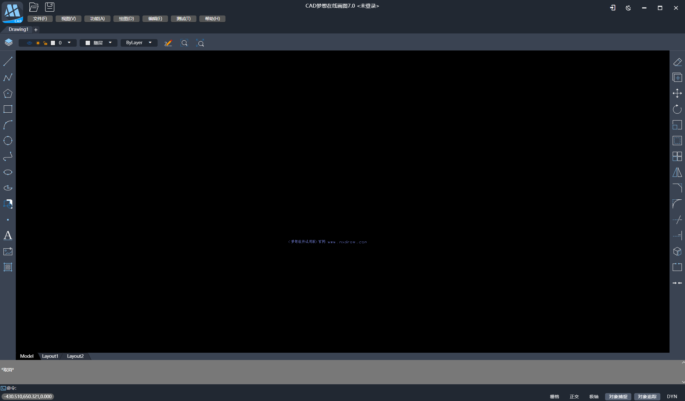

# Package desktop MxCAD APP

We offer electron version to implement the desktop application. For the electron version, There is no change in the front-end secondary development plug-in (that is, the js file generated by the above MxCAD directory), we only need to copy the corresponding js script under dist/plugins to the dist/2d/dist/plugins directory of the electron project now downloaded and decompressed to cover it.

In addition, the electron version adds a new MxElectronAPI object to the window, providing the ability to communicate with the main thread, and we can use MxElectronAPI to determine whether it is an electron environment when writing front-end plugins. We can also write our own plug-in for the electron project based on vite packaging with ts files for some secondary development needs of the electron main thread.

1. Click on the download electron [project](https://gitee.com/mxcadx/mxdraw-article/blob/master/MxCad project plug-in integrated secondary development/MxCADAppElectron. Zip)

2. After unzip, install dependency `npm install` and run `npm run dev` to start electron project

3. Create the src/plugins directory. If it exists, do not create it

4. Create a plug-in directory, such as the testPlugin directory, and then create an index.ts file in the directory as the plug-in entry file

5. vite.plugins.config.ts new plug-in inlet configuration pluginEntryFileName:["plugins/testPlugin/index.ts"]

6. Run the command to debug: `dev:plugins`

7. Run the package command: `build:plugins`

If you create preload.ts in testPlugin and export an object by default, this object holds the API that is used to communicate with the page. Here preload.ts is a preloaded script, if it is difficult to understand you can refer to the preloaded script: < https://www.electronjs.org/zh/docs/latest/tutorial/tutorial-preload >, Its default object is derived through `contextBridge. ExposeInMainWorld` define the front end of the window. The MxElectronAPi. Plug-in directory name (namespace) objects, such as now create testPlugin directory, then the front window. Access is MxElectronAPi. TestPlugin is that the exported object by default.

In the same way, the object exported by preload2d.ts overwrites the value of the same attribute in the object exported by preload2d.ts, but preload2d.ts is only valid in the page that displays 2d drawings. preload3d.ts differs from preload2d.ts in that it only works on 3d displayed pages.

Among them, plugins can exist many plug-ins, each directory under it is a plug-in, the plug-in directory name is the namespace name. The object accessed by the front page is also the name of the `window.MxElectronAPI.` namespace.

In the ts file of the electron project plugin, we keep the mxAppContext context, which you can access through `glob.mxappContext`, and currently mount several properties and methods:
getMainWindow, showMessage, showMessageBoxSync, MainTabs. They have their corresponding type hints and descriptions in ts.

The following description of the corresponding directory in the electron project:
| Path | Description | Reminders |
|-------|-------|-------|
| dist | there are 2d, 3d and other directories in the | directory of the front-end packaged project resources. Among them, there is also a dist directory in 2d and 3d. This dist directory is the front-end resource after packaging mentioned above. It is electron version, but the directory structure is exactly the same. We just need to overlay the generated dist/plugins/test.js above with corresponding dist/plugins/test.js in electron version and check if the corresponding configuration exists in config.json |
| dist-electron | The code packed in the main thread | is not recommended to change the code directly here, because | may be updated at any time
| rendererTypes | window.MxElectronAPI The ts type definition | is available on the front-end, providing the type definition and description |
| src/plugins | plugin directory | each directory contains the index.ts entry |
| vite.plugins.config.ts | vite packaging configuration | for each new creation directory will be recorded here, if you know a little about vite packaging then you can adjust according to your needs, but the final output file structure must not change the location, otherwise the plugin will not load |

For secondary development requirements existing configuration or plug-ins can not meet, you can give us feedback, and then gradually improve.

electron desktop app screenshot:

