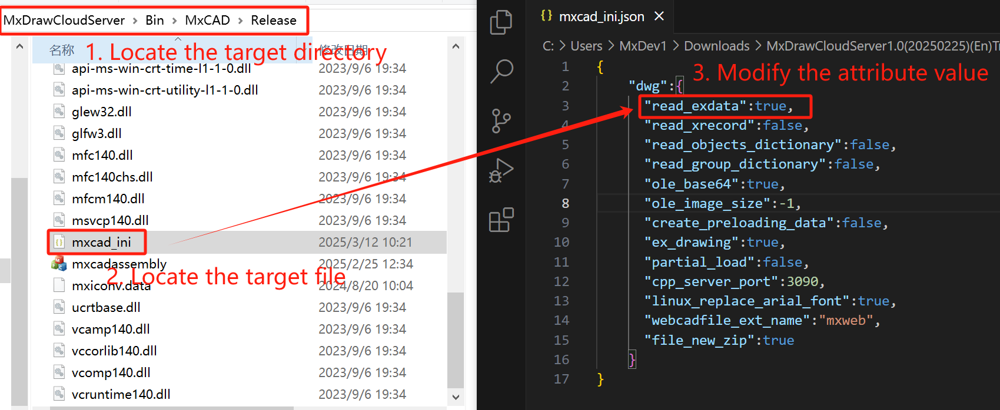
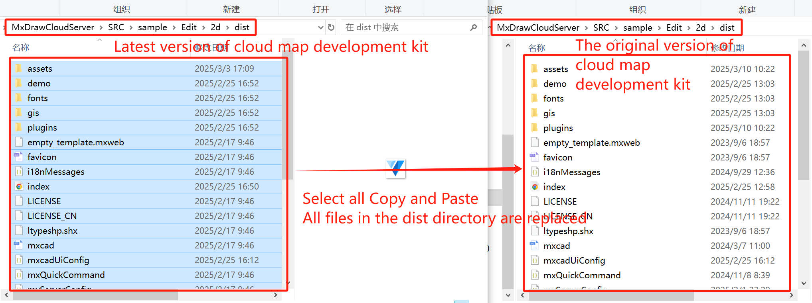

# Frequently Asked Questions

## Drawing

### 1. Drawing cannot be displayed

Keep mxcad mxdraw and development kit] [mxdraw cloud](https://www.mxdraw.com/download.html) is the latest version,

When the drawing cannot be displayed and the browser console does not report an error, it is generally a version problem.

Update to the latest version:

```bash
npm install mxcad@latest mxdraw@latest
```

### 2. Drawing display error

If you open the converted sample drawing provided by us, it is normal to open, but your own converted drawing cannot be displayed partially or not at all.

Then you can convert several more drawings. If there is only a problem with this drawing, it may be that the conversion program's support for this drawing is not perfect. You can send this drawing to the customer service so that we can fix this problem.

### 3. How to modify the default open drawing in mxcad integration project

The query pass `{file:'target drawing'}` can be done via the iframe's src attribute, as follows:

```ts
 iframe.src = "http://localhost:3000/mxcad?file=empty_template.mxweb";
```

### 4.Revise drawing accuracy

When the mxweb drawing is opened in mxcad, the graphics display accuracy is not enough, resulting in graphics deviation. For example, the circle on the drawing is displayed as a polygon, because its display accuracy is an empirical value when the drawing is initialized, and mxcad will determine its display accuracy according to the size of the circle.

Solution 1: Call the redrawing method to adjust the drawing display accuracy.
```ts
import { MxCpp } from "mxcad";
// Invoke the redraw command
MxCpp.getCurrentMxCAD().regen();
```

Solution 2: Manually set the display accuracy value (0 to 1000) when initializing the mxcad project.
```ts
import { MxCpp } from "mxcad";

// Sets the display precision of an object
const mxcad = MxCpp.getCurrentMxCAD();
mxcad.setAttribute({DisplayPrecision:900});
```

### 5.Text display

When loading the mxweb drawing in mxcad, the drawing text will be garbled. For example, when you open a drawing, some or all of the text on the drawing is displayed as? This is because the mxcad font file loading path `fontspath` does not find the target font file corresponding to the text on the drawing.

Solution 1: All the fonts on the drawing that are not loaded with the corresponding font file are converted to the fonts that have been loaded with the font file in the mxcad project.

Solution 2: Add the missing font files in the `fonts` folder in the cloud image development package `MxDrawCloudServer\Bin\MxCAD\Release` directory, and put the missing font files on the drawing in the front-end project mxcad font file load path' fontspath '. Finally, re-convert the drawing format and open the newly converted drawing with a new front-end project.


### 6. Setting line weight does not take effect

Set the solid line weight in mxcad, but it does not take effect in the drawing. This may be due to the mxcad object when the show line weight properties [showLineWeight](../../api/classes/2d.McObject.md#showlineweight) This is caused by not setting.

Solution: When line weight needs to be displayed, Set mxcad line weight of an object method [showLineWeight()](../../api/classes/2d.McObject.md#showlineweight) true.

```ts
import { MxCpp, McDbLine, McCmColor} from "mxcad";

//Draw a straight line
function drawLine() {
  const mxcad = MxCpp.getCurrentMxCAD();
  // Create a new canvas
  mxcad.newFile();
  let line = new McDbLine(1000, 500, 0, -1000, -500, 0)
  line.trueColor = new McCmColor(255, 0, 0);
  line.lineweight = 200;
  mxcad.showLineWeight(true);
  mxcad.drawEntity(line);
}

// Invoke the Draw a line method
drawLine();
```

### 7. Drawing to pdf (including pictures)

We have provided the relevant drawing conversion program for drawing to pdf in the cloud picture development kit. In the process of converting dwg drawings to pdf, we found that the exported pdf did not contain pictures when the drawings contained pictures. This is because the conversion program did not find the target image, so the transferred pdf does not contain the image.

Solution: Put the picture inserted into the dwg drawing in the same directory as the dwg drawing that needs to be converted, and the pdf that can be converted again will contain the picture inserted in the drawing.

## Block

### 1. A block is inserted multiple times to change one of the other blocks

CAD blocks function, it is the default use of reference mode, so one of the other blocks will change with the same. If you do not want to insert a block by reference, you can directly change the block name.

Using blocks by reference saves memory. If you don't use references, you have 100 blocks, which is equivalent to 100 different names of memory.

### 2. Get the target block details

We can refer to the entity McDbBlockReference() by calling the CAD block [getAllAttribute()](../../api/classes/2d.McDbBlockReference.md#getallattribute)  Method to get all attribute literal object ids referenced by the block, and then get the entity details in the block through the object ids.
```ts
import { MxCpp ,McDbBlockReference, McDbAttribute } from "mxcad"

// Object selection event
MxCpp.getCurrentMxCAD().get.on("selectChange", (ids: McObjectId[]) => {
if (ids.length == 0) return;
let id = ids[0];
let mxent = id.getMxDbEntity();
let ent = id.getMcDbEntity();
if (ent !== null) {
    if (ent instanceof McDbBlockReference) {
    let blkRef: McDbBlockReference = ent;
    let aryId = blkRef.getAllAttribute();
    aryId.forEach((id) => {
        let attribt: McDbAttribute = id.getMcDbEntity() as any;
        console.log(attribt.textString);
        console.log(attribt.tag);
    })
    }
}
})
```

## layer

### 1. Object filtering

In CAD, layers allow users to organize graphic objects into different layers for easy management and editing. Each layer has its own unique characteristics, such as color, line type, line width, etc., which determine how the objects on the layer are displayed. We can set [MxCADResbuf](../../api/classes/2d.MxCADResbuf.md#class-mxcadresbuf) Filter to implement object filtering on the layer.


```ts
import { MxCADSelectionSet } from "mxcad";

let ss = new MxCADSelectionSet();
// Get the graph, line, circle, arc, polysemy, object on layer 0.
ss.allSelect(new MxCADResbuf([DxfCode.kEntityType, "LINE,ARC,CIRCLE,LWPOLYLINE",DxfCode.kLayer,"0"]));
console.log("Get object number:" + ss.count());
```

## Updated version

An unsuccessful call or error may occur while running the project call API: This is not a function, etc., because the API in the mxcad call is the latest version, and the mxcad version in the project is not updated, so it is necessary to ensure that the mxcad and mxdraw in the project are the latest version.

After clearing the project cache and browser cache, uninstall and reinstall. To clear the browser cache, refer to the following operations:

 

The project cache can be cleared by running the command npm as an example:
```sh
npm cache clean --force
```
Uninstall mxcad and mxdraw, and download the latest version of mxcad and mxdraw. Take npm as an example: 
```sh
npm uni mxcad mxdraw

npm i mxcad@latest mxdraw@latest
```
After the update is complete, you can check to see if the version number of the dependency package is the same as the latest version of the npm library.


Or, check the log to run the project in the version number of the print [online demo](https://demo.mxdraw3d.com:3000/mxcad/) in the log print version number


## MxCAD APP application integration

### 1. How to modify the UI of the APP

1. If you simply modify the page layout on the basis of the original MxCAD App interface, refer to [MxCAD APP online CAD Preparation Instructions](../7.BestPractice/1.MxCADAPPApplicationIntegration/1.BasicDescriptionOfProjectIntegration.md), Modify the mxUiConfig.json file to configure the interface as required.

2. If you want to customize the interface, you can implement your own UI in the project, and then insert your own UI in the target location according to ID, class, attribute, etc.

* Draw the UI interface in the project
 

* Insert the drawn UI into the target location
 

In addition, you can also directly create elements to insert into the target position, where the target position needs to be obtained by yourself, get its corresponding element and insert the element or component you wrote into it.

### 2. How to change the text font

Passed during project initialization [MxCpp.App.addNetworkLoadingTrueTypeFont()](../../api/classes/2d.McAppType.md#addnetworkloadingtruetypefont) method to set our system needs to load which fonts, convenient for later when we modify the font loading use.

Then get the text entity, and finally set the textStyle property of the text to the target text font style.

```ts
import { MxFun } from 'mxdraw' ;
import { MxCpp } from 'mxcad' ;

// The MxCAD is created successfully. Procedure
MxFun.on("mxcadApplicationCreatedMxCADObject", (param) => {
    // addNetworkLoadingTrueTypeFont([Font name],[Font Chinese name],[font file])
    MxCpp.App.addNetworkLoadingTrueTypeFont(["simsun","syadobe"],["思原宋体","思原黑体"],["stadobe.otf","syadobe.otf"]);
})

// Modify text style
function Mx_Test_TrueText(){
    let mxcad = MxCpp.getCurrentMxCAD();
    //Clear the current display
    mxcad.newFile();
    MxCpp.App.loadFonts([], [], ["syadobe","simsun"], () => {

        // Add a boldface text style
        mxcad.AddTureTypeTextStyle("ht_style","syadobe");

        // Add a typeface text style
        mxcad.AddTureTypeTextStyle("st_style","simsun");

        // Set the current style to bold
        mxcad.drawTextStyle = "ht_style";

        mxcad.drawColor = new McCmColor(200, 255, 50);
        let idText = mxcad.drawText(0, 3500, "绘图控件TrueType文字测试", 100, 0, 0, 1);
      
        let ent = idText.getMcDbEntity();
        // Change the text style to Song Typeface
        if(ent) ent.textStyle = "st_style";
    
        mxcad.zoomAll();
        mxcad.regen();
        mxcad.updateDisplay();
    });
}
```
### 3.Add font file

Some commonly used font files are stored in mxcad projects, but we often encounter that some target drawings need to load their own special font files. When this drawing is first opened in the mxcad project, the text style will be deviated from the display in AutoCAD, and the font text will be displayed as "? ". , or the font style does not meet expectations.

We can copy the target font file to the `MxDrawCloudServer\Bin\MxCAD\Release\fonts` directory in the mxcad project to add the target font file required by the drawing.

 

### 4.Updated drawing watermark display

After modifying the watermark of the drawing, we will provide the cloud image development kit after modifying the watermark. Open the project in the MxCAD project of the development kit, and you can directly see the modified version of the watermark of the drawing. If you need to use the modified watermarking effect in other MxCAD projects, you need to replace the related files in the wasm folder in the mxcad dependency package as follows:
1. Extract the modified watermark cloud image development kit, find  the catalogue of `MxDrawCloudServer\SRC\TsWeb\public\mxcad\assets`目录。
2. Copy the js files and wasm files in the above directories to wasm under the mxcad dependency package of the target project.
* Select `mxdrawassembly_min.js` and `mxdrawassembly_min.wasm ` in ` MxDrawCloudServer\SRC\TsWeb\public\mxcad\assets` `mxdrawassembly_min.worker.js` three files are copied into the target project` \node_modules\mxcad\dist\wasm\2d `folder; Then copy the `mxdrawassembly_min.js' and' mxdrawassembly_minst.wasm ` files into the ` \node_modules\mxcad\dist\wasm\2d-st ` folder of the target project. There is a hash code in the name of the copied file, and the file must be renamed to remove the hash code in the middle when it is placed in the `2d` folder.
 
 
* After replacing the files, delete all cache files in the `node_modules` folder of the target project, such as all files in the `.vite` folder (you can directly delete the `.vite` folder), and then clear the browser cache.
* Restart the project and see the results.

::: tip Look out
`MxDrawCloudServer\SRC\TsWeb\public\mxcad\assets` directory has two ` mxdrawassembly_min.js` files, the two file names in the hash code is different, the file size is also different. These two files need to be copied to the corresponding `2d` and `2D-st` folders respectively. Under normal circumstances, the `2d` folder under the `mxdrawassembly_min.js` file size will be a little larger, in the replacement need to pay attention to.
:::

### 5. Set up to load extension data

When the node.js background service is started through the cloud map development kit, it may occur that the extended data in the drawing cannot be read when the dwg drawing is opened. This is because in order to increase the rate at which the program converts drawings, we default to not loading extended data when opening dwg files. If you need to be able to read the extended data after loading the drawing, you need to set the read_exdata property of the mxcad_ini.json file in the MxDrawCloudServer\Bin\MxCAD\Release directory to true and restart the service. After clearing the cache or opening the drawing without using the cache, the extended data in the drawing can be read.



### 6. Update MxCAD APP

The MxCAD project provided in the cloud map development kit is a test module in the MxCAD APP. The project is packaged as a js file, which will eventually be put into the 'dist\plugins' in the same directory as the MxCAD project. Moreover, MxCAD and mdraw referenced in mxcad are all dependent on the dist directory. Therefore, in order to update the MxCAD APP, it is necessary to copy and paste all files in the dist directory in the latest cloud image development kit to the original dist directory.



### 7. Update the back-end conversion program

As with the above steps to update the MxCAD APP, we only need to copy and paste all the conversion procedures under the 'MxDrawCloudServer\Bin' directory that provides the back-end service in the latest cloud image development kit to the original directory where the back-end service is located to replace it.

## Other

### 1. Instructions for using object ID handles

ID and handle are used to identify an object, ID is a 64-bit long integer variable, is a memory address, the fastest access, but it is different every time you open, if you need to store the identity of an object, the next time you can find the object, you need to use a handle, a handle is a string variable, It guarantees that no matter what time, the handle is unique in the DWG drawing, and the ID is unique in memory.

* Find an object by a handle

```ts
import { MxCpp, McDbDatabase } from "mxcad";

// Find an object by a handle
const handle: string = "6e78";
const dataBase: McDbDatabase = MxCpp.getCurrentMxCAD().getDatabase();
const objectId = dataBase.handleToIdIndex(handle);
const entity = objectId.getMxDbEntity();
if(entity){
    console.log("Target entity object",entity);
}
```

* Find a handle through an entity object

```ts
import { MxCpp, McObjectId } from "mxcad";

  let getEntity = new MxCADUiPrEntity();
  getEntity.setMessage("Select target object");
  let entId = await getEntity.go();
  if(!entId.id) return;
  // The graph data object is obtained from the ID object
  let ent = entId.getMcDbEntity();
  if(!ent) return;
  // Get the handle from the graph data object
  let handle = ent.getHandle();
  console.log("Target object handle",handle);
```

### 2. Close the mobile terminal three-view

In the mxcad mobile demo, a rotating screen may appear, and the contents of the drawing are regarded as 3 objects and will rotate along the Z axis. This is because the mxcad object has turned on the three-view rotation. You can close the three-view and return to the 2d view by following the code:

```ts
import { MxCpp } from "mxcad";  

const mxcad = MxCpp.getCurrentMxCAD();
mxcad.mxdraw.getOrbitControls().touches.ONE = THREE.TOUCH.PAN;
```
