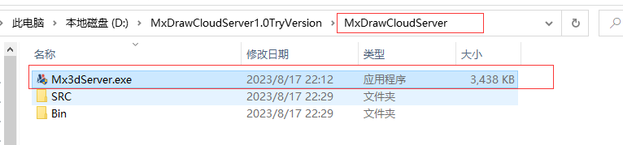
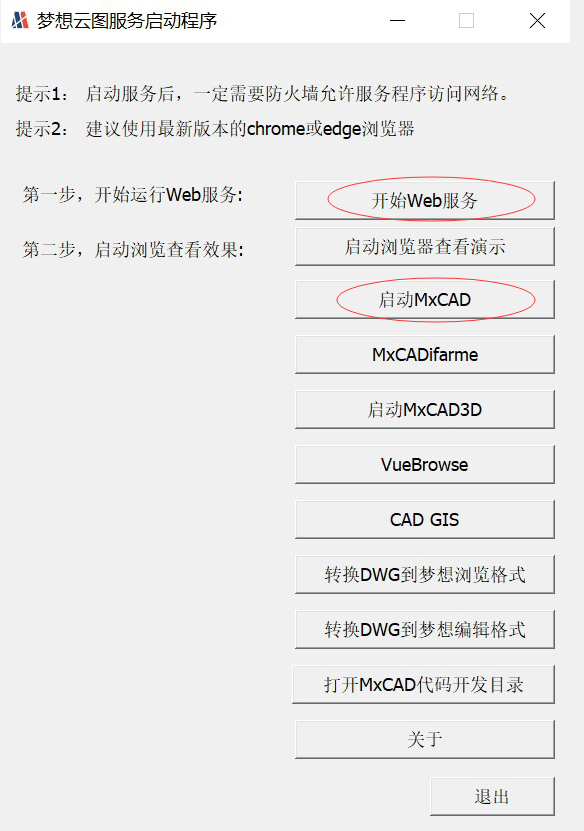

# MxCAD APP应用集成

我们根据 mxcad 开发包开发了一个完整的在线CAD应用，它包括了绘图、编辑、文字样式设置、图层设置、线型设置等功能的实现。

我们同时提供了一个插件的开发接口，用户可以在该接口的基础上进行二次开发，这样就能够为用户减少从头开发的工作量，可以快速将一个完整的CAD项目集成到用户需要的项目中去。

我们推荐使用 iframe 技术将我们的 MxCAD App的功能集成到目标项目中。

点击 [下载示例demo源码](https://demo.mxdraw3d.com:3562/MxCADCode.7z) 

:::tip 注意
下载实例demo源码并解压后，我们需进入`Edit\2d`目录，我们的目标项目均存放在该目录中，其结构如下：

* dist：MxCAD APP 在线打包后的前端资源

* MxCAD: MxCAD APPP 插件的二次开发项目(用户可在该基础上开发功能)

* MxCADiframe: 通过 iframe 嵌入 MxCAD APP 的示例 demo
:::

### 运行Demo说明

1. 进入 MxCAD 目录, 运行`npm install`安装依赖。

2. 调用`npm run dev`命令运行 MxCAD APP在线CAD。

运行后的访问http://localhost:3366/,效果如下图:

3. 调用`npm run build` 命令打包demo。

4. 进入 MxCADiframe 目录，运行`npm install`安装依赖。

5. 在其src/components/Home.vue 中 iframe 的 src 属性设置成刚刚MxCAD访问的网址:http://localhost:3366/

6. 运行调试 MxCADiframe 项目命令: `npm run serve`。

运行后的效果如下图:

:::tip 注意

若直接打开 MxCADiframe 项目出现无法获取图纸或者 iframe 提示 localhost 已拒绝连接，是因为没有启动MxCAD目录下的项目。

:::

用户可参考上述 MxCADiframe 项目的实现方式，在自己的前端项目中用 iframe 嵌入 MxCad 在线编辑项目。

:::tip 提示

MxCAD目录说明:

* 基于vite 可通过npm run dev 直接运行启动服务器浏览dist目录的页面，并且修改MxCAD中.ts、.vue文件会自动编译, 自动刷新页面。

* 基于vite 需要手动运行`npm run build` 打包dist目录， 打包后dist目录直接放在dist/plugins中。

* `import` 引入 mxcad、mxdraw、vue 实际使用的是dist打包后的前端资源中的，而不是一个全新的mxcad、mxdraw、vue。

* MxCAD目录下vite.config.ts 和 dist/plugins/config.json中的plugins 的配置要对应上。

:::

### 后端服务说明

MxCAD APP 在线CAD在运行时，会访问后面的服务接口，比如保存,打开DWG文件接口，我们需要启动 MxDraw云图开发包中的后台服务程序，因此我们需要先 [下载MxDraw云图开发包](https://www.mxdraw.com/download.html)，并通过 [MxDraw云图开发包入门文档](https://help.mxdraw.com/?pid=32) 了解如何使用该开发包。

1. 下载MxDraw云图开发包并解压到目标目录下。

2. 双击运行Mx3dServer.exe应用程序
   

3. 点击开始web服务
   

:::tip 提示

实现上传图纸保存图纸的服务接口需要详细阅读 MxDraw云图开发包相关文档:<https://help.mxdraw.com/?pid=32>，然后参考MxDraw云图开发包中对应的接口源码自己根据自己的需求实现，或者直接复用MxDraw云图开发包提供好的接口。

:::

### MxCAD APP在线CAD 配制说明

 MxCAD APP在线CAD的dist 目录是打包后的前端资源，我们可以通过修改该目录下的配置文件配制MxCAD APP。

 dist 目录下几个重要配置文件:

1. mxUiConfig.json：UI配置文件。其部分配置属性说明如下（可查看配置文件了解更多配置详情）。

* title: 浏览器标题

  
* headerTitle: 加上`<version>`自动替换成版本号

* mTitleButtonBarData: 数组元素中prompt表示提示， cmd表示一个命令，点击按钮会执行一个命令

* mRightButtonBarData和mLeftButtonBarData: isShow表示是否显示

* mMenuBarData: list菜单列表 list中可以一直嵌套list 形成多级菜单

* footerRightBtnSwitchData: ["栅格", "正交", "极轴","对象捕捉", "对象追踪", "DYN"] 显示对应名称的按钮，空数组就不显示
  

2. mxServerConfig.json：服务配置文件。其部分配置属性说明如下。

* uploadFileConfig: 是基于[WebUploader](http://fex.baidu.com/webuploader/)实现的文件上传, 部分配置参数它，后端上传接口说明如下:

* baseUrl: 同一个后台服务器地址，下述相对接口都是基于同一服务器地址
  默认的后台服务源码位置在云图开发包中的位置:
  windows:
   
  linux:
  

* saveDwgUrl: 保存DWG文件服务地址，该接口如何实现后续可以提供开发包
  默认保存文件Node服务所在位置: 
* wasmConfig：这里的配置就区分一下使用哪个wasm相关文件,具体看dist中的配置文件有详细说明

3. plugins/config.json: 插件配置文件。其部分属性说明如下。

* plugins: 就是存放插件名称的文件，它会按照先后顺序依次加载对应当前目录下的js对应名称的脚本， 如有一个plugins/test.js 就填写一个test，而MxCAD目录就是为了创建dist/plugins中对应的js文件，如图:

### 测试Demo用例

在 MxCAD 目录下 的 src 文件夹中我们提供了部分通过 mxcad库 实现的功能测试用例， 用户可以通过页面上的测试按钮或者命令行运行这些功能。

功能对应的代码也可以通过命令在源码中搜索找到对应的实现

开发完成插件后，运行`npm run build` 就可以打包到dist/plugins目录下。

此外，在 src 目录下有一个 `iframe.ts` 文件，与 MxCADiframe 项目中的 postMessage  对应。

