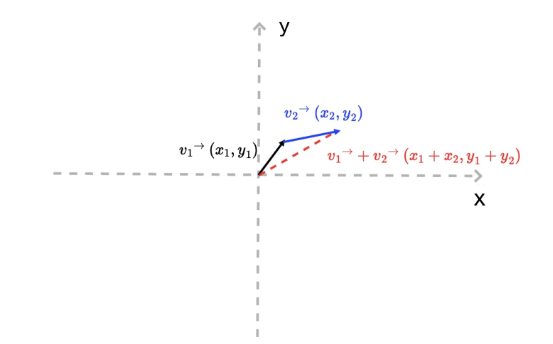
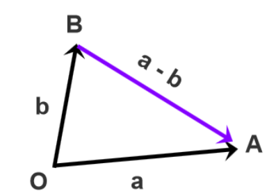
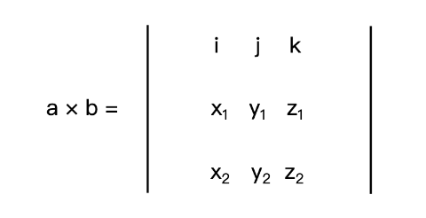
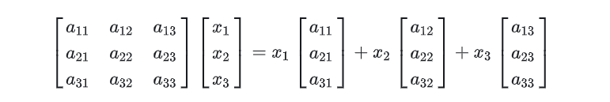
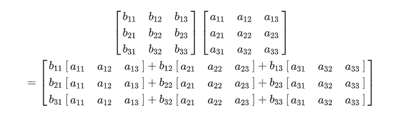

# 数学库

在 CAD 二次开发中, 正确的使用数学库是十分重要的, 我们并不需要很多数学, 只需要会普通的四则运算和调用 mxcad 提供的的 api 即可。

我们通过[快速入门](../1.Start/2.QuickGetStart.md)了解了如果打开图纸后，希望对图形进行各种处理，就需要各种计算， mxcad 提供了一些类参与计算或者表示一些数据结构。

## 几何图形信息的数学体系

在 cad 中，我们要描述图形的顶点、边、线、面、体和其他各种信息有很多不同的方法，如果我们使用不同的绘图系统，每个绘图系统又可能有独特的方式或者特定的 API，去解决某个或某类具体的问题

正因为有了太多可以选择的工具，我们也就很难找到最恰当的那一个。

且如果我们手中只有解决具体问题的工具，没有统一的方法论，那我们也无法一劳永逸地解决问题的根本。

因此在图形学中, 建立了一套描述几何图形信息与各个图形系统无关联的、简单的基于向量和矩阵运算的数学体系，以及如何用这个体系来解决我们的可视化图形呈现的问题。

## 坐标系与坐标映射

首先我们来看看 mxcad 可能会用到的一些坐标系:

1. HTML 采用的是窗口坐标系 左上角为坐标原点，x 轴向右，y 轴向下，坐标值对应像素值, 在 CAD 中我们一般称为屏幕坐标。

2. webgl 坐标系, mxcad 依赖 mxdraw， mxdraw 内部使用了特定版本修改后的 three.js 所以, 一般这种我们指的就是 Three.js 的坐标系

3. 绘图坐标系，就是 cad 中的绘图坐标系，再 mxcad 和 mxdraw 基于它的坐标系的坐标， 一般成为文档坐标。

4. CAD 坐标系, 是指 CAD 图纸的坐标系, 在 mxcad 中 [McGePoint3d](../../api/classes/2d.McGePoint3d.md) 的坐标就是 CAD 图纸坐标

mxcad 的坐标体系相互转换的方法是在[mxdraw 坐标转换](https://www.mxdraw3d.com/mxdraw_docs/start/base.html#%E5%9D%90%E6%A0%87%E8%BD%AC%E6%8D%A2)中全部列举出来了
我们可以直接使用 mxdraw 提供的 API 对 mxcad 相关坐标进行转换。

比如我们把屏幕坐标转成 CAD 图纸坐标:

```ts
import { MxFun } from "mxdraw"
import { McGePoint3d, MxCpp } from "mxcad"
 const mxcad = MxCpp.getCurrentMxCAD()
if (!mxcad) return

const mxdraw = mxcad.mxdraw
const canvas = mxdraw.getCanvas()
canvas.addEventListener("click", (e) => {
  const pt = mxdraw.viewCoord2Cad(e.offsetX, e.offsetY, 0)
  console.log(pt)
}
```

尽管这四个坐标系在原点位置、坐标轴方向、坐标范围上有所区别，但都是直角坐标系，所以它们都满足直角坐标系的特性：不管原点和轴的方向怎么变，用同样的方法绘制几何图形，它们的形状和相对位置都不变。

## 向量 McGeVector3d

:::tip 注意
引入 mxcad 后，在全局会自动在全局挂载 THREE 变量， 表示 three.js
如果发现 McGeVector3d 可以调用`toVector3` 方法得到 THREE.Vector3 使用 three.js 提供的 API 进行向量运算
而要将 THREE.Vector3 变成 McGeVector3d 只需要将 THREE.Vector3 当成 new McGeVector3d 的参数就可以了
:::

那么在直角坐标系如何表示一个点 一段线呢?

前面的例子因为包含 x、y 、z 三个轴，所以它们构成了一个绘图的三维空间， 但通常我们只需要考虑 x、y。因此，我们可以用二维向量来表示这个平面上的点和线段。二维向量其实就是一个包含了两个数值的数组，一个是 x 坐标值，一个是 y 坐标值。

假设，现在这个平面直角坐标系上有一个向量 v。

向量 v 有两个含义：一是可以表示该坐标系下位于 (x, y) 处的一个点；二是可以表示从原点 (0,0) 到坐标 (x,y) 的一根线段

同样的两个向量一样可以进行数学运算:

举个例子，现在有两个向量，v1 和 v2，如果让它们相加，其结果相当于将 v1 向量的终点（x1, y1），沿着 v2 向量的方向移动一段距离，这段距离等于 v2 向量的长度。

这样，我们就可以在平面上得到一个新的点（x1 + x2, y1 + y2），一条新的线段[(0, 0), (x1 + x2, y1 + y2)]，以及一段折线：[(0, 0), (x1, y1) , (x1 + x2, y1 + y2)]。



其次，一个向量包含有长度和方向信息。它的长度可以用向量的 x、y 的平方和的平方根来表示

```js
v.length = function () {
  return Math.hypot(this.x, this.y);
};
```

它的方向可以用与 x 轴的夹角来表示，即：

```js
v.dir = function () {
  return Math.atan2(this.y, this.x);
};
```

在上面的代码里，Math.atan2 的取值范围是 -π 到 π，负数表示在 x 轴下方，正数表示在 x 轴上方

最后，根据长度和方向的定义，我们还能推导出一组关系式:

```js
v.x = v.length * Math.cos(v.dir);
v.y = v.length * Math.sin(v.dir);
```

这个推论意味着一个重要的事实：我们可以很简单地构造出一个绘图向量。也就是说，如果我们希望以点 (x0, y0) 为起点，沿着某个方向画一段长度为 length 的线段，我们只需要构造出如下的一个向量就可以了。

```js
// dir 是一个向量的方向(与x轴的夹角)， length 是向量的长度
function createV1(dir, length) {
  return {
    x: length * Math.cos(dir),
    y: length * Math.sin(dir),
  };
}
var v0 = { x: 0, y: 0 };
var v1 = createV1(Math.PI / 5, 30);
// 然后我们把向量 (x0, y0) 与这个向量 v1相加，得到的就是这条线段的终点
```

而在 mxcad 中也提供了对应的方法`McGeVector3d.length` 和`McGeVector3d.angleTo1` 来求向量长度和方向角度,

还有两个向量相加的`McGeVector3d.add` 你可以选择使用我们提供的这些 API 来简化上述运算。

在 three.js 中有向量`THREE.Vector3` 而对应的在 mxcad 也存在[McGeVector3d](../../api/classes/2d.McGeVector3d.md)表示 3D 空间中的矢量(向量)

在该类中存在四个轴`kXAxis`、`kYAxis`、`kZAxis`、`kNegateZAxis` 分别都是固定的向量。

`THREE.Vector3` 与 `McGeVector3d` 是完全等价的，只是在 mxcad 中与其他数据参与运算的是`McGeVector3d`

下面简单说明了一下 mxcad 提供的一些向量的运算方法:

```ts
import { McGeVector3d } from "mxcad";
const vet = new McGeVector3d(1, 0, 0);
// 得到THREE.Vector3
const tVet = vet.toVector3();
const newVet = new McGeVector3d(tVet);
// 旋转
tVet.rotateBy(Math.PI.McGeVector3d.kXAxis);
// 取反
vet.negate();
// 垂直90度
vet.perpVector();
// 计算两个向量之间的角度
vet.angleTo1(newVet);
vet.angleTo1(newVet, McGeVector3d.kZAxis);
// 归一化
vet.normalize();
// 点积
vet.dotProduct(newVet);
// 交叉积
vet.crossProduct(newVet);
// 是否相等
vet.isEqualTo(newVet);
// 向量与某个值相乘
vet.mult(10);
```

可以参考[数学库演示效果](#数学库演示效果)中点击获取向量长度和角度和根据方向和距离通过一个向量得到一条线，查看如果正确使用对应方法。

如上代码我们使用了很多向量的运算方法，可能你并不理解他们代表什么意思，我们大致讲解一下:

### 向量的加减法

他们的运算比较容易计算:

```js
//  比如向量v + 向量v1:
(v.x + v1.x, v.y + v1.y)(
  // 比如向量v - 向量v1:
  v.x - v1.x,
  v.y - v1.y
);
```

那么他们加减得到向量，如何理解呢?


将各个向量依次首尾顺次相接，结果为第一个向量的起点指向最后一个向量的终点向量 a 加向量 b，将 a 和 b 首尾相连后，由 a 的起点指向 b 的终点，就是 a + b


将两个向量平移至公共起点 O，从减数向量的终点 B 指向被减向量的终点 A 为相减结果将向量 a 和向量 b 的起点移到左下角的公共起点 O，从点 B 指向点 A 的向量就是 a - b

可能理解起来比较抽象，下面我们通过查看[数学库演示效果](#数学库演示效果)中点击向量的加减 查看具体的效果和源码可以更容易理解

### 向量的乘法

向量乘法有两种，一种是点乘，一种是叉乘，它们有着不同的几何和物理含义

如果你阅读后不是很理解可以在[数学库演示效果](#数学库演示效果)中点击向量乘法 查看它的实际应用, 阅读源码更容易理解其概念。

#### 点乘

假设，现在有两个 N 维向量 a 和 b，a = [a1, a2, ...an]，b = [b1, b2, ...bn]，那向量的点积代码如下：

```js
a*b = a1*b1 + a2*b2 + ... + an*bn
```

在 N 维线性空间中，a、b 向量点积的几何含义是 a 向量乘以 b 向量在 a 向量上的投影分量。
它的物理含义相当于 a 力作用于物体，产生 b 位移所做的功。点积公式如下图所示：


当然点乘还有两种特殊情况:

a、b 向量平行，那么它们的夹角是 0°， 那么 a·b=|a|\*|b| 用 JavaScript 代码表示就是:

```js
a.x * b.x + a.y * b.y === a.length * b.length；
```

a、b 向量垂直，那么它们的夹角是 90°，那么 a·b=0 用 JavaScript 代码表示就是:

```js
a.x * b.x + a.y * b.y === 0;
```

#### 叉乘

叉乘和点乘有两点不同:

首先，向量叉乘运算的结果不是标量，而是一个向量；其次，两个向量的叉积与两个向量组成的坐标平面垂直

以二维空间为例，向量 a 和 b 的叉积，就相当于向量 a（蓝色带箭头线段）与向量 b 沿垂直方向的投影（红色带箭头线段）的乘积
那如下图所示，二维向量叉积的几何意义就是**向量 a、b 组成的平行四边形的面积**


那叉乘在数学上该怎么计算呢？假设，现在有两个三维向量 a(x1, y1, z1) 和 b(x2, y2, z2)，那么，a 与 b 的叉积可以表示为一个如下图的行列式：


其中 i、j、k 分别是 x、y、z 轴的单位向量。我们把这个行列式展开，就能得到如下公式：

```js
a * b = [y1 * z2 - y2 * z1, - (x1 * z2 - x2 * z1), x1 * y2 - x2 * y1]
```

二维空间中向量叉乘的物理意义就是 a 和 b 的力矩（力矩你可以理解为一个物体在力的作用下，绕着一个轴转动的趋向。

## 3D 点 McGePoint3d

这是最常使用的一个类 [McGePoint3d](../../api/classes/2d.McGePoint3d.md) 代表 3D 空间中的一个点 的构造类

由`x`、`y`、`z` 三个双精度数值组成的结构, 当然 McGePoint3d 本质上也是一个向量, 上面我们讲了向量也可以表示一个点。

之所以区分，是因为它的含义就是表示坐标系上的一个点, 而不是表示一个量,

如果要改变这个点的位置，就需要仿射变换，可以通过对向量进行运算得到新的点位置。

下面是该类常用的一些方法，主要是与向量进行数学运算得到新的点的位置。

```ts
import { McGePoint3d } from "mxcad"
const pt1 = new McGePoint3d(0, 0, 0)
// 或者
const pt2 new McGePoint3d({ x: 0, y: 0, z: 0})

// 提供了一些实用的方法
// 判断两个点是否相等
pt1.isEqualTo(pt2)
// 计算两点距离
pt1.distanceTo(pt2)
// 将three.js 的向量设置成点
pt1.setFromVector3(new THREE.Vector3())
// 得到点对应的three.js 向量
pt1.toVector3()

// 两点相减得到新向量
const vet = pt1.sub(pt2)
// 加上向量的新位置
pt1.addvec(vet)
// 简写
pt1.av(vet)

// 减去向量的新位置
pt1.subvec(vet)
// 简写
pt1.sv(vet)
```

前面我们提到了仿射变换, 那么什么是放射变换呢?

仿射变换简单来说就是“线性变换 + 平移”。

比如，对元素设置 CSS 的 transform 属性就是对元素应用仿射变换。

而几何图形的仿射变换具有以下 2 个性质：
1、仿射变换前是直线段的，仿射变换后依然是直线段
2、对两条直线段 a 和 b 应用同样的仿射变换，变换前后线段长度比例保持不变

常见的仿射变换形式包括平移、旋转、缩放以及它们的组合

最简单的就是平移，在 mxcad 中你可以直接理解为 McGePoint3d 点通过 addvec 方法加上一个向量 McGeVector3d， 就是朝该向量所代表的方向上平移向量的距离。

## 矩阵 McGeMatrix3d

如上我们知道如何平移一个点，我们同样可以通过线性变换对一个点进行旋转和缩放。

那么什么是线性变换呢? ， 我们一样可以通过向量运算的方式, 得到如何旋转和缩放的方式。

只是旋转和缩放, 我们选择用矩阵的形式表示，通过矩阵与向量相乘形式的变换就叫做线性变换。

线性变换除了可以满足仿射变换的 2 个性质之外，还有 2 个额外的性质：
1、线性变换不改变坐标原点（因为如果 x0、y0 等于零，那么 x、y 肯定等于 0）；
2、线性变换可以叠加，多个线性变换的叠加结果就是将线性变换的矩阵依次相乘，再与原始向量相乘。

那根据线性变换的第 2 条性质，我们就能总结出一个通用的线性变换公式，即一个原始向量 P0 经过 M1、M2、…Mn 次的线性变换之后得到最终的坐标 P

在 mxcad 在中 [McGeMatrix3d](../../api/classes/2d.McGeMatrix3d.md) 类表示 3D 空间的仿射变换

通常情况下我们需要将平移、旋转、缩放等组合形成的各种复杂的放射变换都通过线性变换来表示，

我们只需要将原本 n 维的坐标转换为了 n+1 维的坐标。
这种 n+1 维坐标被称为齐次坐标，对应的矩阵就被称为齐次矩阵

我们的 McGeMatrix3d 也是齐次矩阵, 所以，我们可以直接通过 McGeMatrix3d 进行各种线性变换， 最终再通过向量的`transformBy`方法应用这个仿射变换。

同样的矩阵也可以应用在 mxcad 中所有的几何实体[McDbEntity.transformBy](../../api/classes/McDbEntity.md#transformBy)进行仿射变换, 因为所有的几何图形都是基于点和线构成的。

而我们可以将点或者线看作一个向量，对实体进行放射变换就相当于对组成实体的所有点进行放射变换。

### 矩阵的乘法

矩阵的乘法其实对应的就是上面讲述的线性变换可以叠加的这一特性,

我们希望通过一个一个的矩阵组合形成一个复杂的仿射变换, 就是通过矩阵一个一个的相乘得到的最终的矩阵，就是组合形成的复杂的仿射变换

其中两个 A、B 矩阵相乘, 以 A 为例, 这个时候 A 可以选择左乘或者右乘矩阵 B,

左乘就是`B * A` 右乘就是`A * B`

这里我们通过下图可以理解左乘和右乘的区别:

首先假设矩阵 A:


设列向量:


用列向量去右乘矩阵 A


相当于对矩阵 A 中的列向量做线性组合

用列向量左乘矩阵 A


相当于对矩阵 A 中的行向量左线性组合

根据上述概念扩展到矩阵乘法中的左乘与右乘, 思路是一样的:

设置一个矩阵 B:


用矩阵 B 来左乘矩阵 A:


**因此矩阵 B 左乘矩阵 A 得到的新矩阵的每一行都是矩阵 A 的行向量的线性组合，同理,矩阵 B 右乘矩阵 A 得到的新矩阵的每一列都是矩阵 A 的列向量的线性组合**

下面列举一些 McGeMatrix3d 提供的方法:

```ts
import { McGeMatrix3d, McGePoint3d, McGeVector3d } from "mxcad";
// 乘法的单位矩阵
McGeMatrix3d.kIdentity;

const m = new McGeMatrix3d();

const m1 = new McGeMatrix3d();

// 设置为单位矩阵。
m.setToIdentity();

// 左乘指定的矩阵。
const m3 = m.preMultBy(m1);

// 右乘指定的矩阵。
m3.postMultBy(m1);

// 矩阵设置为两个矩阵的乘积。
new McGeMatrix3d().setToProduct(m1, m2);

// 逆矩阵。
m1.invert();

// 是否为奇异矩阵。
m1.isSingular();

// 转置
m1.transposeIt();

// 是否相等
m1.isEqualTo(m2);

// 矩阵的行列式。
m1.det();

// 将矩阵设置为指定的坐标系。参数分别是原点、xyz轴
m1.setCoordSystem(
  new McGePoint3d(),
  new McGeVector3d(),
  new McGeVector3d(),
  new McGeVector3d()
);

// 平移
m1.setToTranslation(new McGeVector3d(0, 1, 0));

// 旋转 参数:角度、轴、旋转中心点
m1.setToRotation(Math.PI, McGeVector3d.kXAxis, new McGePoint3d());

// 缩放 参数: 缩放因子、缩放中心点
m1.setToScaling(0.5, new McGePoint3d());

// 设置为镜向矩阵
m1.setMirror(new McGePoint3d(), new McGePoint3d());

// 获取缩放因子
m1.scale();

// 获取矩阵中指定位置的元素值 参数 行索引、列索引
m1.getData(0, 0);
```

如何在 mxcad 中使用矩阵，可以查看[数学库演示效果](#数学库演示效果)中对点的旋转平移和缩放|对实体进行仿射变换|查看具体的效果和源码可以更容易理解使用。

## MxCADResbuf

[MxCADResbuf](../../api/classes/2d.MxCADResbuf.md)是 CAD 二次开发中`resbuf`(即 "result buffer") 用来传递数据的一种数据结构。

一般用于对象属性查询、自定义对象的定义和存储、XDATA（扩展数据）处理、绘图实体的编辑 等

例如在[MxCADSelectionSet](../../api/classes/2d.MxCADSelectionSet.md)选择集中表示过滤对象:

```ts
import { MxCADSelectionSet, MxCADResbuf } from "mxcad";
let ss = new MxCADSelectionSet();
let filter = new MxCADResbuf();
// 这里添加查询字符"0" 第二个参数是数据类型8 在CAD二次开发中 表示这是一个空指针（RTNUL）即该 resbuf 结构不包含任何有效数据，通常在链表的末尾作为终止符使用
filter.AddString("0", 8);
// 选择图层0的所有实体
ss.allSelect(filter);
ss.forEach((objId) => console.log(objId));
```

## calcBulge 计算圆弧凸度

MxCADUtility 是[MxCADUtilityClass](../../api/classes/2d.MxCADUtilityClass.md) 提供的实例, 提供了很多实用的方式。

[MxCADUtility.calcBulge](../../api/classes/2d.MxCADUtilityClass.md#calcBulge) 计算圆弧凸度

在多段线实体中添加点有一个参数是凸度值, mxcad 提供了 calcBulge 方法来计算得到凸度

需要三个参数依次为: 圆弧的开始点(起点)、圆弧的中点、圆弧的结束点(端点)

```ts
import { MxCADUtility, McGePoint3d, McDbPolyline } from "mxcad";
// 圆弧开始点
const startPoint = new McGePoint3d(0, 0, 0);
// 圆弧中点
const midPoint = new McGePoint3d(0, 0, 0);
// 圆弧结束点
const endPoint = new McGePoint3d(0, 0, 0);
const bulge = MxCADUtility.calcBulge(startPoint, midPoint, endPoint).val;
const pl = new McDbPolyline();
pl.addVertexAt(startPoint, bulge);
pl.addVertexAt(endPoint);
```

如果你并不知道以上三个参数中的任意一个，参考下图自行计算凸度:


**凸度值就是圆弧的开始点与结束点距离的一半去除以 圆弧的开始点与结束点相连这条线段的中点到圆弧圆心的距离**

## 数学库演示效果

该 demo 基于 vue3, 采用 tsx 的方式, 请自行参考[vue 官网 Tsx 说明](https://cn.vuejs.org/guide/extras/render-function.html#jsx-tsx)编写代码(展开代码可进行编辑)

:::demo

```tsx
import {
  createMxCad,
  McGeVector3d,
  McGePoint3d,
  McGeMatrix3d,
  MxCADUiPrPoint,
  McDbLine,
} from "mxcad";
import { MxFun } from "mxdraw";
import { reactive, defineComponent } from "vue";

// CAD组件
const Cad = defineComponent({
  emits: ["mxcad"],
  setup(props, { emit }) {
    createMxCad({
      canvas: "#myCanvas",
      locateFile: (fileName: string) => {
        return self.location.origin + "/mxcad_docs/wasm/2d-st/" + fileName;
      },
      // 加载字体的目录位置
      fontspath: self.location.origin + "/mxcad_docs/fonts",
      // 加载转换后的图纸文件
      fileUrl: self.location.origin + "/mxcad_docs/empty_template.mxweb",
    }).then((mxcad) => {
      emit("mxcad", mxcad);
    });
    return () => (
      <div style="height: 600px; overflow: hidden;">
        <canvas id="myCanvas" style="height: 300px"></canvas>
      </div>
    );
  },
});

// 获取CAD当前图纸坐标
const useMxcadDrawingCoordinates = () => {
  const coordinates = reactive({
    x: 100,
    y: 100,
  });
  const onGetDrawingCoordinates = (mxcad) => {
    // 获取mxdraw控件
    const mxdraw = mxcad.mxdraw;
    const canvas = mxdraw.getCanvas();
    canvas.onmousemove = (e: MouseEvent) => {
      // 屏幕坐标转文档坐标
      const { x, y } = MxFun.screenCoord2Doc(e.clientX, e.clientY);
      // 文档坐标转CAD图纸坐标
      const pt = MxFun.docCoord2Cad(x, y, 0);
      coordinates.x = pt.x;
      coordinates.y = pt.y;
    };
  };
  return {
    coordinates,
    onGetDrawingCoordinates,
  };
};
// 向量相关
const useMxCadVector3d = () => {
  // 获取向量长度和角度
  const getVetLengthAndDir = async () => {
    const getPt = new MxCADUiPrPoint();
    getPt.clearLastInputPoint();
    getPt.setUserDraw((pt, pw) => {
      const point = new McGePoint3d(
        MxFun.viewCoordLong2Cad(150),
        MxFun.viewCoordLong2Cad(300)
      );
      // 通过两个点相减得到一个新的向量
      const vet = point.sub(pt);
      pw.setColor("#f00");
      pw.drawLine(point.toVector3(), pt.toVector3());
      pw.setColor(0x00ff00);
      const midPoint = new McGePoint3d(
        (point.x + pt.x) / 2,
        (point.y + pt.y) / 2
      );
      // 计算向量长度
      pw.drawText(
        "向量长度:" + vet.length(),
        MxFun.viewCoordLong2Cad(20),
        0,
        midPoint.toVector3()
      );
      // 计算向量方向(角度)
      pw.drawText(
        "向量方向(角度°):" +
          (Math.atan2(vet.y, vet.x) * (180 / Math.PI)).toFixed(2) +
          "°",
        MxFun.viewCoordLong2Cad(20),
        0,
        point.toVector3()
      );
    });
    await getPt.go();
  };
  // 根据方向和距离通过一个向量得到一条线
  const getALineFromVectorAccordToDirectionAndDistance = async () => {
    const getPt = new MxCADUiPrPoint();
    getPt.clearLastInputPoint();
    getPt.setUserDraw((pt, pw) => {
      //  向量的方向
      const angle = Math.PI / 3;
      // 屏幕距离转CAD图纸距离
      const dist = MxFun.viewCoordLong2Cad(150);
      // 根据向量方向和距离得到向量
      const vet = new McGeVector3d(
        dist * Math.cos(angle),
        dist * Math.sin(angle)
      );
      // 克隆当前鼠标所在位置(避免改变pt的位置) 加上向量的位置 得到新的坐标点
      const point = pt.clone().addvec(vet);
      pw.setColor("#f00");
      pw.drawLine(point.toVector3(), pt.toVector3());
      pw.setColor(0x00ff00);
      pw.drawText(
        "向量相加后点的位置",
        MxFun.viewCoordLong2Cad(16),
        0,
        point.toVector3()
      );
    });
    await getPt.go();
  };
  // 向量的加减
  const callAdditionAndSubtractionOfVectors = async () => {
    const getPt = new MxCADUiPrPoint();
    getPt.clearLastInputPoint();
    // 假设存在两个向量
    const vet1 = new McGeVector3d(0, MxFun.viewCoordLong2Cad(300));
    const vet2 = new McGeVector3d(MxFun.viewCoordLong2Cad(300), 0);
    const size = MxFun.viewCoordLong2Cad(20);
    getPt.setUserDraw((pt, pw) => {
      const draw = (
        color: number,
        vet: McGeVector3d,
        funName: "subvec" | "addvec",
        vetName: string
      ) => {
        pw.setColor(color);
        const _pt = pt.clone()[funName](vet).toVector3();
        pw.drawLine(_pt, pt.toVector3());
        pw.drawText(
          `点与向量${vetName}${
            funName === "addvec" ? "相加" : "相减"
          }得到的的点`,
          size,
          0,
          _pt
        );
        return _pt;
      };

      // 点分别对两个点进行相加相减操作
      pw.setColor(0xff0000);
      draw(0xff0000, vet1, "addvec", "vet1");
      draw(0xff0000, vet1, "subvec", "vet1");
      draw(0xffff00, vet2, "addvec", "vet2");
      draw(0xffff00, vet2, "subvec", "vet2");

      // 两向量分贝相加相减 后得到新的vet3 vet4 向量 (这里直接使用three.js提供的向量相加方法)
      const vet3 = new McGeVector3d(vet1.toVector3().add(vet2.toVector3()));
      const vet4 = new McGeVector3d(vet1.toVector3().sub(vet2.toVector3()));
      pw.setColor(0xff00ff);
      draw(0xff00ff, vet3, "addvec", "vet3");
      draw(0xff00ff, vet3, "subvec", "vet3");
      draw(0x00ff00, vet4, "addvec", "vet4");
      draw(0x00ff00, vet4, "subvec", "vet4");

      pw.setColor(0xffffff);
      pw.drawText("点", size, 0, pt.toVector3());
    });
    await getPt.go();
  };

  // 向量乘法
  const callVectorMultiplication = async () => {
    const getPt = new MxCADUiPrPoint();
    getPt.clearLastInputPoint();
    getPt.setUserDraw((pt, pw) => {
      let vet = new McGeVector3d(MxFun.viewCoordLong2Cad(300), 0);
      // 根据向量vet 生成一条线
      const startPoint = new McGePoint3d(
        MxFun.viewCoordLong2Cad(300),
        MxFun.viewCoordLong2Cad(300)
      );
      const endPoint = startPoint.clone().addvec(vet);
      const line = {
        startPoint,
        endPoint,
      };
      // 描述点的位置
      pw.drawText(
        "R",
        MxFun.viewCoordLong2Cad(16),
        0,
        line.startPoint.toVector3()
      );
      pw.drawText(
        "Q",
        MxFun.viewCoordLong2Cad(16),
        0,
        line.endPoint.toVector3()
      );
      pw.drawText("p", MxFun.viewCoordLong2Cad(16), 0, pt.toVector3());

      // 第一个向量是 线段开始点到结束点
      vet = endPoint.sub(startPoint);

      // 第二个向量 线段开始点到pt点
      const vet1 = pt.sub(line.startPoint);
      // 绘制两个向量
      pw.setColor(0x00ffff);
      pw.drawLine(line.startPoint.toVector3(), line.endPoint.toVector3());
      pw.drawText(
        "向量vet",
        MxFun.viewCoordLong2Cad(16),
        0,
        new THREE.Vector3(
          (line.startPoint.x + line.endPoint.x) / 2,
          (line.startPoint.y + line.endPoint.y) / 2
        )
      );

      pw.setColor(0xffff00);
      pw.drawLine(line.startPoint.toVector3(), pt.toVector3());
      pw.drawText(
        "向量vet1",
        MxFun.viewCoordLong2Cad(16),
        0,
        new THREE.Vector3(
          (line.startPoint.x + pt.x) / 2,
          (line.startPoint.y + pt.y) / 2
        )
      );
      // 计算点积
      const dotProduct = vet.normalize().dotProduct(vet1.normalize());
      // 通过点积得到向量夹角
      pw.drawText(
        "两向量之间的夹角:" +
          (Math.acos(dotProduct) * (180 / Math.PI)).toFixed(1) +
          "°",
        MxFun.viewCoordLong2Cad(20),
        Math.PI / 4,
        line.startPoint
          .clone()
          .addvec(new McGeVector3d(-MxFun.viewCoordLong2Cad(20), 0))
          .toVector3()
      );

      // 求点到线段的距离
      // 先求出投影点N点 线段开始点记作R点 线段结束点记作Q点 pt点记作P点
      // 推导: 已知QN为QP在QR上的投影
      // QN = (QR / |QR|) * (QP·QR / |QR|) = QR * (QP·QR / |QR|²)
      // N.x - Q.x = QN.x, N.y - Q.y = QN.y
      // vet向量取反就是QR 结束点到开始点方向的向量
      const Q = line.endPoint.clone();
      const R = line.startPoint.clone();
      const P = pt.clone();

      const QP = P.sub(Q);
      const QR = R.sub(Q);
      const RP = P.sub(R);
      // 点P到线段QR的距离
      let dist: number;
      // 点P到QR所在直线的距离 叉乘的大小(length)就是平行四边形面积 / 底边就是 平行四边形的高度 也就是 点P到QR的距离
      let dist1 = QP.crossProduct(QR).length() / QR.length();
      // 计算点积
      let result = QP.dotProduct(QR);
      // 点积的性质:点积的结果除以QR的长度就是向量在另一个向量上的投影长度
      const QN = QR.clone().mult(result / QR.length() ** 2);
      // 得到点N
      const N = Q.clone().addvec(QN);
      pw.drawText("N", MxFun.viewCoordLong2Cad(16), 0, N.toVector3());
      if (result < 0) {
        pw.setColor(0xff0000);
        pw.drawLine(Q.toVector3(), pt.toVector3());
        dist = QP.length();
      } else if (result > Math.pow(QR.length(), 2)) {
        // 在几何学中，点P到线段QR的最短距离的平方等于点P到QR所在直线的垂直距离的平方。
        // 因此，当判断点P在QR的延长线的哪一侧时，使用QR长度的平方来进行比较，以确定点P到线段QR的最短距离。
        pw.setColor(0xff0000);
        pw.drawLine(R.toVector3(), pt.toVector3());
        dist = RP.length();
      } else {
        dist = dist1;
      }
      pw.setColor(0x00ff00);
      pw.drawLine(N.toVector3(), pt.toVector3());
      let text = `点P到线段QR的距离：${Math.floor(
        dist
      )}, 点P到QR所在直线的距离为${Math.floor(dist1)}`;
      pw.drawText(
        text,
        MxFun.viewCoordLong2Cad(16),
        0,
        pt
          .clone()
          .addvec(new McGeVector3d(0, MxFun.viewCoordLong2Cad(16)))
          .toVector3()
      );
    });
    await getPt.go();
  };
  return {
    getVetLengthAndDir,
    getALineFromVectorAccordToDirectionAndDistance,
    callAdditionAndSubtractionOfVectors,
    callVectorMultiplication,
  };
};

// 仿射变换 矩阵
const useMxCadAffineTransformation = () => {
  // 对点的旋转平移和缩放
  const callRotationTranslationAndScalingOfPoint = async () => {
    const getPt = new MxCADUiPrPoint();
    getPt.clearLastInputPoint();
    getPt.setUserDraw((pt, pw) => {
      // 对当前点进行平移
      const m = new McGeMatrix3d();
      // x轴平移300像素
      m.setToTranslation(new McGeVector3d(MxFun.viewCoordLong2Cad(300), 0));
      const N = pt.clone().transformBy(m);
      pw.drawText("平移后的点N", MxFun.viewCoordLong2Cad(16), 0, N.toVector3());
      pw.drawLine(pt.toVector3(), N.toVector3());

      // 点N 以pt为中心点 绕z轴 旋转45度
      const m1 = new McGeMatrix3d();
      m1.setToRotation(Math.PI / 4, McGeVector3d.kZAxis, pt);
      const C = N.clone().transformBy(m1);
      pw.drawText("点pt", MxFun.viewCoordLong2Cad(16), 0, pt.toVector3());

      pw.drawText("点C", MxFun.viewCoordLong2Cad(16), 0, C.toVector3());

      // 缩放0.5
      const m2 = new McGeMatrix3d();
      m2.setToScaling(0.5, pt);
      // 相当于点pt与点C的中点
      const D = C.clone().transformBy(m2);
      pw.drawText(
        "点N以pt为中心点 绕z轴 旋转45度得到点C",
        MxFun.viewCoordLong2Cad(20),
        0,
        D.toVector3()
      );
      pw.drawLine(pt.toVector3(), C.toVector3());

      // 先绕Z轴旋转45度再缩放0.5倍最后反向平移
      const m3 = m1.clone().postMultBy(m2).postMultBy(m.invert());
      const F = C.clone().transformBy(m3);
      pw.drawText("点F", MxFun.viewCoordLong2Cad(20), 0, F.toVector3());
      pw.drawLine(F.toVector3(), pt.toVector3());
      const midF = F.clone().transformBy(m2);
      pw.drawText(
        "点C先绕Z轴旋转45度再缩放0.5倍最后反向平移",
        MxFun.viewCoordLong2Cad(20),
        0,
        midF.toVector3()
      );
    });
    await getPt.go();
  };

  // 对实体进行仿射变换
  const callEntityAffineTransformation = async () => {
    const getPt = new MxCADUiPrPoint();
    getPt.clearLastInputPoint();
    const startPoint = new McGePoint3d();
    getPt.setUserDraw((pt, pw) => {
      const line = new McDbLine(startPoint, pt);
      pw.setColor(0xffffff);
      pw.drawMcDbEntity(line);
      // 对当前线段进行平移
      const m = new McGeMatrix3d();
      // x轴平移300像素
      m.setToTranslation(new McGeVector3d(MxFun.viewCoordLong2Cad(300), 0));

      line.transformBy(m);
      pw.setColor(0xff0000);
      pw.drawMcDbEntity(line);

      pw.drawText(
        "平移后的线段",
        MxFun.viewCoordLong2Cad(20),
        0,
        line.endPoint.toVector3()
      );

      const m1 = new McGeMatrix3d();
      // 缩放中心点是 图纸原点到当前鼠标点的中点
      const sPt = new McGePoint3d(pt.x / 2, pt.y / 2);
      m1.setToScaling(0.5, sPt);
      line.transformBy(m1);
      pw.setColor(0xff00ff);
      pw.drawMcDbEntity(line);
      pw.drawText(
        "缩放0.5倍的线段",
        MxFun.viewCoordLong2Cad(20),
        0,
        new McGePoint3d(
          (line.startPoint.x + line.endPoint.x) / 2,
          (line.startPoint.y + line.endPoint.y) / 2
        ).toVector3()
      );

      const m2 = new McGeMatrix3d();
      m2.setToRotation(Math.PI / 2, McGeVector3d.kZAxis, line.startPoint);
      line.transformBy(m2);
      pw.setColor(0x00ff00);
      pw.drawMcDbEntity(line);
      pw.drawText(
        "旋转90°的线段",
        MxFun.viewCoordLong2Cad(20),
        0,
        new McGePoint3d(
          (line.startPoint.x + line.endPoint.x) / 2,
          (line.startPoint.y + line.endPoint.y) / 2
        ).toVector3()
      );

      // 矩阵相乘
      const m3 = m1.postMultBy(m2).postMultBy(m);
      const line1 = new McDbLine(new McGePoint3d(), pt);
      line1.transformBy(m3);
      pw.setColor(0x00ffff);
      pw.drawMcDbEntity(line1);
      pw.drawText(
        "矩阵相乘后应用的线段",
        MxFun.viewCoordLong2Cad(20),
        0,
        new McGePoint3d(
          (line1.startPoint.x + line1.endPoint.x) / 2,
          (line1.startPoint.y + line1.endPoint.y) / 2
        ).toVector3()
      );
    });
    await getPt.go();
  };
  return {
    callRotationTranslationAndScalingOfPoint,
    callEntityAffineTransformation,
  };
};
const App = () => {
  const { coordinates, onGetDrawingCoordinates } = useMxcadDrawingCoordinates();
  const {
    getVetLengthAndDir,
    getALineFromVectorAccordToDirectionAndDistance,
    callAdditionAndSubtractionOfVectors,
    callVectorMultiplication,
  } = useMxCadVector3d();
  const {
    callRotationTranslationAndScalingOfPoint,
    callEntityAffineTransformation,
  } = useMxCadAffineTransformation();
  return (props, context) => {
    const onMxcad = (mxcad) => {
      onGetDrawingCoordinates(mxcad);
    };
    return (
      <div>
        <Cad onMxcad={onMxcad} />
        <div>
          CAD图纸坐标x: {coordinates.x}, y: {coordinates.y}
        </div>
        <div>
          向量相关:
          <button onClick={getVetLengthAndDir}>获取向量长度和角度</button>|<button
            onClick={getALineFromVectorAccordToDirectionAndDistance}
          >
            根据方向和距离通过一个向量得到一条线
          </button>|<button onClick={callAdditionAndSubtractionOfVectors}>
            向量的加减
          </button>|<button onClick={callVectorMultiplication}>向量乘法</button>|
          <br />
          矩阵仿射变换:
          <button onClick={callRotationTranslationAndScalingOfPoint}>
            对点的旋转平移和缩放
          </button>
          |<button onClick={callEntityAffineTransformation}>
            对实体进行仿射变换
          </button>|
        </div>
      </div>
    );
  };
};
export default App();
```

:::
