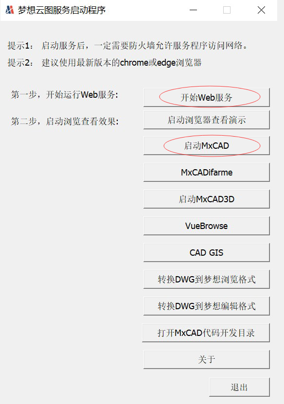
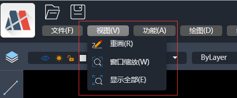

# MxCAD APP应用集成

我们根据 mxcad 开发包开发了一个完整的在线CAD应用，它包括了绘图、编辑、文字样式设置、图层设置、线型设置等功能的实现。

我们同时提供了一个插件的开发接口，用户可以在该接口的基础上进行二次开发，这样就能够为用户减少从头开发的工作量，可以快速将一个完整的CAD项目集成到用户需要的项目中去。

我们推荐使用 iframe 技术将我们的 MxCAD App的功能集成到目标项目中。

点击 [下载示例demo源码](https://demo.mxdraw3d.com:3562/MxCADCode.7z) 

:::tip 注意
下载实例demo源码并解压后，我们需进入`Edit\2d`目录，我们的目标项目均存放在该目录中，其结构如下：

* dist：MxCAD APP 在线打包后的前端资源

* MxCAD: MxCAD APPP 插件的二次开发项目(用户可在该基础上开发功能)

* MxCADiframe: 通过 iframe 嵌入 MxCAD APP 的示例 demo
:::

## 运行Demo说明

1. 进入 MxCAD 目录, 运行`npm install`安装依赖。

2. 调用`npm run dev`命令运行 MxCAD APP在线CAD。

运行后的访问http://localhost:3366/,效果如下图:


3. 调用`npm run build` 命令打包demo。

4. 进入 MxCADiframe 目录，运行`npm install`安装依赖。

5. 在其src/components/Home.vue 中 iframe 的 src 属性设置成刚刚MxCAD访问的网址:http://localhost:3366/

6. 运行调试 MxCADiframe 项目命令: `npm run serve`。

运行后的效果如下图:


:::tip 注意

若直接打开 MxCADiframe 项目出现无法获取图纸或者 iframe 提示 localhost 已拒绝连接，是因为没有启动MxCAD目录下的项目。

:::

用户可参考上述 MxCADiframe 项目的实现方式，在自己的前端项目中用 iframe 嵌入 MxCad 在线编辑项目。


:::tip 提示

MxCAD目录说明:

* 基于vite 可通过npm run dev 直接运行启动服务器浏览dist目录的页面，并且修改MxCAD中.ts、.vue文件会自动编译, 自动刷新页面。

* 基于vite 需要手动运行`npm run build` 打包dist目录， 打包后dist目录直接放在dist/plugins中。

* `import` 引入 mxcad、mxdraw、vue 实际使用的是dist打包后的前端资源中的，而不是一个全新的mxcad、mxdraw、vue。

* MxCAD目录下vite.config.ts 和 dist/plugins/config.json中的plugins 的配置要对应上。

:::


## 后端服务说明

MxCAD APP 在线CAD在运行时，会访问后面的服务接口，比如保存,打开DWG文件接口，我们需要启动 MxDraw云图开发包中的后台服务程序，因此我们需要先 [下载MxDraw云图开发包](https://www.mxdraw.com/download.html)，并通过 [MxDraw云图开发包入门文档](https://help.mxdraw.com/?pid=32) 了解如何使用该开发包。

1. 下载MxDraw云图开发包并解压到目标目录下。

2. 双击运行Mx3dServer.exe应用程序
   

3. 点击开始web服务
   

:::tip 提示

实现上传图纸保存图纸的服务接口需要详细阅读 MxDraw云图开发包相关文档:<https://help.mxdraw.com/?pid=32>，然后参考MxDraw云图开发包中对应的接口源码自己根据自己的需求实现，或者直接复用MxDraw云图开发包提供好的接口。

:::

## MxCAD APP在线CAD 配制说明

 MxCAD APP在线CAD的dist 目录是打包后的前端资源，我们可以通过修改该目录下的配置文件配制MxCAD APP。

 dist 目录下几个重要配置文件:


1. mxUiConfig.json：UI配置文件。其部分配置属性说明如下（可查看配置文件了解更多配置详情）。

* title: 浏览器标题

  
* headerTitle: 加上`<version>`自动替换成版本号


* mTitleButtonBarData: 数组元素中prompt表示提示， cmd表示一个命令，点击按钮会执行一个命令


* mRightButtonBarData和mLeftButtonBarData: isShow表示是否显示


* mMenuBarData: list菜单列表 list中可以一直嵌套list 形成多级菜单


* footerRightBtnSwitchData: ["栅格", "正交", "极轴","对象捕捉", "对象追踪", "DYN"] 显示对应名称的按钮，空数组就不显示
  


2. mxServerConfig.json：服务配置文件。其部分配置属性说明如下。

* uploadFileConfig: 是基于[WebUploader](http://fex.baidu.com/webuploader/)实现的文件上传, 部分配置参数它，后端上传接口说明如下:

* baseUrl: 同一个后台服务器地址，下述相对接口都是基于同一服务器地址
  默认的后台服务源码位置在云图开发包中的位置:
  windows:
   
  linux:
  

* saveDwgUrl: 保存DWG文件服务地址，该接口如何实现后续可以提供开发包
  默认保存文件Node服务所在位置: 
* wasmConfig：这里的配置就区分一下使用哪个wasm相关文件,具体看dist中的配置文件有详细说明


3. plugins/config.json: 插件配置文件。其部分属性说明如下。

* plugins: 就是存放插件名称的文件，它会按照先后顺序依次加载对应当前目录下的js对应名称的脚本， 如有一个plugins/test.js 就填写一个test，你可以在这些js文件中写自己需要扩展的功能，可以全局在window上访问到mxcad，直接手写js并不好，而MxCAD目录就是用来打包这个js的工程，创建dist/plugins中对应的js文件，如图:


:::tip 提示
MxCAD工程里引入的mxcad和vue实际是访问的cadDemo中的mxcad和vue，这个js文件 就是针对cadDemo的二次开发扩展。MxCADiframe 工程是演示如何把cadDemo打包后的资源放在iframe中集成的。
:::

## 测试Demo用例

在 MxCAD 目录下 的 src 文件夹中我们提供了部分通过 mxcad库 实现的功能测试用例， 用户可以通过页面上的测试按钮或者命令行运行这些功能。


功能对应的代码也可以通过命令在源码中搜索找到对应的实现


开发完成插件后，运行`npm run build` 就可以打包到dist/plugins目录下。

此外，在 src 目录下有一个 `iframe.ts` 文件，与 MxCADiframe 项目中的 postMessage  对应。


## URL参数


| 参数 | 值 | 说明 |
|---|---|---|
| webgl_ver | 1 \| 2 | webgl的版本，你可以选择使用webgl1或者webgl2来渲染你的图纸|
| file | mxweb格式的URL路径 | 如xxx.mxweb 会自动替换默认打开的图纸|
| viewRange | ```{"viewx1": 视图范围对角点1的x值,"viewy1":视图范围对角点1的y值,"viewx2":视图范围对角点2的x值,"viewy2": 视图范围的对角点的y值}``` | 图纸初始显示范围格式如下:```{"viewx1":202,"viewy1":473,"viewx2":2884,"viewy2":2094}```|
| map | true \| false | 地图模式：在地图中显示图纸|


## 快捷键

### 菜单快捷键

打开菜单 按下`Ctrl` + 对应括号中的字符如`E` 打开菜单

当菜单处于打开状态时按下 对应菜单项括号中的字符 则会触发对应菜单项的命令

如 `Ctrl + E` 然后 + `N` 就是新建文件。


### 弹框内快捷键

当打开某个弹框时，如果某项操作按钮或者选项卡由括号对应字符如`(E)` 那么按下`E`就会执行对应的操作
如图： 

### 全局快捷键

:::tip 快捷键提示
部分快捷键与浏览器快捷键冲突，只有在全屏模式下生效
:::

1. Ctrl + A 全选会选中所有对象

2. Ctrl + C 复制所有选中对象

3. Ctrl + Shift + C 带基点复制所有选中对象

4. Ctrl + Shift + V 将复制的对象粘贴为块插入

5. Ctrl + X 剪切选中的对象

6. Ctrl + V 将复制的对象粘贴 外部复制的文本和图片也可以粘贴(没有复制对象的情况下)

7. Ctrl + N 新建文件

8. Ctrl + O 打开文件

9. Ctrl + P 打印

10. Ctrl +  S 保存文件

11. Ctrl + Z 撤销操作

12. Ctrl + Y 恢复操作

13. Delete 删除对象操作

14. F8 开启或关闭正交

15. F7 开启或关闭栅格

16. F10 开启或关闭极轴

17. F9或者F3 开启或关闭对象捕捉

18. F11 开启或关闭对象捕捉追踪


## 命令实现简要说明

:::tip 命令说明提示
如果没有具体位置说明，则表示该命令为内部命令或测试命令, 大部分命令的源码实现可以在MxCAD: MxCAD APPP 插件的二次开发项目中搜索到
:::

### 绘制多边形  Mx_Polygon
绘制具有任意数量边的多边形。

位置：“菜单栏”→“绘图”→“多边形”

### 复制到剪贴板  Mx_CopyClip
将选定的内容复制到剪贴板，以便在其他地方粘贴使用。

位置：“编辑菜单”→“复制”

### 剪切到剪贴板  Mx_CutClip
将选定的内容剪切到剪贴板，原位置的内容将被删除。

位置：“编辑菜单”→“剪切”

### 复制基准  Mx_CopyBase
可能用于复制特定的基准点或基准对象。

位置：暂未明确

### 粘贴剪贴板内容  Mx_PasteClip
将剪贴板中的内容粘贴到当前位置。

位置：“编辑菜单”→“粘贴”

### 粘贴块  Mx_PasteBlock
将块对象从剪贴板粘贴到当前图形中。

位置：“编辑菜单”→“粘贴块”

### 全选  Mx_select_all
选中当前图形中的所有对象。

位置：“编辑菜单”→“全选”

### 打开文件选项  Mx_open_file_options
提供打开文件的相关选项设置。

位置：“文件菜单”→“打开选项”

### 打开记录文件  Mx_openRecordsFile
打开特定的记录文件。

位置：“文件菜单”→“打开记录文件”

### 样条曲线  _SampleCurve
用于创建样条曲线。

位置：“绘图菜单”→“样条曲线”

### 绘制旋转尺寸  _DrawRotatedDimension
绘制具有旋转角度的尺寸标注。

位置：“标注菜单”→“旋转尺寸”

### 绘制对齐尺寸  _DrawAlignedDimension
绘制与对象对齐的尺寸标注。

位置：“标注菜单”→“对齐尺寸”

### 平面旋转 90 度逆时针  Mx_Plan90CCW
将平面逆时针旋转 90 度。

位置：“视图菜单”→“平面旋转”

### 平面操作  Mx_Plan
可能涉及平面的相关设置和操作。

位置：暂未明确

### 视图颜色  _ViewColor
用于设置视图的颜色显示。

位置：“视图菜单”→“颜色设置”

### 修订云线  _Revcloud
绘制修订云线，常用于标识修改或需要关注的区域。

位置：“绘图菜单”→“修订云线”

### 打印  Plot
执行打印操作。

位置：“文件菜单”→“打印”

### 铅笔工具  MxET_Pencil
可能用于手绘或自由绘制。

位置：“绘图工具栏”→“铅笔”

### 全屏显示  MxFullScreen
将图形界面切换为全屏模式。

位置：“视图菜单”→“全屏显示”

### 圆环  _donut
绘制圆环形状。

位置：“绘图菜单”→“圆环”

### 角度标注  _dimangular
用于标注角度尺寸。

位置：“标注菜单”→“角度标注”

### 拉伸  _stretch
对选定的对象进行拉伸操作。

位置：“修改菜单”→“拉伸”

### 水印  _watermark
添加水印到图形中。

位置：“插入菜单”→“水印”

### 绘制直径尺寸  _DrawDiametricDimension
绘制对象的直径尺寸标注。

位置：“标注菜单”→“直径标注”

### 绘制径向尺寸  _DrawRadialDimension
绘制对象的径向尺寸标注。

位置：“标注菜单”→“径向标注”

### 打开 MxWeb  Mx_openMxweb
打开特定的 MxWeb 页面或功能。

位置：暂未明确

### 测量距离  Mx_MxMeasurementDistance
测量两点之间的距离。

位置：“测量菜单”→“距离测量”

### 测量几何图形  MEASUREGEOM
对几何图形进行测量操作。

位置：“测量菜单”→“几何测量”

### 标识  ID
可能用于为对象添加标识或识别信息。

位置：暂未明确

### 样条曲线  Mx_Spline
创建样条曲线。

位置：“绘图菜单”→“样条曲线”

### 打开 DWG 文件  OpenDwg
打开 DWG 格式的图形文件。

位置：“文件菜单”→“打开”→“DWG 文件”

### 打开 DWG 文件（不使用缓存）  OpenDwg_DoNotUseCache
以不使用缓存的方式打开 DWG 文件。

位置：“文件菜单”→“打开”→“DWG 文件（不使用缓存）”

### 导入 DWG 文件（不使用缓存）  OpenDwgImp_DoNotUseCache
以不使用缓存的方式导入 DWG 文件。

位置：“文件菜单”→“导入”→“DWG 文件（不使用缓存）”

### 导入 DWG 文件  OpenDwgImp
导入 DWG 格式的文件。

位置：“文件菜单”→“导入”→“DWG 文件”

### 另存为  Mx_SaveAs
将当前图形另存为新的文件。

位置：“文件菜单”→“另存为”

### 快速保存  Mx_QSave
快速保存当前图形的更改。

位置：“文件菜单”→“快速保存”

### 导出 DWG  Mx_Export_DWG
将当前图形导出为 DWG 格式的文件。

位置：“文件菜单”→“导出”→“DWG 文件”

### 调试  Mx_debug
用于进行程序的调试操作。

位置：暂未明确

### 清除缓冲区  Mx_clear_buf
清除系统的缓冲区数据。

位置：暂未明确

### 阵列  Mx_Array
对选定对象进行阵列复制操作。

位置：“修改菜单”→“阵列”

### 新建文件  Mx_NewFile
创建一个新的图形文件。

位置：“文件菜单”→“新建”

### 基于模板新建文件  Mx_NewFile_Template
根据指定的模板创建新的图形文件。

位置：“文件菜单”→“新建”→“基于模板”

### 绘制多行文字  MxPE_DrawMText
绘制多行的文字内容。

位置：“绘图菜单”→“多行文字”

### 前端网页智能选择  Mx_FrontEndWebpageIntelliSel
在前端网页中进行智能选择操作。

位置：暂未明确

### 前端网页夹点编辑  Mx_FrontEndWebpageGripEdit
在前端网页中进行夹点编辑操作。

位置：暂未明确

### 图形夹点编辑  McDraw_GripEdit
对图形对象的夹点进行编辑。

位置：暂未明确

### 撤销  Mx_Undo
撤销上一步的操作。

位置：“编辑菜单”→“撤销”

### 重做  Mx_Redo
重做被撤销的操作。

位置：“编辑菜单”→“重做”

### 平移视图  Mx_Pan
平移视图以便查看不同的区域。

位置：“顶部按钮栏”→“视区平移”

### 绘制图像  Mx_DrawImage
在图形中插入图像。

位置：“插入菜单”→“图像”

### 模型固定 SVG  Mx_ModelFixedSvg
可能用于处理模型的 SVG 格式的固定显示。

位置：暂未明确

### 绘制直线段  Mx_Lines
绘制直线段。

位置：“左侧按钮栏”→“绘线命令”

### 角度测量  Mx_AngleSurveying
测量角度值。

位置：“测量菜单”→“角度测量”

### 三点绘制圆弧  Mx_3PointArc
通过指定三个点来绘制圆弧。

位置：“绘图菜单”→“圆弧”→“三点圆弧”

### 两点绘制圆弧  Mx_2PointArc
通过指定两个点来绘制圆弧。

位置：“绘图菜单”→“圆弧”→“两点圆弧”

### 坐标操作  Mx_Coord
可能涉及坐标的相关设置和操作。

位置：暂未明确

### 绘制直线  Mx_Line
绘制直线。

位置：“绘图菜单”→“直线”

### 绘制矩形  Mx_DrawRect
绘制矩形。

位置：“绘图菜单”→“矩形”

### 尺寸测量  Mx_DimensionMeasurement
对图形对象进行尺寸测量操作。

位置：“标注菜单”→“尺寸测量”

### 面积测量  Mx_Area
测量图形的面积。

位置：“测量菜单”→“面积测量”

### 引线标注  Mx_LeadTag
绘制带有引线的标注。

位置：“标注菜单”→“引线标注”

### 任意直线  Mx_AnyLine
可以绘制任意形式的直线。

位置：“绘图菜单”→“直线”

### 云线  Mx_CloudLine
绘制云状的线条。

位置：“绘图菜单”→“云线”

### 正多边形  Mx_RegularPolygon
绘制正多边形。

位置：“绘图菜单”→“正多边形”

### 注释  Mx_Comment
添加注释内容。

位置：“注释菜单”→“注释”

### 检查绘制  Mx_CheckDraw
可能用于检查绘制的准确性或完整性。

位置：暂未明确

### 椭圆  Mx_Ellipse
绘制椭圆。

位置：“绘图菜单”→“椭圆”

### 文字  Mx_Text
输入文字内容。

位置：“绘图菜单”→“文字”

### 椭圆弧  Mx_MxDbEllipseArc
绘制椭圆弧。

位置：“绘图菜单”→“椭圆弧”

### 圆弧  Mx_MxDbCircleArc
绘制圆弧。

位置：“绘图菜单”→“圆弧”

### 弧形形状  Mx_MxDbArcShape
绘制弧形形状。

位置：“绘图菜单”→“弧形”

### 环形形状  Mx_MxDbRingShape
绘制环形形状。

位置：“绘图菜单”→“环形”

### 星形形状  Mx_MxDbStarShape
绘制星形形状。

位置：“绘图菜单”→“星形”

### 箭头  Mx_MxDbArrow
绘制箭头。

位置：“绘图菜单”→“箭头”

### 样条曲线  Mx_Spline
创建样条曲线。

位置：“绘图菜单”→“样条曲线”

### 圆  Mx_Circle
绘制圆形。

位置：“绘图菜单”→“圆”

### 点  Mx_Point
绘制点。

位置：“绘图菜单”→“点”

### 多段线  Mx_Pline
绘制多段线。

位置：“绘图菜单”→“多段线”

### 圆弧  Mx_Arc
绘制圆弧。

位置：“绘图菜单”→“圆弧”

### 椭圆  Mx_Ellipse
绘制椭圆。

位置：“绘图菜单”→“椭圆”

### 删除  Mx_Erase
删除选定的对象。

位置：“修改菜单”→“删除”

### 复制  Mx_Copy
复制选定的对象。

位置：“编辑菜单”→“复制”

### 移动  Mx_Move
移动选定的对象到新的位置。

位置：“修改菜单”→“移动”

### 旋转  Mx_Rotate
旋转选定的对象。

位置：“修改菜单”→“旋转”

### 缩放  Mx_Scale
缩放选定的对象。

位置：“修改菜单”→“缩放”

### 窗口缩放  Mx_WindowZoom
通过指定窗口范围进行缩放。

位置：“视图菜单”→“窗口缩放”

### 缩放范围  Mx_ZoomE
将图形显示范围调整到全部可见。

位置：“视图菜单”→“缩放范围”

### 平面旋转 90 度顺时针  Mx_Plan90CW
将平面顺时针旋转 90 度。

位置：“视图菜单”→“平面旋转”

### 偏移  Mx_Offset
对选定对象进行偏移复制。

位置：“修改菜单”→“偏移”

### 重生成  Mx_Regen
重新生成图形显示。

位置：“视图菜单”→“重生成”

### 镜像  Mx_Mirror
对选定对象进行镜像操作。

位置：“修改菜单”→“镜像”

### 倒角  Mx_Chamfer
在两条线之间创建倒角。

位置：“修改菜单”→“倒角”

### 圆角  Mx_Fillet
在两条线之间创建圆角。

位置：“修改菜单”→“圆角”

### 修剪  Mx_Trim
修剪对象到指定边界。

位置：“修改菜单”→“修剪”

### 延伸  Mx_Extend
将对象延伸到指定边界。

位置：“修改菜单”→“延伸”

### 分解  Mx_Explode
将组合对象分解为单个对象。

位置：“修改菜单”→“分解”

### 合并  Mx_Join
将多个对象合并为一个对象。

位置：“修改菜单”→“合并”

### 打断  Mx_Break
在对象上指定位置打断。

位置：“修改菜单”→“打断”

### 绘制顺序置于最顶层  Mx_DrawOrderTopmost
将对象的绘制顺序置于最顶层。

位置：“显示菜单”→“绘制顺序”

### 绘制顺序置于最底层  Mx_DrawOrderButtomost
将对象的绘制顺序置于最底层。

位置：“显示菜单”→“绘制顺序”

### 绘制顺序置于顶层  Mx_DrawOrderTop
将对象的绘制顺序置于顶层。

位置：“显示菜单”→“绘制顺序”

### 绘制顺序置于底层  Mx_DrawOrderButtom
将对象的绘制顺序置于底层。

位置：“显示菜单”→“绘制顺序”

### 绘制矩形  Mx_Rectang
绘制矩形。

位置：“绘图菜单”→“矩形”

### 列表  list
可能用于生成对象列表或显示相关信息列表。

位置：暂未明确

### 插件测试  My_PluginTest
对插件进行测试操作。

位置：暂未明确

### 扩展工具  My_Extool
可能是特定的扩展工具相关操作。

位置：暂未明确

### 打开演示代码  Mx_Open_DemoCode
打开演示用的代码。

位置：暂未明确

### 打开开发安装  Mx_Open_DevInstall
打开开发相关的安装程序或设置。

位置：暂未明确

### 打开地图  Mx_Open_Map_gdslwzj
打开特定的地图 gdslwzj。

位置：暂未明确

### 打开地图  Mx_Open_Map_gdyx
打开特定的地图 gdyx。

位置：暂未明确

### 打开地图  Mx_Open_Map_tdtsl
打开特定的地图 tdtsl。

位置：暂未明确

### 打开地图  Mx_Open_Map_bdsl
打开特定的地图 bdsl。

位置：暂未明确

### 打开地图  Mx_Open_Map_geoq
打开特定的地图 geoq。

位置：暂未明确

### 打开地图  Mx_Open_Map_googlecn
打开特定的谷歌中国地图。

位置：暂未明确

### 视图背景颜色  Mx_ViewBackgroundColor
设置视图的背景颜色。

位置：“视图菜单”→“背景颜色”

### 测试扩展属性  Mx_TestExProp
测试对象的扩展属性。

位置：暂未明确

### 测试打开文件  Mx_Test_OpenFile
测试打开文件的功能。

位置：暂未明确

### 测试获取文件  Mx_Test_GetFile
测试获取文件的操作。

位置：暂未明确

### 测试扩展属性  Mx_TestExProp
测试对象的扩展属性。

位置：暂未明确

### 选择实体隐藏图层  Mx_SelectEntitHideLayer
选择位于隐藏图层的实体对象。

位置：暂未明确

### 测试添加当前选择  MxTest_TestAddCurrentSelect
测试添加当前选择的功能。

位置：暂未明确

### 测试设置视图角度  MxTest_TestSetViewAngle
测试设置视图的角度。

位置：暂未明确

### 文本缩放中心  MxText_ZoomCenter
将文本的缩放中心进行设置。

位置：暂未明确

### 测试地图下载  MxTest_Map_Download
测试地图的下载功能。

位置：暂未明确

### 测试绘制图像  Mx_Test_DrawImage
测试绘制图像的操作。

位置：暂未明确

### 测试修改图像  Mx_Test_ModifyImage
测试对图像的修改功能。

位置：暂未明确

### 测试绘制三维多段线  Mx_Test_Draw3DPolyline
测试绘制三维多段线的功能。

位置：暂未明确

### 临时测试  MxTemp_Test
临时的测试操作。

位置：暂未明确

### 测试相交与  Mx_Test_IntersectWith
测试对象之间的相交情况。

位置：暂未明确

### 测试偏移绘制线  Mx_Test_OffsetIn_DrawLine
测试在绘制线时的偏移操作。

位置：暂未明确

### 测试创建组  Mx_Test_CreateGroup
测试创建组的功能。

位置：暂未明确

### 屏幕截图转 JPG  Mx_ScreenToJpg
将屏幕截图保存为 JPG 格式的图片。

位置：暂未明确

### 比较 DWG 文件  Mx_CompareDWG
比较两个 DWG 文件的差异。

位置：暂未明确

### 测试绘制标记圆  Mx_Test_DrawMarkCircle
测试绘制标记圆的功能。

位置：暂未明确

### 测试擦除  Mx_Test_Wipeout
测试绘制遮罩层

### 测试绘制直线  Mx_Test_DrawLine
测试绘制直线的相关功能和效果。

位置：暂未明确

### 测试绘制圆弧  Mx_Test_DrawArc
测试绘制圆弧的操作和表现。

位置：暂未明确

### 测试绘制圆  Mx_Test_DrawCircle
对绘制圆的功能进行测试。

位置：暂未明确

### 测试绘制多段线  Mx_Test_DrawPolyline
检验绘制多段线的功能是否正常。

位置：暂未明确

### 测试绘制填充  Mx_Test_DrawHatch
测试绘制填充图案的效果。

位置：暂未明确

### 测试绘制文本  Mx_Test_DrawText
检查绘制文本的相关功能。

位置：暂未明确

### 测试绘制椭圆  Mx_Test_Ellipse
验证绘制椭圆的操作。

位置：暂未明确

### 测试绘制椭圆弧  Mx_Test_EllipseArc
检测绘制椭圆弧的功能。

位置：暂未明确

### 测试绘制多行文本  Mx_Test_MText
对绘制多行文本的功能进行测试。

位置：暂未明确

### 测试绘制文本  Mx_Test_Text
考察绘制普通文本的性能。

位置：暂未明确

### 参数化绘制直线  Mx_ParamDrawLine
根据特定参数绘制直线。

位置：暂未明确

### 测试绘制对齐标注  Mx_Test_DimAligned
测试对齐标注的绘制功能。

位置：暂未明确

### 测试绘制旋转标注  Mx_Test_DrawDimRotated
检验旋转标注的绘制情况。

位置：暂未明确

### 测试绘制角度标注  Mx_Test_DrawDimAngular
测试角度标注的绘制效果。

位置：暂未明确

### 测试真实文本  Mx_Test_TrueText
验证真实文本的显示和处理。

位置：暂未明确

### 线性  Mx_Linear
可能与线性相关的操作或设置。

位置：暂未明确

### 角度测量  BR_AngleMeasure
用于测量角度。

位置：暂未明确

### 坐标测量  BR_CoordMeasure
测量坐标相关的数据。

位置：暂未明确

### 测试选择实体  MxTest_SelectEntity
测试实体选择的功能。

位置：暂未明确

### 测试获取所有实体  TestGetAllEntity
获取当前图形中的所有实体对象。

位置：暂未明确

### 测试获取系统变量  MxTest_GetSysVars
获取系统设置的相关变量。

位置：暂未明确

### 测试读取 x 数据  MxTest_ReadxData
读取特定的 x 数据。

位置：暂未明确

### 测试写入 x 数据  MxTest_WritexData
向指定位置写入 x 数据。

位置：暂未明确

### 测试绘制表格  Mx_Test_DrawTable
测试表格的绘制功能。

位置：暂未明确

### 测试生成二维码  Mx_Test_QRCode
生成二维码的测试操作。

位置：暂未明确

### 测试插入图章  MxTest_InsertStamp
测试插入图章的效果。

位置：暂未明确

### 测试线型  MxTest_LineTypeTest
对线型进行相关测试。

位置：暂未明确

### 测试根据图层生成实体  TestGentEntityOnLayer
基于特定图层生成实体对象。

位置：暂未明确

### 测试获取命名对象字典  MxTest_GetNamedObjectsDictionary
获取命名对象的字典信息。

位置：暂未明确

### 测试获取对象扩展字典数据  MxTest_GetObjectExDictionaryData
获取对象的扩展字典数据。

位置：暂未明确

### 测试写入 X 记录  MxTest_WriteXRecord
向 X 记录中写入数据。

位置：暂未明确

### 测试添加文本样式表  MxTest_AddTextStyleTable
添加文本样式的表格。

位置：暂未明确

### 测试更改颜色  Mx_Test_ChangeColor
改变对象的颜色。

位置：暂未明确

### 测试更改可见性  Mx_Test_ChangeVisible
调整对象的可见状态。

位置：暂未明确

### 测试更改实体图层  Mx_Test_ChangeEntityLayer
将实体对象移动到不同的图层。

位置：暂未明确

### 更改实体绘制顺序  Mx_ChaneEntityDrawOrder
调整实体对象的绘制顺序。

位置：暂未明确

### Mx 比较  Mx_MxCompare
对两个 Mx 对象进行比较。

位置：暂未明确

### 导出为 PDF  Mx_Export_Pdf
将图形导出为 PDF 格式文件。

位置：暂未明确

### 切割 DWG 文件  Mx_Cut_Dwg
对 DWG 文件进行切割操作。

位置：暂未明确

### 查找文本  Mx_FindText
在图形中查找指定的文本内容。

位置：暂未明确

### 块库  Mx_BlockLibrary
存储和管理块的库。

位置：暂未明确

### 图纸库  Mx_DrawingsLibrary
保存图纸的库。

位置：暂未明确

### 代码编辑器  Mx_CodeEditor
用于编辑代码的工具。

位置：暂未明确

### 数据库显示  Mx_DatabaseDisplay
显示数据库中的相关信息。

位置：暂未明确

### 属性  Mx_Properties
查看和编辑对象的属性。

位置：暂未明确

### 运行代码  runCode
执行编写的代码。

位置：暂未明确

### 插入  Mx_Insert
将图块插入到图形中。

位置：暂未明确

### 添加插入块列表  Mx_add_insert_blocks_list
添加用于插入的块列表。

位置：暂未明确

### 编辑文本  Mx_EditText
编辑已有的文本内容。

位置：暂未明确

### 绘制文本  _DrawText
绘制文本对象。

位置：暂未明确

### 显示遍历图层  showWalkThroughLayers
显示所有图层并进行遍历。

位置：暂未明确

### 打开所有图层  _OpenAllLayer
打开图形中的所有图层。

位置：暂未明确

### 关闭图层  _SelOffLayer
关闭选定的图层。

位置：暂未明确

### 图层恢复  _layer_recovery
恢复图层的之前状态。

位置：暂未明确

### 设置当前图层  _layer_putCurrent
将选定的图层设置为当前图层。

位置：暂未明确

### 图层匹配  _layer_matching
对图层进行匹配操作。

位置：暂未明确

### 将对象设置到当前图层  _layer_setEntToCurrentLayer
将选定对象移动到当前图层。

位置：暂未明确

### 复制对象到新图层  _layer_CopyObjectsToNewLayer
将对象复制到新创建的图层。

位置：暂未明确

### 冻结图层  _layer_freeze
冻结选定的图层。

位置：暂未明确

### 解冻所有图层  _layer_thawedAll
解冻所有被冻结的图层。

位置：暂未明确

### 锁定图层  _layer_lock
锁定选定的图层。

位置：暂未明确

### 解锁图层  _layer_unlock
对锁定的图层进行解锁。

位置：暂未明确

### 合并图层  _layer_combined
将多个图层合并为一个。

位置：暂未明确

### 删除图层  _layer_remove
删除选定的图层。

位置：暂未明确

### 图层管理器  MxLayerManager
用于管理图形的图层。

位置：暂未明确

### 线宽  Mx_LWeight
设置线条的宽度。

位置：暂未明确

### 块  Mx_Block
处理图形中的块对象。

位置：暂未明确

### 导出为 PDF  ExportPdf
将图形导出为 PDF 格式。

位置：暂未明确

### 快速选择  Mx_QuickSelect
快速选择满足特定条件的对象。

位置：暂未明确

### 点样式  Mx_ddptype
设置点的显示样式。

位置：暂未明确

### 阵列对话框  Mx_ArrayDialog
用于设置阵列参数的对话框。

位置：暂未明确

### 云快捷命令  MxCloud_QuickCommand
云相关的快捷命令。

位置：暂未明确

### 标注样式  Mx_Dimstyle
设置标注的样式。

位置：暂未明确

### 显示 DWG 裁剪对话框  showDWGCutDialog
显示 DWG 文件裁剪的相关对话框。

位置：暂未明确

### 线型  Mx_Linetype
设置线条的类型。

位置：暂未明确

### CAD 关于  _xCAD_About
关于 CAD 软件的信息。

位置：暂未明确

### 插入图像  _InsertImage
在图形中插入图像。

位置：暂未明确

### 样式  Mx_Style
图形的样式设置。

位置：暂未明确

### 填充  Mx_Hatch
对区域进行填充操作。

位置：暂未明确

### 设置应用对话框  Mx_SetAppDialog
设置应用程序的相关对话框。

位置：暂未明确

### 打印对话框  Mx_PrintDialog
用于设置打印参数的对话框。

位置：暂未明确

### 批量打印对话框  Mx_batch_PrintDialog
用于批量打印设置的对话框。

位置：暂未明确

### 查找旧文本  Mx_FindText_old
查找旧版本的文本内容。

位置：暂未明确

### 显示绘图设置对话框  showDraftingSettingsDialog
显示绘图设置的相关对话框。

位置：暂未明确

### 插入表格  Mx_InsertTable
在图形中插入表格。

位置: "菜单栏"→"插入"→"插入表格"

### 颜色  Mx_Color
设置对象的颜色。

位置：暂未明确

### 标注样式  Mx_Dimstyle
设置标注的样式。

位置：暂未明确
