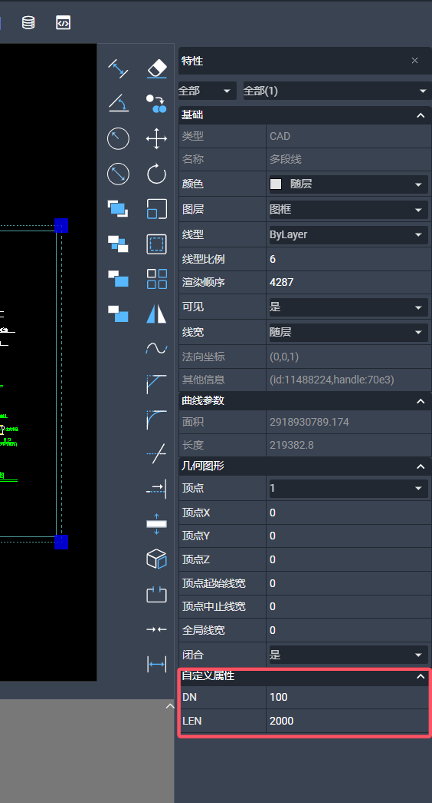
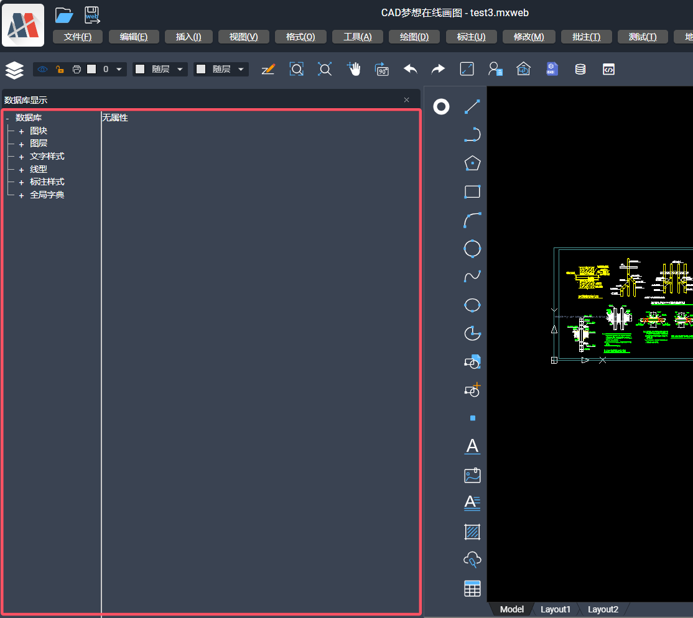

# 扩展插件的开发

项目的扩展插件是一个 js 文件, 比如我们测试用的 test.js

```javascript
console.log("hello world");
```

我们在 dist/plugins/config.json 中配置这个扩展插件

```json
{
  "plugins": ["test"]
}
```

然后项目就会自动执行打印了 hello world 了

## 扩展插件配置说明

| 参数名  | 类型           | 描述                              |
| ------- | -------------- | --------------------------------- |
| plugins | pluginConfig[] | 扩展插件列表 按照数组顺序依次执行 |

## pluginConfig 的配置说明如下：

| 参数名      | 类型    | 描述                                                                             |
| ----------- | ------- | -------------------------------------------------------------------------------- |
| name        | String  | 扩展插件名称                                                                     |
| isAfterLoad | Boolean | 是否等待项目加载后再执行代码                                                     |
| dir         | Boolean | 项目是否为目录结构, 如果是目录结构会自动加载目录下的 index.js(name 则是目录名称) |

## 内置插件说明

| 插件名                | 描述                                                 |
| --------------------- | ---------------------------------------------------- |
| test                  | 测试插件, 提供各种示例代码和插件使用示例             |
| pluginBaseTemplate    | 标准的插件项目工程打包的空模板(测试使用)             |
| loginPlugin           | 官网的登录插件(配合 electron 使用, 用于官网账号登录) |
| pluginCodeEdit        | 代码编辑插件(可以在线调试代码)                       |
| pluginIdentifyPattern | 图纸识别、符号标注、家装设计、图纸比对               |

## 扩展插件项目工程

对于相对复杂的扩展，简单的使用 js 效率特别低，没有很好的开发体验，因为我们基于 vite 创建了一些标准的插件项目模板工程。

在[项目集成基本说明](./1.BasicDescriptionOfProjectIntegration.md)中，分别提到了三个目录：
dist 目录是项目的打包后的代码，
MxCAD 目录是扩展插件开发中的示例代码，
MxCADiframe 目录相当于你自己的项目集成我们的项目的一个示例工程。

在理解了这三个目录的工程后，我们应该明白， MxCAD 目录就是一个扩展插件项目工程， 但是我们只能去参考它的代码实现，你应该有一个自己的扩展插件。

基于 vite 我们可以很方便的打包到一个扩展插件， 因为扩展插件本质上就是 js 文件。
我们只要把这个 js 文件打包到 dist/plugins 目录下， 然后在 dist/plugins/config.json 中配置这个插件， 就可以生效了。

在开发包中，我们提供了一个标准的扩展工程， 你可以复制它直接开发自己的扩展插件。
位置: MxDrawCloudServer\SRC\sample\Edit\2d\createPluginBaseTemplate

但是为了更理解这个打包工程，下面是这个工程的说明。

一、修改扩展插件的名称
找到 package.json 的 name 属性， 修改成自己的插件名称

二、vite.config.ts 中的 exclude 属性记录了外部依赖，globals 属性记录了外部依赖的全局变量。
这些定义的外部依赖，都可以通过模块化的方式引人。
比如:

```ts
import { MxFun } from "mxdraw";
```

就是从全局变量 Mx 中导出 MxFun 对象

```js
const { MxFun } = Mx;
```

三、请确保扩展工程目录存在一个同级目录是 dist 目录
比如扩展插件目录是: test
那么在 test 目录的同级目录必须存在 dist 目录(我们项目打包后的代码)

四、`npm run dev` 是开发调试 `npm run build` 是打包(打包后的 js 文件自动放在 dist/plugins 目录下)

五、MxPluginContext.d.ts 是插件上下文的 ts 类型文件，用于类型提示

### 插件代码配置

在 mxcad npm 包中 MxCADPluginBase 类， 我们可以通过如下方式修改它的配置，实现在项目初始化时，根据这个配置来初始化项目。

```ts
import { MxCADPluginBase, MxCADUI } from "mxcad";
import { MxFun } from "mxdraw";
class MxCADPlugin extends MxCADPluginBase {
  constructor() {
    super();
    // 修改项目初始化默认打开的mxweb文件
    this.openFile = "test3.mxweb";
  }
}
let mxcadUi: MxCADUI;
MxFun.on("mxcadApplicationStart", (mxcadUiImp: MxCADUI) => {
  mxcadUi = mxcadUiImp;
  mxcadUi.init(new MxCADPlugin());
});
```

具体的 MxCADPluginBase、MxCADUI 的示例提供的配置在 ts 类型提示中有对应说明，请自行查看，一般这些配置都是项目初始化时，可能会用到的配置。

如果你有使用`mxcadUi.init(new MxCADPlugin())`请确保 scripts/synchronizationProfile.js 中的自动化脚本配置中`isAfterLoad` 是`false`。
如果为`true`，那么插件代码会在项目加载完成后才执行, 导致 MxCADPluginBase 配置不生效`。

### 插件上下文

在扩展插件中，在 window 对象上暴露了全局变量`MxPluginContext`

#### getApp 获取 Vue3 App 实例

这里的 app 就是 vue 的 createApp 创建的 app 实例

```ts
import { App } from "vue";
const app = MxPluginContext.getApp();
app.use({
  install(app: App) {
    // vue3 插件
  },
});
```

#### 实体自定义属性



上面的展示效果在扩展插件中显示自定义的实体属性实现如下:

```ts
import { MxFun } from "mxdraw";
import { MxCpp, McObjectId, MxPropertiesWindowCustomValueType } from "mxcad";
// 等待项目创建mxcad实例
MxFun.on("mxcadApplicationCreatedMxCADObject", (param) => {
  const { mxcad } = param;
  // 获取
  MxCpp.PropertiesWindow.onEvent_getProperties((id: McObjectId) => {
    let ent = id.getMcDbEntity();
    if (!ent) return [];
    let dn = ent.getxDataDouble("DN");
    let len = ent.getxDataDouble("LEN");
    let ret = [];

    if (dn.ret) {
      ret.push({
        sVarName: "DN",
        iVarType: MxPropertiesWindowCustomValueType.kDouble,
        val: dn.val,
        isOnlyRead: false,
      });
    }

    if (len.ret) {
      ret.push({
        sVarName: "LEN",
        iVarType: MxPropertiesWindowCustomValueType.kDouble,
        val: len.val,
        isOnlyRead: false,
      });
    }
    return ret;
  });
  // 设置
  MxCpp.PropertiesWindow.onEvent_setProperties((id: McObjectId, prop: any) => {
    let ent = id.getMcDbEntity();
    if (!ent) return;
    if (prop.sVarName == "DN") {
      ent.setxDataDouble("DN", prop.val);
    } else if (prop.sVarName == "LEN") {
      ent.setxDataDouble("LEN", prop.val);
    }
  });
});
```

展示自定义属性是有显示的可以通过`MxPluginContext.setCustomDataListLength(12)`设置最多可以展示的自定义属性数量

#### store 部分全局数据管理

1. 命令行输入框自动聚焦 可以通过`MxPluginContext.store.useFocus()` 控制是否自动聚焦监听输入

```ts
const { setCommandFocus, isCommandFocus } = MxPluginContext.useFocus()
setCommandFocus(false) // 关闭命令行输入框用户键盘输入自动聚焦 true 则开启自动聚焦
// 当前是否自动聚焦
console.log(isCommandFocus.value)
// 设置自动聚焦的输入框
setInputEl(document.getElementById("inputEl")
```

#### getUiConfig 获取 UI 配置

这是一个动态添加 UI 配置的示例，因为 getUiConfig 获取的配置部分数据是响应式的，你可以直接添加或者修改 UI 配置，并且它可以生效

```ts
MxPluginContext.getUiConfig().then((config) => {
  if (!config?.leftDrawerComponents?.includes("CodeEditor"))
    config?.leftDrawerComponents?.push("CodeEditor");
  const uiInfo = {
    icon: "class: iconfont daimabianji",
    prompt: "代码编辑",
    cmd: "Mx_CodeEditor",
  };
  if (!config.mTopButtonBarData) {
    config.mTopButtonBarData = [];
  }
  const isUI = config.mTopButtonBarData.some((info) => {
    return info.cmd === uiInfo.cmd && uiInfo.prompt === uiInfo.prompt;
  });
  if (!isUI) {
    config.mTopButtonBarData.push(uiInfo);
  }
});
```

#### 添加侧边栏组件



我们可以自定义实现一个自己的侧边栏，代码示例如下：
我们需要实现三个文件
useComponent.ts

```ts
const { utils } = MxPluginContext
const { browserCacheRef } = utils

export const isShow = browserCacheRef(false, "Mx_Open_Test_Component");
```

index.vue

```vue
<template>
  <div v-show="isShow">
    <v-btn>hello world</v-btn>
  </div>
</template>
<script setup lang="ts">
import { VBtn } from "vuetify/components";
import { isShow } from "./useComponent";
</script>
```

index.ts

```ts
import { defineAsyncComponent } from "vue";
import { isShow } from "./useComponent";

MxPluginContext.addDrawerComponent("Test_Component", {
  isShow: isShow,
  component: defineAsyncComponent(() => import("./index.vue")),
  width: 600,
  title: "hello world",
  cmd: [
    {
      cmd: "Mx_Open_Test_Component",
      call: async () => {
        isShow.value = !isShow.value;
      },
    },
  ],
});
MxPluginContext.getUiConfig().then((config) => {
  if (!config?.leftDrawerComponents?.includes("Test_Component")) {
    config?.leftDrawerComponents?.push("Test_Component");
  }
});
```

这里有一些关键要素：

1. UiConfig 的 leftDrawerComponents 或者 rightDrawerComponents 中必须有添加的侧边栏名称， 这里是 Test_Component
2. 必须实现一个命令来控制侧边栏的打开和关闭逻辑
3. 组件必须提供 isShow 并只有为 true 才可以显示
4. 侧边栏组件中可以直接使用 vuetify/components 的组件

#### vuetify 组件的使用

项目使用了 vuetify 的组件，在扩展插件中一样可以使用组件, 但是 vuetify 的实例在项目中已经挂载，所以我们应该按照如下方式使用：

index.vue

```vue
<script setup lang="ts">
import { VBtn, VList, VSelect } from "vuetify/components";
</script>
<template>
  <div>
    <VList>
      <VBtn>hello</VBtn>
      <VSelect :items="[1, 2, 3, 4]"></VSelect>
    </VList>
  </div>
</template>
```

index.ts

```ts
import { createVNode, render } from "vue";
import Index from "./index.vue";
const targetEl = document.querySelector("header div div");
const el = document.createElement("div");

targetEl.appendChild(el);
const vnode = createVNode(Index);
const app = MxPluginContext.getApp();
vnode.appContext = app._context;
render(vnode, el);
```

这样我们就将组件添加到了 header 头部的 div 元素中。

#### 自定义弹框

我们在上下文中提供了自定义的弹框组件，你可以配合 hooks 按照我们的规范去实现自定义的弹框

| 属性            | 类型                                                                                                                                                                        | 描述                         |
| --------------- | --------------------------------------------------------------------------------------------------------------------------------------------------------------------------- | ---------------------------- |
| title           | string                                                                                                                                                                      | 弹框的标题                   |
| logo            | string                                                                                                                                                                      | 左侧的 logo                  |
| cardClass       | string                                                                                                                                                                      | 定义卡片的 css class         |
| cardTextClass   | string                                                                                                                                                                      | 定义卡片内容区域的 css class |
| cardActionClass | string                                                                                                                                                                      | 定义底部操作区域的 css class |
| footerBtnList   | `{ name: string, fun?: (...args: any[]) => void, primary?: boolean, labelProps?: { keyName?: string,colon?: boolean,noTextCaption?: boolean}, disabled?: () => boolean }[]` | 底部区域的按钮配置           |
| modelValue      | boolean                                                                                                                                                                     | 显示隐藏                     |
| keys            | `{ [key: string]: (e: KeyboardEvent) => any }`                                                                                                                              | 弹框的快捷键定义             |

| 插槽        | 描述                                                     |
| ----------- | -------------------------------------------------------- |
| header      | 定义整个弹框的头部                                       |
| header-icon | 如果没有 header 插槽，可以定义左侧默认 logo 图片显示区域 |
| default     | 默认插槽, 弹框主体内容                                   |
| actions     | 底部操作栏                                               |

1. 自定义弹框的基础用法

* 首先创建一个test_dialog文件夹用于存储弹框相关的文件。

* 在文件夹下创建 dialog.ts 文件用于注册弹框，注册代码如下：

```ts
// dialog.isShow.value 默认是false
// 如果没有传入命令，则只能通过修改dialog.isShow.value或者调用showDialog来显示弹框
// 如果传入了命令，则调用命令会自动显示或关闭弹框
// 如果传入了第三个参数，则会自定义这个命令的实现
export const dialog = MxPluginContext.useDialogIsShow(
    false,
    "Mx_test_dialog",
    () => {
        dialog.showDialog(!dialog.isShow.value);
    }
);
```

* 在文件夹下创建 dialog.vue 文件用于构建弹框ui界面，构建代码如下：

```vue
<script setup lang="ts">
import { VBtn } from "vuetify/components";
import { dialog } from "./dialog.ts";
// MxPluginContext 该上下文对象已经被默认注册，可直接使用
const { MxDialog } = MxPluginContext.components;
const { isShow } = dialog;
// 弹框底部按钮列表
const footerBtnList = [
  {
    name: "确定",
    fun:()=>{
        isShow.value = false
    }
  },
];
</script>
<template>
  <MxDialog
    title="测试标题"
    v-model="isShow"
    max-width="300"
    :footerBtnList="footerBtnList"
  >
    asdasdasdasdasdasd
    <VBtn
      >asdasdsa
      <template #loader></template>
    </VBtn>
    <input />
    <VBtn>asdasdsa</VBtn>
  </MxDialog>
</template>
```

* 在文件夹下创建 index.ts 文件在界面创建弹框，创建代码如下：

```ts
import { createVNode, render } from "vue";
import dialog from "./dialog.vue";

const el = document.createElement("div");
document.body.appendChild(el);
const vnode = createVNode(dialog);
const app = MxPluginContext.getApp();
vnode.appContext = app._context;
render(vnode, el);
```
* 最终在MxCAD项目中的 src/index.ts 文件中引入 test_dialog/index.ts 文件。

```ts
import './test_dialog/index'
```

* 启动MxCAD项目，执行上面注册的 'Mx_test_dialog' 命令就能显示弹框了。

2. 自定义弹框的进阶用法

* dialog.ts

```ts
// 弹框要显示的数据
type RevealData = { title: string };
// 弹框确认要传入的数据
type ConfirmData = { data: number };
// 弹框取消要传入的数据
type CancelData = { data: number };
export const dialog = MxPluginContext.useDialogIsShow<
  RevealData,
  ConfirmData,
  CancelData
>();
```

* dialog.vue

```vue
<script setup lang="ts">
import { ref } from "vue";
import { VBtn, VList, VSelect } from "vuetify/components";
import { dialog } from "./dialog.ts";
const { MxDialog } = MxPluginContext.components;
const footerBtnList = [
  {
    name: "取消",
    fun: () => {
      // 弹框点击了取消按钮，传入数据
      dialog.cancel({ data: 1 });
      // 需要先发送数据再关闭弹框
      dialog.showDialog(false);
    },
  },
  {
    name: "确定",
    fun: () => {
      // 弹框点击了确认按钮，传入数据
      dialog.confirm({ data: 2 });
      dialog.showDialog(false);
    },
    primary: true,
  },
];
const { isShow, onReveal } = dialog;
const title = ref("测试标题");
onReveal((data) => {
  // 接收到显示的消息
  if (data.title) title.value = data.title;
});
</script>
<template>
  <MxDialog
    :title="title"
    v-model="isShow"
    max-width="300"
    :footerBtnList="footerBtnList"
  >
    asdasdasdasdasdasd
    <VBtn
      >asdasdsa
      <template #loader></template>
    </VBtn>
    <input />
    <VBtn>asdasdsa</VBtn>
  </MxDialog>
</template>
```

* index.ts

```ts
import DialogComponent from "./dialog.vue";
import { dialog } from "./dialog";
import { createVNode, render } from "vue";

const el = document.createElement("div");
document.body.appendChild(el);
const vnode = createVNode(DialogComponent);
const app = MxPluginContext.getApp();
vnode.appContext = app._context;
render(vnode, el);

// 显示弹框， 并传入显示数据
dialog
  .showDialog(true, { title: "测试标题显示" })
  .then(({ data, isCanceled }) => {
    // 需要等待cancel或者confirm调用才会触发
    if (isCanceled) {
      // 调用dialog.cancel({ data: 1 })取消
      console.log("弹框取消的数据", data.data === 1);
    } else {
      // 调用dialog.confirm({ data: 2 })取消
      console.log("弹框确认的数据", data.data === 2);
    }
  });
// 也可以直接传入显示数据 和 showDialog 的返回结果一致
dialog.reveal({ title: "reveal" }).then(({ data, isCanceled }) => {});

// 我们也可以通过监听确认或者取消事件得到数据
dialog.onConfirm((data) => {}), dialog.onCancel((data) => {});
```

* 按照上述步骤修改后，启动MxCAD项目弹框就能直接显示再界面中了。

3. 在弹框打开时，可以设置快捷键操作。

```vue
<script setup lang="ts">
const { MxDialog } = MxPluginContext.components;
const keys = {
  x: (e) => {
    // 按下x键触发
    console.log(e);
  },
  "ctrl + z": (e) => {
    // 按下Ctrl + z组合键
  },
  escape: (e) => {
    // 按下esc键
  },
};
</script>
<template>
  <MxDialog :keys="keys"> </MxDialog>
</template>
```

#### 其他

以下具体方法的使用看 ts 类型提示

1. useTheme 主题相关
2. useFileName 文件名称显示相关
3. addCommand 添加命令，通过它添加的命令在命名输入框中会有提示
4. callCommand 执行命令
5. useLoading 显示加载框
6. useMessage 显示消息提示
7. components 项目中常用的一些组件

还有一些全局的对象，都是第三方库
|包名|window 挂载的全局对象名称|描述|
|---|---|---|
|vue|Vue|vue3 框架[查看文档](https://cn.vuejs.org/)|
|mxcad|MxCAD|mxcad 编辑展示 CAD 图形|
|mxdraw|Mx|基于three@0.113.2改造的用于 CAD 图形渲染的库[查看文档](https://www.mxdraw3d.com/mxdraw_docs/)|
|three|THREE|three@0.113.2 可以使用适合这个版本的一些示例[查看文档](https://www.three3d.cn/docs/index.html)|
|pinia|pinia|vue3 状态管理库 版本@2 [查看文档](https://pinia.vuejs.org/zh/introduction.html)|
|vuetify|vuetify|vue3 组件库 [查看文档](https://vuetifyjs.com)|
|vuetify/components|vuetifyComponents|vuetify 的所有组件|
|axios|axios|网络请求的库, 项目使用默认的实例，没有单独创建实例，所以可以对项目中的请求进行全局的拦截和响应，比如设置请求头的需求|

### 国际化 i18n 翻译

已弃用 vue-i18n, 当前实现采用[@voerkai18n/cli](https://zhangfisher.github.io/voerka-i18n/) [github 地址](https://github.com/zhangfisher/voerka-i18n)

这里简要说明，更多详细说明请参考[@voerkai18n/cli 文档](https://zhangfisher.github.io/voerka-i18n/)

如果你需要国际化 i18n 翻译, 在扩展插件工程中安装依赖:

```sh
npm install @voerkai18n/cli -D
```

然后再 package.json 中添加:

```json
{
  "scripts": {
    "i18n": "npm run i18nInit && npm run i18nExtract && npm run i18nAutoTranslate && npm run i18nCompile",
    "i18nInit": "voerkai18n init . -lngs zh en cht -d zh",
    "i18nExtract": "voerkai18n extract -D -f ts,vue",
    "i18nAutoTranslate": "voerkai18n translate --appid xxx --appkey xxx",
    "i18nCompile": "voerkai18n compile -t -l"
  }
}
```

:::tip 关于 i18nAutoTranslate 自动翻译
i18nAutoTranslate 自动翻译需要提供百度的 appid 和 appkey
具体如何提供获取 appid 和 appkey 或者需要自定义翻译接口请参考:
https://zhangfisher.github.io/voerka-i18n/zh/guide/tools/cli.html#%E8%87%AA%E5%8A%A8%E7%BF%BB%E8%AF%91-translate
:::

`voerkai18n`具体命令的参数说明请参考:https://zhangfisher.github.io/voerka-i18n/zh/guide/tools/cli.html#%E5%AE%89%E8%A3%85

然后我们就可以调用`i18nInit`命令初始化

```sh
npm run i18nInit
```

初始化会再 src 中生成一个 languages 目录

我们可以通过引入 languages/index.ts 导出 t 函数翻译文本

```ts
// 任意ts或者vue文件中
import { t } from "./languages";
const text = t("你好");
console.log(text);
```

写好后，我们可以通过调用 `npm run i18nExtract`提取文件中`t("")`包裹的文字；

然后你可以选择手动翻译在 languages/translates/default.json 中你可以看到如下内容:

```json
{
  "你好": {
    "en": "",
    "cht": "",
    "$files": ["src/index.ts"]
  }
}
```

我们可以再`en`属性中填写对应的英文名称

当然 default.json 是默认从文件中提取的，有一些没有文字没有办法提取到。
我们可以在 languages/translates 目录下创建一个新的 json 文件, 然后按照上述格式，补充文字和翻译的内容。

如果你设置了`voerkai18n translate --appid xxx --appkey xxx`中的 appid 和 appkey 或者自定义了翻译接口，

那么, 我们调用`npm run i18nAutoTranslate` 会自动将 languages/translates 目录中的 json 文件，对应的翻译内容全部通过翻译接口翻译完成。

最后，我们通过`npm run i18nCompile` 将 json 文件中翻译好的数据，编译成 ts 就实现了国际化 i18n 的功能了， 对于扩展插件工程， 我们应该始终使用使用开发库模式 `voerkai18n compile -l`也就是要加上`-l`

为了简化这些步骤，我们可与直接运行`npm run i18n` 自动提取、翻译、编译， 每次添加了新的`t("")`函数, 或者 languages/translates 的 json 中修改了数据内容，都可以调用它。

在 vue 中，我们希望切换语音时，vue 组件中的数据可以自动响应式的切换,

我们需要重新定义一个新的`t`函数来实现它， 注意，必须是 t 函数，因为它是通过`t("")`正则匹配提取文字的。

i18n.ts

```ts
import { ref } from "vue";
import { i18nScope } from "./languages";
const activeLanguage = ref<string>();
i18nScope.on("change", (value) => {
  activeLanguage.value = value;
});
export const t = (message: string, ...args: any[]) => {
  activeLanguage.value;
  return i18nScope.t(message, ...args);
};
```

我们使用这个 t 函数在组件中使用它，就可以确保在切换语言时，动态的自动切换。

```vue
<script setup lang="ts">
import { t } from "./i18n";
</script>
<template>
  <div>{{ t("你好") }}</div>
</template>
```
