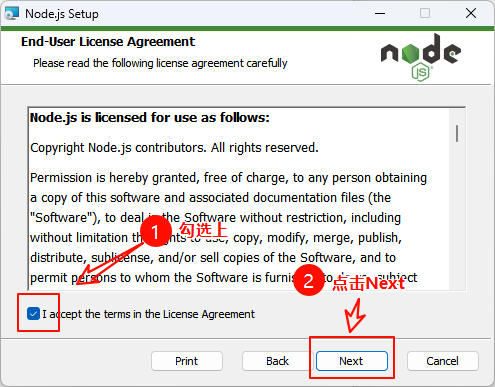
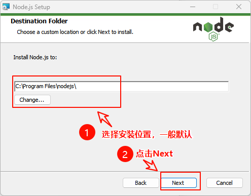
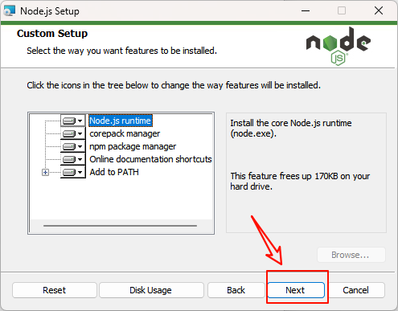
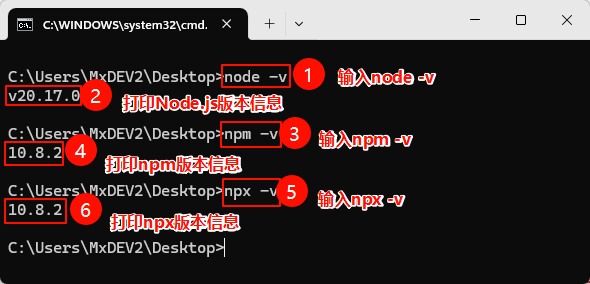
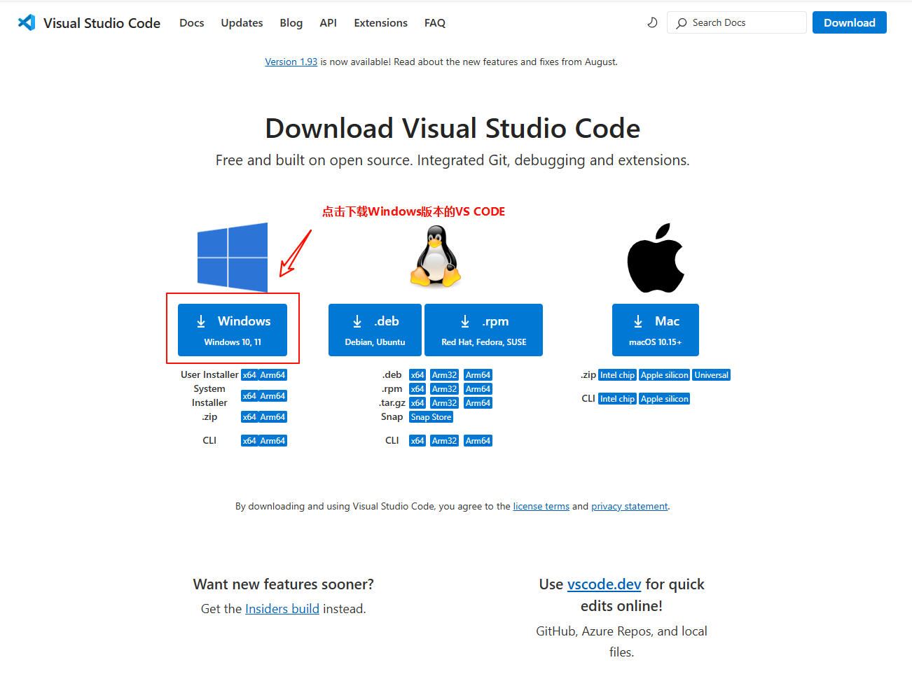
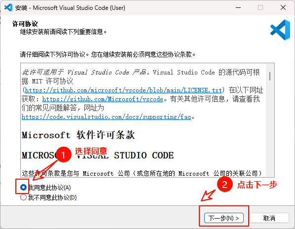
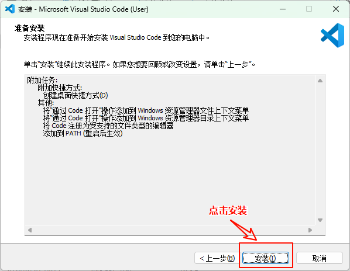
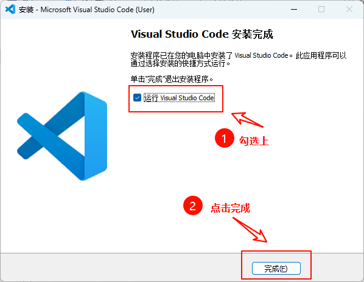

> ## Development Environment Setup

1. We need to create a new test project and import the `mxcad` package using the `npm package manager`, so we need to first install `Node.js`, which comes with the `npm package manager` and the `npx tool` included in the `npm package manager`. You can download `Node.js` from the following link：https://nodejs.org/zh-cn

   > **Installing Node.js**

   1. Download the installation package for `Node.js` from the official website

      

   2. Double-click on the downloaded installation package to begin the installation process

      

   3. In the first step, click on `Next`

      

   4. In the second step, check the agreement box, then click `Next` again

      

   5. In the third step, choose the installation location (usually the default), then click `Next`

      

   6. Click on `Next` in the fourth step

      

   7. In the fifth step, do not check the checkbox (it is usually not checked by default), and directly click on `Next`

      

   8. Click on `Install` in the sixth step to start the installation process

      

   9.  After the installation is complete, open a command prompt window, then type `node -v` to get the version information of `Node.js`, `npm -v` to get the version information of `npm`, and `npx -v` to get the version information of `npx`. If version information appears, it indicates a successful installation

      

2. Install `VS Code`. `VS Code` is a handy integrated development tool. You can download it from the following link：https://code.visualstudio.com/Download

   > **Installing VS Code**

   1. Download the `VS Code` installation package from the official website

      

   2. Double-click to launch the `VS Code` installation program

      

   3. In the first step, select Agree, then click Next

      

   4. In the second step, check all options, then click Next

      

   5. Click on Install in the third step

      

   6. Wait for the installation to complete in the fourth step

      

   7. Check the box to launch `VS Code`, then click Finish in the fifth step

      

   8. Finally, after `VS Code` starts, it should look like the image below

      