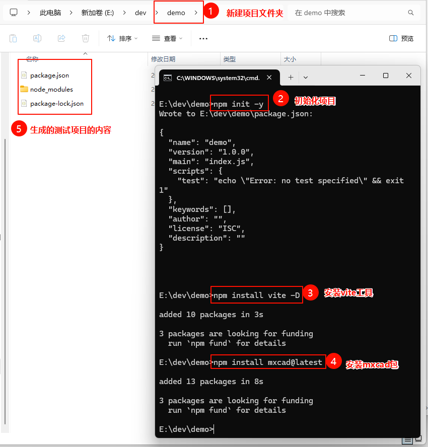
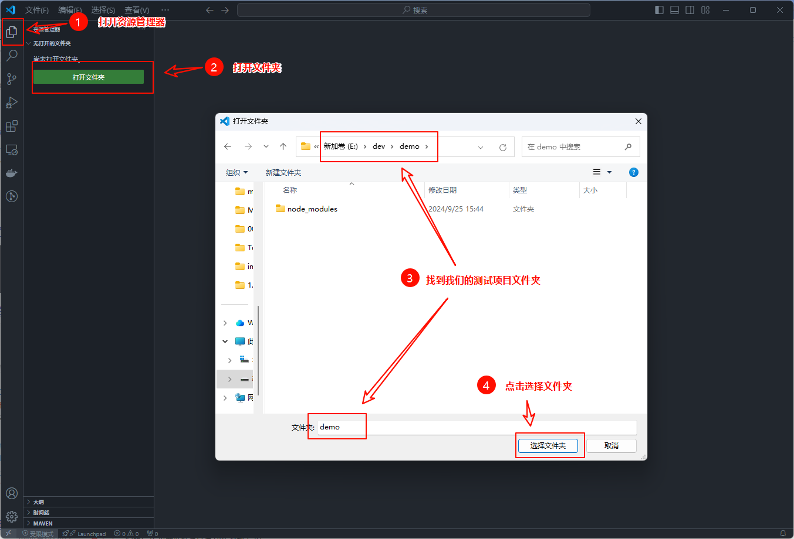
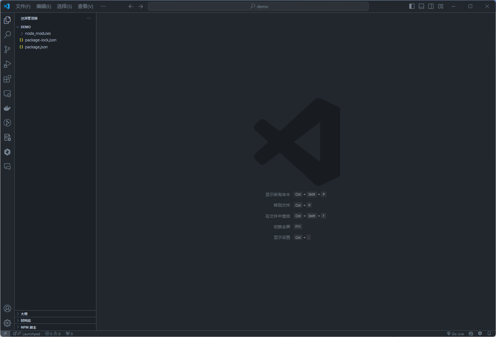
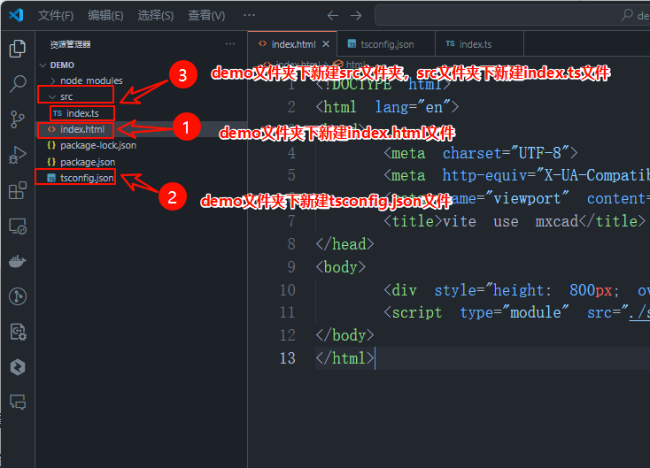
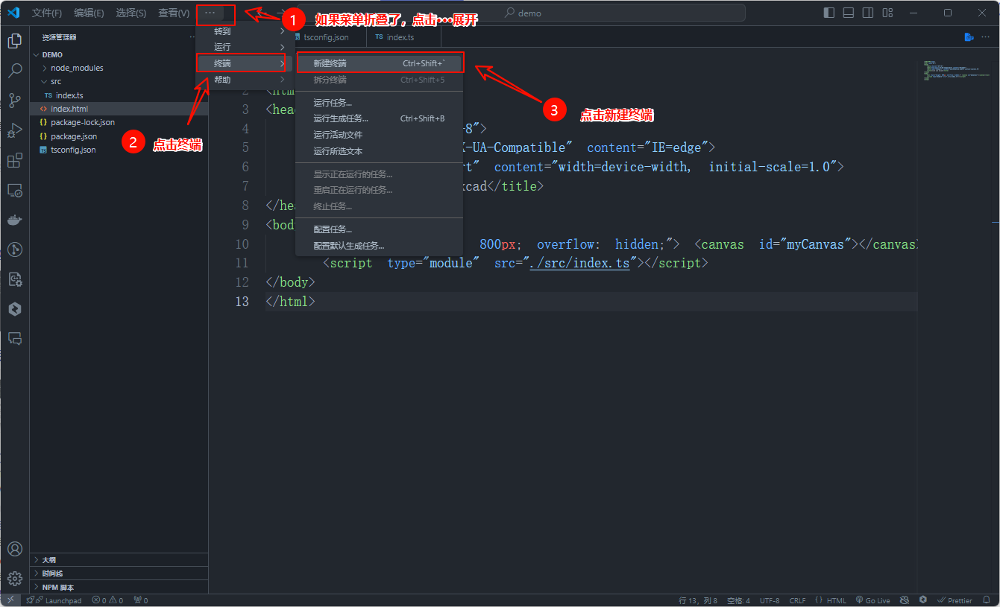
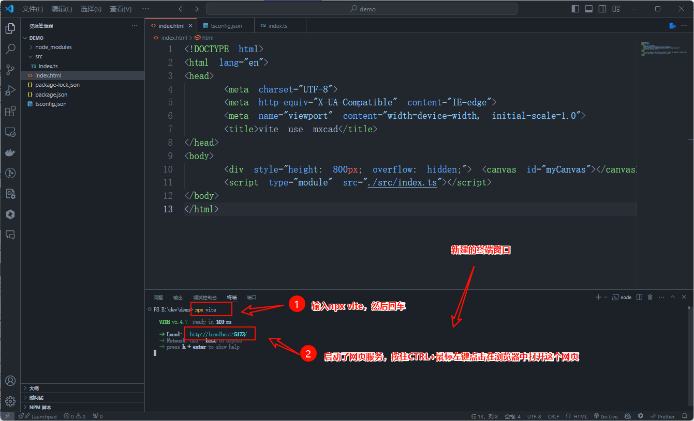
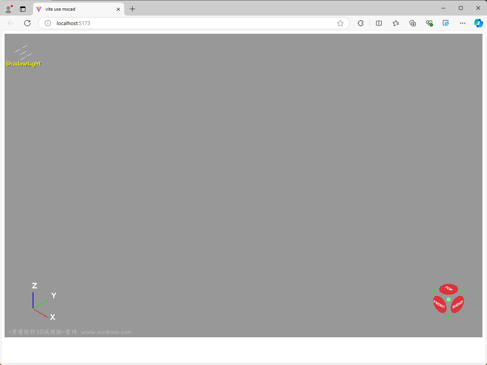

> ## Creating Project, Installing mxcad, Writing Basic Code

1. Create a test project folder named `demo ` in a suitable location and open a `command line tool` in the `demo` folder. Then, enter the following commands to initialize the project and import the `mxcad` package

   ```sh
   npm init -y
   npm install vite -D
   npm install mxcad@latest
   ```

   


2. Open the test project folder using `VS Code`
   The project folder will open up as shown in the following image
   


3. After opening the project, create an `index.html file`, a `tsconfig.json file`, and an `src directory` in the project directory. Then, create an `index.ts file` within the `src directory` and write the most basic code

   > index.html

   ```html
   <!DOCTYPE html>
   <html lang="en">
   <head>
       <meta charset="UTF-8">
       <meta http-equiv="X-UA-Compatible" content="IE=edge">
       <meta name="viewport" content="width=device-width, initial-scale=1.0">
       <title>vite use mxcad</title>
   </head>
   <body>
       <div style="height: 800px; overflow: hidden;"> <canvas id="myCanvas"></canvas></div>
       <script type="module" src="./src/index.ts"></script>
   </body>
   </html>
   ```

   >tsconfig.json

   ```json
   {
     "compilerOptions": {
       "module": "esnext",
       "moduleResolution": "node",
       "typeRoots": ["./node_modules/@types", "./typings"]
     }
   }
   ```

   > src/index.ts

   ```typescript
   import { MxCAD3DObject } from "mxcad"

   // Create MxCAD3D object
   const mxcad3d = new MxCAD3DObject()

   // Initialize MxCAD3D object
   mxcad3d.create({
       // CSS selector string of the canvas element (id selector in the example), or the canvas element object
       canvas: "#myCanvas",
       // Get the path location of the wasm-related files (wasm/js/worker.js)
       locateFile: (fileName)=> new URL(`/node_modules/mxcad/dist/wasm/3d/${fileName}`, import.meta.url).href,
   })

   // Initialization completed
   mxcad3d.on("init", ()=>{
       console.log("Initialization completed");
   });
   ```


   

4. Open a terminal and run the command to run the project

   ```sh
   npx vite
   ```

   

   

   Upon opening the webpage, you will see a 3D view window in the browser
   

   ​

:::tip Note
GitHub and network loading may be slow, requiring a few minutes of waiting...
:::
:::demo

```tsx
import { MxCAD3DObject } from "mxcad"
import { defineComponent,onMounted } from "vue"
export default defineComponent({
  setup() {

    onMounted(async () => {
      // Ensure that the DOM has been rendered
      const mxcad3d = new MxCAD3DObject();
      
      await mxcad3d.create({
        canvas: '#myCanvas',
        locateFile: (fileName) => `https://unpkg.com/mxcad/dist/wasm/3d/${fileName}`,
      });
     
        
      mxcad3d.on('init', () => {
        console.log('Initialization completed');
      });
    });

    return () => (
      <div style={{ height: 600, overflow: 'hidden' }}>
        <canvas id="myCanvas" style={{ height: 300 }} />
      </div>
    );
  },
});


```
:::