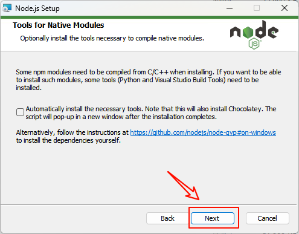

> ## 开发环境准备

1. 我们需要通过`npm包管理器`来新建测试项目并引入`mxcad`包，所以需要先安装`Node.js`，里面自带了`npm包管理器` 以及包含在`npm包管理器`中的`npx工具` (用于启动运行我们的测试项目)，`Node.js`下载地址：https://nodejs.org/zh-cn

   > **安装Node.js**

   1. 到官网下载`Node.js`的安装包
      
   2. 双击下载好的安装包，开始进行安装
      
   3. 第一步，点击`Next`
      
   4. 第二步，勾选同意，再点击`Next`
      
   5. 第三步，选择安装位置（一般都默认），然后再点击`Next`
      
   6. 第四步，点击`Next`
      
   7. 第五步，不要勾选复选框（默认也是没有勾选的），直接点击`Next`
      
   8. 第六步，点击`Install`，开始安装
      
   9. 第七步，安装完成后，打开一个命令行窗口，然后输入`node -v`，获取`Node.js`的版本信息，输入`npm -v`，获取`npm`的版本信息，输入`npx -v`，获取`npx`的版本信息，出现版本信息说明安装成功
      

2. 安装`VS CODE`，`VS CODE`是一款好用的集成开发工具，下载地址：https://code.visualstudio.com/Download

   > **安装VS CODE**

   1. 到官网下载`VS CODE`安装包
      
   2. 双击启动`VS CODE`安装程序
      
   3. 第一步，选择同意，点击下一步
      
   4. 第二步，全部勾选，点击下一步
      
   5. 第三步，点击安装
      
   6. 第四步，等待安装完成
      
   7. 第五步，勾选上启运行`VS CODE`，点击完成
      
   8. 最后，`VS CODE`启动后如下图所示
      