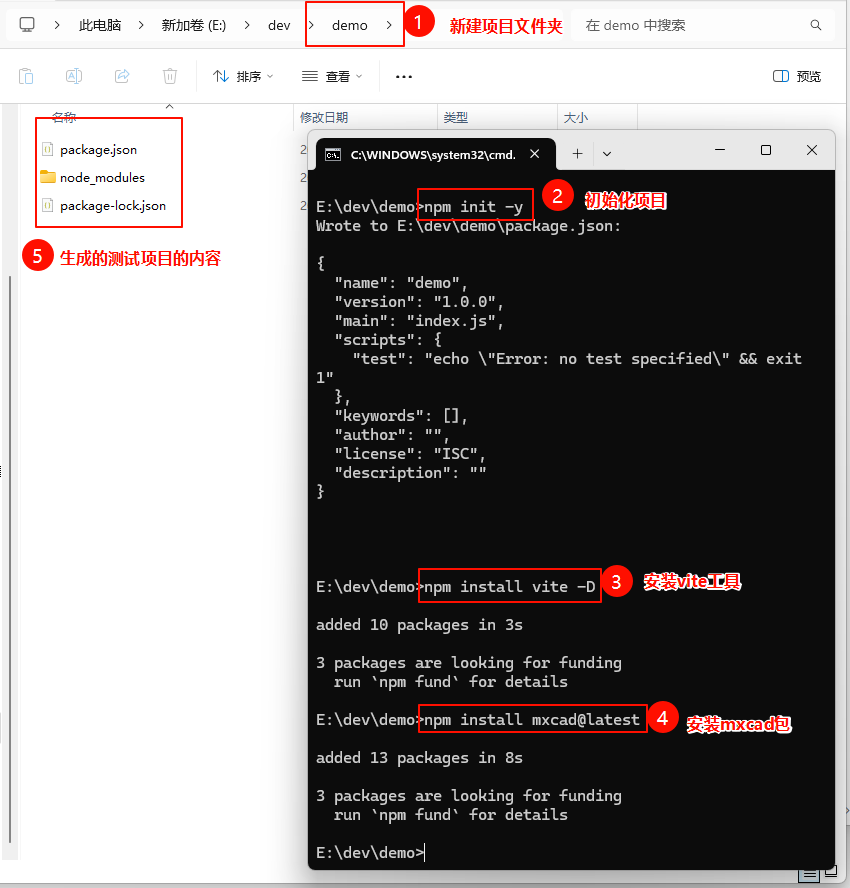
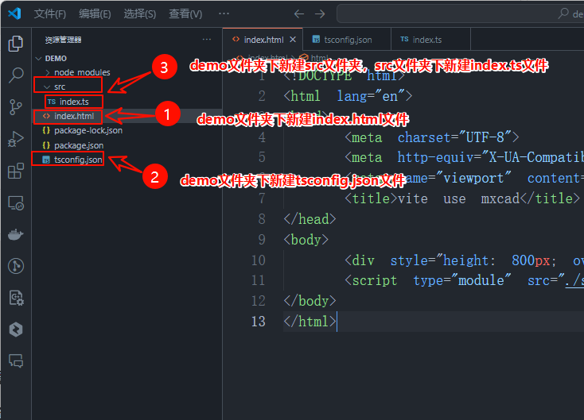
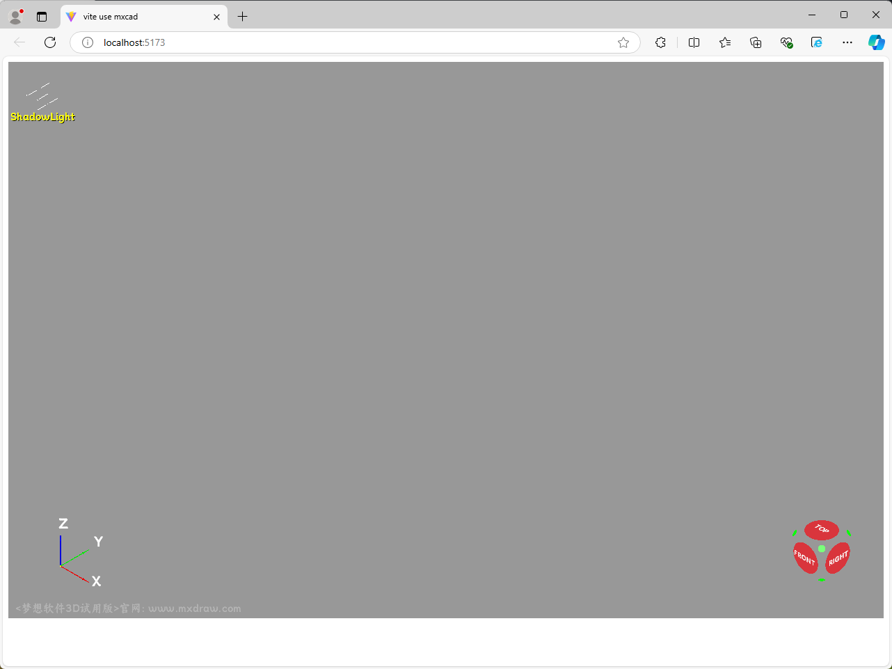

> ## 创建项目、安装mxcad、编写基本代码

1. 在合适的位置创建测试项目文件夹`demo` ，并在`demo` 文件夹中打开`cmd命令行工具` ，依次输入以下指令来初始化项目并引入`mxcad`包。

   ```sh
   npm init -y
   npm install vite -D
   npm install mxcad@latest
   ```

   


2. 使用`VS CODE`打开测试项目文件夹
   
   项目文件夹打开后如下图所示
   


3. 打开项目后，在项目目录下新建一个`index.html文件`、`tsconfig.json文件`以及一个`src目录`，然后在`src目录`下新建一个`index.ts文件` 并编写最基本的代码

   > index.html

   ```html
   <!DOCTYPE html>
   <html lang="en">
   <head>
       <meta charset="UTF-8">
       <meta http-equiv="X-UA-Compatible" content="IE=edge">
       <meta name="viewport" content="width=device-width, initial-scale=1.0">
       <title>vite use mxcad</title>
   </head>
   <body>
       <div style="height: 800px; overflow: hidden;"> <canvas id="myCanvas"></canvas></div>
       <script type="module" src="./src/index.ts"></script>
   </body>
   </html>
   ```

   >tsconfig.json

   ```json
   {
     "compilerOptions": {
       "module": "esnext",
       "moduleResolution": "node",
       "typeRoots": ["./node_modules/@types", "./typings"]
     }
   }
   ```

   > src/index.ts

   ```typescript
   import { MxCAD3DObject } from "mxcad"

   // 创建mxcad3d对象
   const mxcad3d = new MxCAD3DObject()

   // 初始化mxcad3d对象
   mxcad3d.create({
       // canvas元素的css选择器字符串（示例中是id选择器），或canvas元素对象
       canvas: "#myCanvas",
       // 获取加载wasm相关文件(wasm/js/worker.js)路径位置
       locateFile: (fileName)=> new URL(`/node_modules/mxcad/dist/wasm/3d/${fileName}`, import.meta.url).href,
   })

   // 初始化完成
   mxcad3d.on("init", ()=>{
       console.log("初始化完成");
   });
   ```


      

4. 新建终端，执行运行项目的命令，运行测试项目

   ```sh
   npx vite
   ```

   

   

   打开网页后，你将会在浏览器中看到一个三维视图窗口
   


:::tip 注意
github以及网络问题加载可能较慢，可能需要等待几分钟...
:::
:::demo

```tsx
import { MxCAD3DObject } from "mxcad"
import { defineComponent,onMounted } from "vue"
export default defineComponent({
  setup() {

    onMounted(async () => {
      // 确保DOM已经渲染完毕
      const mxcad3d = new MxCAD3DObject();
      
      await mxcad3d.create({
        canvas: '#myCanvas',
        locateFile: (fileName) => self.location.origin + `/mxcad_docs3d/wasm/3d/${fileName}`,
      });
     
        
      mxcad3d.on('init', () => {
        console.log('初始化完成');
      });
    });

    return () => (
      <div style={{ height: 600, overflow: 'hidden' }}>
        <canvas id="myCanvas" style={{ height: 300 }} />
      </div>
    );
  },
});


```
:::